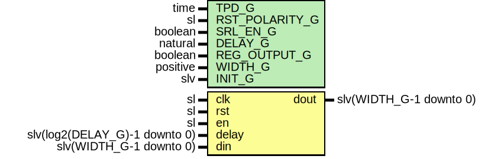

# Entity: SlvDelay

- **File**: SlvDelay.vhd
## Diagram

## Description

Company    : SLAC National Accelerator Laboratory
Description: Shift Register Delay module for std_logic_vectors
This file is part of 'SLAC Firmware Standard Library'.
It is subject to the license terms in the LICENSE.txt file found in the
top-level directory of this distribution and at:
   https://confluence.slac.stanford.edu/display/ppareg/LICENSE.html.
No part of 'SLAC Firmware Standard Library', including this file,
may be copied, modified, propagated, or distributed except according to
the terms contained in the LICENSE.txt file.
## Generics

| Generic name   | Type     | Value | Description                                                    |
| -------------- | -------- | ----- | -------------------------------------------------------------- |
| TPD_G          | time     | 1 ns  |                                                                |
| RST_POLARITY_G | sl       | '1'   | '1' for active HIGH reset, '0' for active LOW reset            |
| SRL_EN_G       | boolean  | false | Allow an SRL to be inferred. Disables reset.                   |
| DELAY_G        | natural  | 1     |                                                                |
| REG_OUTPUT_G   | boolean  | false | For use with Dynamic SRLs, adds extra delay register on output |
| WIDTH_G        | positive | 1     |                                                                |
| INIT_G         | slv      | "0"   |                                                                |
## Ports

| Port name | Direction | Type                          | Description           |
| --------- | --------- | ----------------------------- | --------------------- |
| clk       | in        | sl                            |                       |
| rst       | in        | sl                            | Optional reset        |
| en        | in        | sl                            | Optional clock enable |
| delay     | in        | slv(log2(DELAY_G)-1 downto 0) |                       |
| din       | in        | slv(WIDTH_G-1 downto 0)       |                       |
| dout      | out       | slv(WIDTH_G-1 downto 0)       |                       |
## Signals

| Name   | Type                    | Description |
| ------ | ----------------------- | ----------- |
| r      | RegType                 |             |
| rin    | RegType                 |             |
| iDelay | natural                 |             |
| iDout  | slv(WIDTH_G-1 downto 0) |             |
## Constants

| Name       | Type                    | Value                                                                                                                | Description |
| ---------- | ----------------------- | -------------------------------------------------------------------------------------------------------------------- | ----------- |
| INIT_C     | slv(WIDTH_G-1 downto 0) |  ite(INIT_G = "0",  slvZero(WIDTH_G),  INIT_G) |             |
| REG_INIT_C | RegType                 |  (       shift => (others => INIT_C))                                                                                |             |
| SRL_C      | string                  |  ite(SRL_EN_G,  "YES",  "NO")                  |             |
## Types

| Name        | Type | Description |
| ----------- | ---- | ----------- |
| VectorArray |      |             |
| RegType     |      |             |
