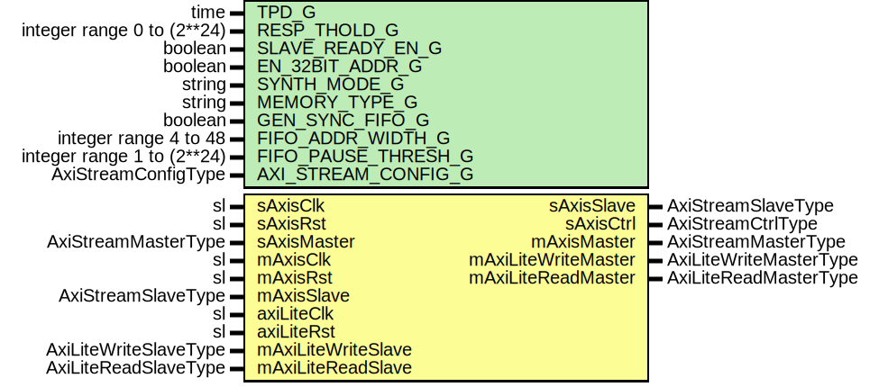

# Entity: SrpV0AxiLite

## Diagram

## Description

Title      : SRPv0 Protocol: https://confluence.slac.stanford.edu/x/aRmVD
Company    : SLAC National Accelerator Laboratory
Description: SLAC Register Protocol Version 0, AXI-Lite Interface
Note: This module only supports 32-bit aligned addresses and 32-bit transactions.
This file is part of 'SLAC Firmware Standard Library'.
It is subject to the license terms in the LICENSE.txt file found in the
top-level directory of this distribution and at:
   https://confluence.slac.stanford.edu/display/ppareg/LICENSE.html.
No part of 'SLAC Firmware Standard Library', including this file,
may be copied, modified, propagated, or distributed except according to
the terms contained in the LICENSE.txt file.
## Generics

| Generic name        | Type                       | Value      | Description           |
| ------------------- | -------------------------- | ---------- | --------------------- |
| TPD_G               | time                       | 1 ns       | General Config        |
| RESP_THOLD_G        | integer range 0 to (2**24) | 1          | =1 = normal operation |
| SLAVE_READY_EN_G    | boolean                    | false      |                       |
| EN_32BIT_ADDR_G     | boolean                    | false      |                       |
| SYNTH_MODE_G        | string                     | "inferred" |                       |
| MEMORY_TYPE_G       | string                     | "block"    |                       |
| GEN_SYNC_FIFO_G     | boolean                    | false      |                       |
| FIFO_ADDR_WIDTH_G   | integer range 4 to 48      | 9          |                       |
| FIFO_PAUSE_THRESH_G | integer range 1 to (2**24) | 2**8       |                       |
| AXI_STREAM_CONFIG_G | AxiStreamConfigType        |            | AXI Stream IO Config  |
## Ports

| Port name           | Direction | Type                   | Description                                            |
| ------------------- | --------- | ---------------------- | ------------------------------------------------------ |
| sAxisClk            | in        | sl                     | Streaming Slave (Rx) Interface (sAxisClk domain)       |
| sAxisRst            | in        | sl                     |                                                        |
| sAxisMaster         | in        | AxiStreamMasterType    |                                                        |
| sAxisSlave          | out       | AxiStreamSlaveType     |                                                        |
| sAxisCtrl           | out       | AxiStreamCtrlType      |                                                        |
| mAxisClk            | in        | sl                     | Streaming Master (Tx) Data Interface (mAxisClk domain) |
| mAxisRst            | in        | sl                     |                                                        |
| mAxisMaster         | out       | AxiStreamMasterType    |                                                        |
| mAxisSlave          | in        | AxiStreamSlaveType     |                                                        |
| axiLiteClk          | in        | sl                     | AXI Lite Bus (axiLiteClk domain)                       |
| axiLiteRst          | in        | sl                     |                                                        |
| mAxiLiteWriteMaster | out       | AxiLiteWriteMasterType |                                                        |
| mAxiLiteWriteSlave  | in        | AxiLiteWriteSlaveType  |                                                        |
| mAxiLiteReadMaster  | out       | AxiLiteReadMasterType  |                                                        |
| mAxiLiteReadSlave   | in        | AxiLiteReadSlaveType   |                                                        |
## Signals

| Name            | Type                | Description |
| --------------- | ------------------- | ----------- |
| r               | RegType             |             |
| rin             | RegType             |             |
| sFifoAxisMaster | AxiStreamMasterType |             |
| sFifoAxisSlave  | AxiStreamSlaveType  |             |
| mFifoAxisMaster | AxiStreamMasterType |             |
| mFifoAxisSlave  | AxiStreamSlaveType  |             |
| mFifoAxisCtrl   | AxiStreamCtrlType   |             |
## Constants

| Name          | Type                | Value                                                                                                                                                                                                                                                                                                                                                                                                                                                                                                                                                                                                                                                                                                                                                                                                                                                                                                                                                                                             | Description |
| ------------- | ------------------- | ------------------------------------------------------------------------------------------------------------------------------------------------------------------------------------------------------------------------------------------------------------------------------------------------------------------------------------------------------------------------------------------------------------------------------------------------------------------------------------------------------------------------------------------------------------------------------------------------------------------------------------------------------------------------------------------------------------------------------------------------------------------------------------------------------------------------------------------------------------------------------------------------------------------------------------------------------------------------------------------------- | ----------- |
| AXIS_CONFIG_C | AxiStreamConfigType |  ssiAxiStreamConfig(4)                                                                                                                                                                                                                                                                                                                                                                                                                                                                                                                                                                                                                                                                                                                                                                                                                                                                                                                                                                            |             |
| REG_INIT_C    | RegType             |  (       echo                => (others => '0'),        address             => (others => '0'),        rdSize              => (others => '0'),        rdCount             => (others => '0'),        timer               => (others => '1'),        state               => S_IDLE_C,        timeout             => '0',        fail                => '0',        mAxiLiteWriteMaster => AXI_LITE_WRITE_MASTER_INIT_C,        mAxiLiteReadMaster  => AXI_LITE_READ_MASTER_INIT_C,        sFifoAxisSlave      => AXI_STREAM_SLAVE_INIT_C,        mFifoAxisMaster     => AXI_STREAM_MASTER_INIT_C) |             |
## Types

| Name      | Type                                                                                                                                                                                                                                                                                                                                                                                                          | Description |
| --------- | ------------------------------------------------------------------------------------------------------------------------------------------------------------------------------------------------------------------------------------------------------------------------------------------------------------------------------------------------------------------------------------------------------------- | ----------- |
| StateType | ( S_IDLE_C,  S_ADDR_C,  S_WRITE_C,  S_WRITE_AXI_C,  S_READ_SIZE_C,  S_READ_C,  S_READ_AXI_C,  S_STATUS_C,  S_DUMP_C)  |             |
| RegType   |                                                                                                                                                                                                                                                                                                                                                                                                               |             |
## Processes
- comb: ( axiLiteRst, mAxiLiteReadSlave, mAxiLiteWriteSlave,
                   mFifoAxisCtrl, r, sFifoAxisMaster )
- seq: ( axiLiteClk )
## Instantiations

- SlaveAxiStreamFifo: surf.SsiFifo
- MasterAxiStreamFifo: surf.AxiStreamFifoV2
**Description**
Output FIFO

