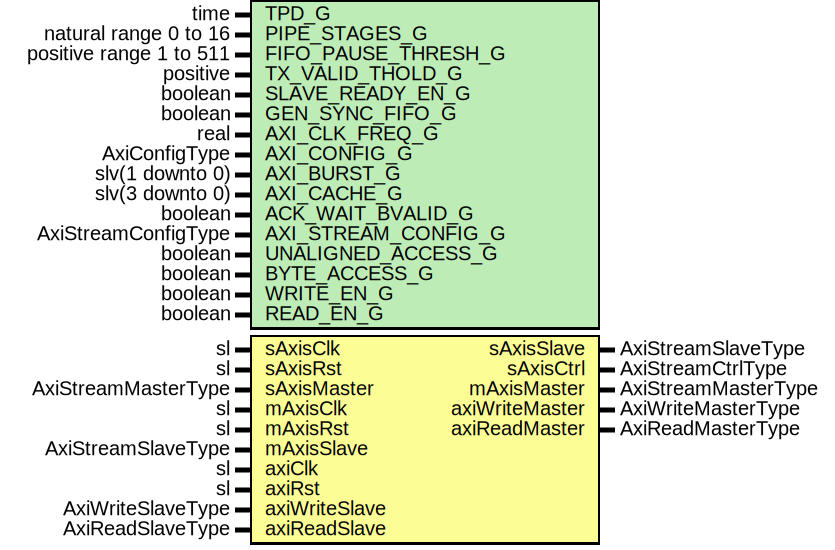

# Entity: SrpV3Axi

## Diagram

## Description

Title      : SRPv3 Protocol: https://confluence.slac.stanford.edu/x/cRmVD
Company    : SLAC National Accelerator Laboratory
Description: SLAC Register Protocol Version 3, AXI Interface
This file is part of 'SLAC Firmware Standard Library'.
It is subject to the license terms in the LICENSE.txt file found in the
top-level directory of this distribution and at:
   https://confluence.slac.stanford.edu/display/ppareg/LICENSE.html.
No part of 'SLAC Firmware Standard Library', including this file,
may be copied, modified, propagated, or distributed except according to
the terms contained in the LICENSE.txt file.
## Generics

| Generic name        | Type                    | Value     | Description       |
| ------------------- | ----------------------- | --------- | ----------------- |
| TPD_G               | time                    | 1 ns      |                   |
| PIPE_STAGES_G       | natural range 0 to 16   | 0         |                   |
| FIFO_PAUSE_THRESH_G | positive range 1 to 511 | 256       |                   |
| TX_VALID_THOLD_G    | positive                | 1         |                   |
| SLAVE_READY_EN_G    | boolean                 | true      |                   |
| GEN_SYNC_FIFO_G     | boolean                 | false     |                   |
| AXI_CLK_FREQ_G      | real                    | 156.25E+6 | units of Hz       |
| AXI_CONFIG_G        | AxiConfigType           |           |                   |
| AXI_BURST_G         | slv(1 downto 0)         | "01"      |                   |
| AXI_CACHE_G         | slv(3 downto 0)         | "1111"    |                   |
| ACK_WAIT_BVALID_G   | boolean                 | true      |                   |
| AXI_STREAM_CONFIG_G | AxiStreamConfigType     |           |                   |
| UNALIGNED_ACCESS_G  | boolean                 | false     |                   |
| BYTE_ACCESS_G       | boolean                 | false     |                   |
| WRITE_EN_G          | boolean                 | true      | Write ops enabled |
| READ_EN_G           | boolean                 | true      |                   |
## Ports

| Port name      | Direction | Type                | Description                             |
| -------------- | --------- | ------------------- | --------------------------------------- |
| sAxisClk       | in        | sl                  | AXIS Slave Interface (sAxisClk domain)  |
| sAxisRst       | in        | sl                  |                                         |
| sAxisMaster    | in        | AxiStreamMasterType |                                         |
| sAxisSlave     | out       | AxiStreamSlaveType  |                                         |
| sAxisCtrl      | out       | AxiStreamCtrlType   |                                         |
| mAxisClk       | in        | sl                  | AXIS Master Interface (mAxisClk domain) |
| mAxisRst       | in        | sl                  |                                         |
| mAxisMaster    | out       | AxiStreamMasterType |                                         |
| mAxisSlave     | in        | AxiStreamSlaveType  |                                         |
| axiClk         | in        | sl                  | Master AXI Interface  (mAxiClk domain)  |
| axiRst         | in        | sl                  |                                         |
| axiWriteMaster | out       | AxiWriteMasterType  |                                         |
| axiWriteSlave  | in        | AxiWriteSlaveType   |                                         |
| axiReadMaster  | out       | AxiReadMasterType   |                                         |
| axiReadSlave   | in        | AxiReadSlaveType    |                                         |
## Signals

| Name        | Type                | Description |
| ----------- | ------------------- | ----------- |
| r           | RegType             |             |
| rin         | RegType             |             |
| srpReq      | SrpV3ReqType        |             |
| wrDmaAck    | AxiWriteDmaAckType  |             |
| rdDmaAck    | AxiReadDmaAckType   |             |
| srpWrMaster | AxiStreamMasterType |             |
| srpWrSlave  | AxiStreamSlaveType  |             |
| srpRdMaster | AxiStreamMasterType |             |
| srpRdSlave  | AxiStreamSlaveType  |             |
## Constants

| Name              | Type                | Value                                                                                                                                                                                                                                                                                                                                                                                                                                                                                                                                                                                                                                                          | Description |
| ----------------- | ------------------- | -------------------------------------------------------------------------------------------------------------------------------------------------------------------------------------------------------------------------------------------------------------------------------------------------------------------------------------------------------------------------------------------------------------------------------------------------------------------------------------------------------------------------------------------------------------------------------------------------------------------------------------------------------------- | ----------- |
| DMA_AXIS_CONFIG_C | AxiStreamConfigType |  (       TSTRB_EN_C    => AXI_STREAM_CONFIG_G.TSTRB_EN_C,        TDATA_BYTES_C => AXI_CONFIG_G.DATA_BYTES_C,   -- Matches the AXI4 DATA width       TDEST_BITS_C  => AXI_STREAM_CONFIG_G.TDEST_BITS_C,        TID_BITS_C    => AXI_STREAM_CONFIG_G.TID_BITS_C,        TKEEP_MODE_C  => AXI_STREAM_CONFIG_G.TKEEP_MODE_C,        TUSER_BITS_C  => AXI_STREAM_CONFIG_G.TUSER_BITS_C,        TUSER_MODE_C  => AXI_STREAM_CONFIG_G.TUSER_MODE_C) |             |
| REG_INIT_C        | RegType             |  (       srpAck   => SRPV3_ACK_INIT_C,        wrDmaReq => AXI_WRITE_DMA_REQ_INIT_C,        rdDmaReq => AXI_READ_DMA_REQ_INIT_C)                                                                                                                                                                                                                                                                                                                                                                                                                                                          |             |
## Types

| Name    | Type | Description |
| ------- | ---- | ----------- |
| RegType |      |             |
## Processes
- comb: ( axiRst, r, rdDmaAck, srpReq, wrDmaAck )
**Description**
[in]

- seq: ( axiClk )
## Instantiations

- U_SrpV3Core_1: surf.SrpV3Core
- U_AxiStreamDmaWrite_1: surf.AxiStreamDmaWrite
**Description**
[out]

- U_AxiStreamDmaRead_1: surf.AxiStreamDmaRead
**Description**
[in]

