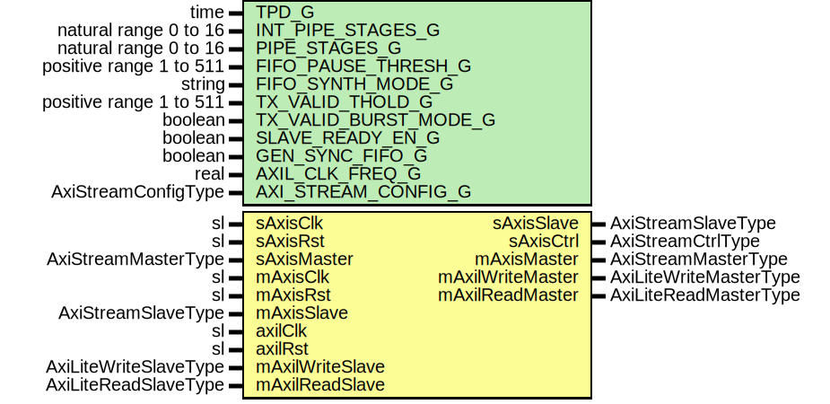

# Entity: SrpV3AxiLite

- **File**: SrpV3AxiLite.vhd
## Diagram

## Description

Title      : SRPv3 Protocol: https://confluence.slac.stanford.edu/x/cRmVD
Company    : SLAC National Accelerator Laboratory
Description: SLAC Register Protocol Version 3, AXI-Lite Interface
Note: This module only supports 32-bit aligned addresses and 32-bit transactions.
      For non 32-bit aligned addresses or non 32-bit transactions, use
      the SrpV3Axi.vhd module with the AxiToAxiLite.vhd bridge
This file is part of 'SLAC Firmware Standard Library'.
It is subject to the license terms in the LICENSE.txt file found in the
top-level directory of this distribution and at:
   https://confluence.slac.stanford.edu/display/ppareg/LICENSE.html.
No part of 'SLAC Firmware Standard Library', including this file,
may be copied, modified, propagated, or distributed except according to
the terms contained in the LICENSE.txt file.
## Generics

| Generic name          | Type                    | Value      | Description                             |
| --------------------- | ----------------------- | ---------- | --------------------------------------- |
| TPD_G                 | time                    | 1 ns       |                                         |
| INT_PIPE_STAGES_G     | natural range 0 to 16   | 1          |                                         |
| PIPE_STAGES_G         | natural range 0 to 16   | 1          |                                         |
| FIFO_PAUSE_THRESH_G   | positive range 1 to 511 | 256        |                                         |
| FIFO_SYNTH_MODE_G     | string                  | "inferred" |                                         |
| TX_VALID_THOLD_G      | positive range 1 to 511 | 500        | >1 = only when frame ready or # entries |
| TX_VALID_BURST_MODE_G | boolean                 | true       | only used in VALID_THOLD_G>1            |
| SLAVE_READY_EN_G      | boolean                 | false      |                                         |
| GEN_SYNC_FIFO_G       | boolean                 | false      |                                         |
| AXIL_CLK_FREQ_G       | real                    | 156.25E+6  | units of Hz                             |
| AXI_STREAM_CONFIG_G   | AxiStreamConfigType     |            |                                         |
## Ports

| Port name        | Direction | Type                   | Description                                |
| ---------------- | --------- | ---------------------- | ------------------------------------------ |
| sAxisClk         | in        | sl                     | AXIS Slave Interface (sAxisClk domain)     |
| sAxisRst         | in        | sl                     |                                            |
| sAxisMaster      | in        | AxiStreamMasterType    |                                            |
| sAxisSlave       | out       | AxiStreamSlaveType     |                                            |
| sAxisCtrl        | out       | AxiStreamCtrlType      |                                            |
| mAxisClk         | in        | sl                     | AXIS Master Interface (mAxisClk domain)    |
| mAxisRst         | in        | sl                     |                                            |
| mAxisMaster      | out       | AxiStreamMasterType    |                                            |
| mAxisSlave       | in        | AxiStreamSlaveType     |                                            |
| axilClk          | in        | sl                     | Master AXI-Lite Interface (axilClk domain) |
| axilRst          | in        | sl                     |                                            |
| mAxilWriteMaster | out       | AxiLiteWriteMasterType |                                            |
| mAxilWriteSlave  | in        | AxiLiteWriteSlaveType  |                                            |
| mAxilReadMaster  | out       | AxiLiteReadMasterType  |                                            |
| mAxilReadSlave   | in        | AxiLiteReadSlaveType   |                                            |
## Signals

| Name         | Type                | Description |
| ------------ | ------------------- | ----------- |
| r            | RegType             |             |
| rin          | RegType             |             |
| axisMaster   | AxiStreamMasterType |             |
| axisSlave    | AxiStreamSlaveType  |             |
| sCtrl        | AxiStreamCtrlType   |             |
| rxMaster     | AxiStreamMasterType |             |
| rxSlave      | AxiStreamSlaveType  |             |
| rxCtrl       | AxiStreamCtrlType   |             |
| rxTLastTUser | slv(7 downto 0)     |             |
| txSlave      | AxiStreamSlaveType  |             |
| rst          | sl                  |             |
| sRst         | sl                  |             |
| rxRst        | sl                  |             |
## Constants

| Name               | Type                | Value                                                                                                                                                                                                                                                                                                                                                                                                                                                                                                                                                                                                                                                                                                                                                                                                                                                                                                                                                                                                                                                                                                                                                                                                                                                                                                                                                                                                                                                                                                                                                                                                                                                                                                                                                                                                                                                                                                                                                                                                                                                                                                                                                                     | Description    |
| ------------------ | ------------------- | ------------------------------------------------------------------------------------------------------------------------------------------------------------------------------------------------------------------------------------------------------------------------------------------------------------------------------------------------------------------------------------------------------------------------------------------------------------------------------------------------------------------------------------------------------------------------------------------------------------------------------------------------------------------------------------------------------------------------------------------------------------------------------------------------------------------------------------------------------------------------------------------------------------------------------------------------------------------------------------------------------------------------------------------------------------------------------------------------------------------------------------------------------------------------------------------------------------------------------------------------------------------------------------------------------------------------------------------------------------------------------------------------------------------------------------------------------------------------------------------------------------------------------------------------------------------------------------------------------------------------------------------------------------------------------------------------------------------------------------------------------------------------------------------------------------------------------------------------------------------------------------------------------------------------------------------------------------------------------------------------------------------------------------------------------------------------------------------------------------------------------------------------------------------------- | -------------- |
| AXIS_CONFIG_C      | AxiStreamConfigType |  ssiAxiStreamConfig(4,  TKEEP_COMP_C,  TUSER_FIRST_LAST_C,  8)                                                                                                                                                                                                                                                                                                                                                                                                                                                                                                                                                                                                                                                                                                                                                                                                                                                                                                                                                                                                                                                                                                                                                                                                                                                                                                                                                                                                                                                                                                                                                                                                                                                                                                                                                                                                                                                                                                                                                                                                   |                |
| TIMEOUT_C          | natural             |  (getTimeRatio(AXIL_CLK_FREQ_G,  10.0) - 1)                                                                                                                                                                                                                                                                                                                                                                                                                                                                                                                                                                                                                                                                                                                                                                                                                                                                                                                                                                                                                                                                                                                                                                                                                                                                                                                                                                                                                                                                                                                                                                                                                                                                                                                                                                                                                                                                                                                                                                                                                                                                                            | 100 ms timeout |
| SRP_VERSION_C      | slv(7 downto 0)     |  x"03"                                                                                                                                                                                                                                                                                                                                                                                                                                                                                                                                                                                                                                                                                                                                                                                                                                                                                                                                                                                                                                                                                                                                                                                                                                                                                                                                                                                                                                                                                                                                                                                                                                                                                                                                                                                                                                                                                                                                                                                                                                                                                                                                                                    |                |
| NON_POSTED_READ_C  | slv(1 downto 0)     |  "00"                                                                                                                                                                                                                                                                                                                                                                                                                                                                                                                                                                                                                                                                                                                                                                                                                                                                                                                                                                                                                                                                                                                                                                                                                                                                                                                                                                                                                                                                                                                                                                                                                                                                                                                                                                                                                                                                                                                                                                                                                                                                                                                                                                     |                |
| NON_POSTED_WRITE_C | slv(1 downto 0)     |  "01"                                                                                                                                                                                                                                                                                                                                                                                                                                                                                                                                                                                                                                                                                                                                                                                                                                                                                                                                                                                                                                                                                                                                                                                                                                                                                                                                                                                                                                                                                                                                                                                                                                                                                                                                                                                                                                                                                                                                                                                                                                                                                                                                                                     |                |
| POSTED_WRITE_C     | slv(1 downto 0)     |  "10"                                                                                                                                                                                                                                                                                                                                                                                                                                                                                                                                                                                                                                                                                                                                                                                                                                                                                                                                                                                                                                                                                                                                                                                                                                                                                                                                                                                                                                                                                                                                                                                                                                                                                                                                                                                                                                                                                                                                                                                                                                                                                                                                                                     |                |
| NULL_C             | slv(1 downto 0)     |  "11"                                                                                                                                                                                                                                                                                                                                                                                                                                                                                                                                                                                                                                                                                                                                                                                                                                                                                                                                                                                                                                                                                                                                                                                                                                                                                                                                                                                                                                                                                                                                                                                                                                                                                                                                                                                                                                                                                                                                                                                                                                                                                                                                                                     |                |
| REG_INIT_C         | RegType             |  (       timer            => 0,        hdrCnt           => (others => '0'),        remVer           => (others => '0'),        opCode           => (others => '0'),        prot             => (others => '0'),        timeoutSize      => (others => '0'),        timeoutCnt       => (others => '0'),        tid              => (others => '0'),        tidDly           => (others => '1'),        addr             => (others => '0'),        reqSize          => (others => '0'),        cnt              => (others => '0'),        cntSize          => (others => '0'),        memResp          => (others => '0'),        timeout          => '0',        eofe             => '0',        frameError       => '0',        verMismatch      => '0',        reqSizeError     => '0',        ignoreMemResp    => '0',        rxRst            => '0',        overflowDet      => '0',        skip             => '0',        mAxilWriteMaster => AXI_LITE_WRITE_MASTER_INIT_C,        mAxilReadMaster  => AXI_LITE_READ_MASTER_INIT_C,        rxSlave          => AXI_STREAM_SLAVE_INIT_C,        txMaster         => AXI_STREAM_MASTER_INIT_C,        state            => IDLE_S) |                |
## Types

| Name      | Type                                                                                                                                                                                                                                                                                                                                                                                                                                                                                                                   | Description |
| --------- | ---------------------------------------------------------------------------------------------------------------------------------------------------------------------------------------------------------------------------------------------------------------------------------------------------------------------------------------------------------------------------------------------------------------------------------------------------------------------------------------------------------------------- | ----------- |
| StateType | ( IDLE_S,  HDR_REQ0_S,  HDR_REQ1_S,  HDR_REQ2_S,  HDR_REQ3_S,  HDR_RESP_S,  FOOTER_S,  AXIL_RD_REQ_S,  AXIL_RD_RESP_S,  AXIL_WR_REQ_S,  AXIL_WR_RESP_S)  |             |
| RegType   |                                                                                                                                                                                                                                                                                                                                                                                                                                                                                                                        |             |
## Processes
- comb: ( axilRst, mAxilReadSlave, mAxilWriteSlave, r, rxCtrl,
                   rxMaster, rxTLastTUser, txSlave )
- seq: ( axilClk )
## Instantiations

- U_Limiter: surf.SsiFrameLimiter
- RX_FIFO: surf.AxiStreamFifoV2
- TX_FIFO: surf.AxiStreamFifoV2
