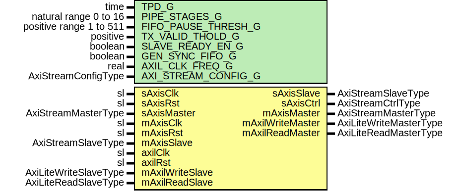

# Entity: SrpV3AxiLiteFull

## Diagram

## Description

Title      : SRPv3 Protocol: https://confluence.slac.stanford.edu/x/cRmVD
Company    : SLAC National Accelerator Laboratory
Description: SLAC Register Protocol Version 3, AXI-Lite Interface
This file is part of 'SLAC Firmware Standard Library'.
It is subject to the license terms in the LICENSE.txt file found in the
top-level directory of this distribution and at:
   https://confluence.slac.stanford.edu/display/ppareg/LICENSE.html.
No part of 'SLAC Firmware Standard Library', including this file,
may be copied, modified, propagated, or distributed except according to
the terms contained in the LICENSE.txt file.
## Generics

| Generic name        | Type                    | Value     | Description |
| ------------------- | ----------------------- | --------- | ----------- |
| TPD_G               | time                    | 1 ns      |             |
| PIPE_STAGES_G       | natural range 0 to 16   | 0         |             |
| FIFO_PAUSE_THRESH_G | positive range 1 to 511 | 256       |             |
| TX_VALID_THOLD_G    | positive                | 1         |             |
| SLAVE_READY_EN_G    | boolean                 | false     |             |
| GEN_SYNC_FIFO_G     | boolean                 | false     |             |
| AXIL_CLK_FREQ_G     | real                    | 156.25E+6 | units of Hz |
| AXI_STREAM_CONFIG_G | AxiStreamConfigType     |           |             |
## Ports

| Port name        | Direction | Type                   | Description                                |
| ---------------- | --------- | ---------------------- | ------------------------------------------ |
| sAxisClk         | in        | sl                     | AXIS Slave Interface (sAxisClk domain)     |
| sAxisRst         | in        | sl                     |                                            |
| sAxisMaster      | in        | AxiStreamMasterType    |                                            |
| sAxisSlave       | out       | AxiStreamSlaveType     |                                            |
| sAxisCtrl        | out       | AxiStreamCtrlType      |                                            |
| mAxisClk         | in        | sl                     | AXIS Master Interface (mAxisClk domain)    |
| mAxisRst         | in        | sl                     |                                            |
| mAxisMaster      | out       | AxiStreamMasterType    |                                            |
| mAxisSlave       | in        | AxiStreamSlaveType     |                                            |
| axilClk          | in        | sl                     | Master AXI-Lite Interface (axilClk domain) |
| axilRst          | in        | sl                     |                                            |
| mAxilWriteMaster | out       | AxiLiteWriteMasterType |                                            |
| mAxilWriteSlave  | in        | AxiLiteWriteSlaveType  |                                            |
| mAxilReadMaster  | out       | AxiLiteReadMasterType  |                                            |
| mAxilReadSlave   | in        | AxiLiteReadSlaveType   |                                            |
## Signals

| Name           | Type               | Description |
| -------------- | ------------------ | ----------- |
| axiReadMaster  | AxiReadMasterType  |             |
| axiReadSlave   | AxiReadSlaveType   |             |
| axiWriteMaster | AxiWriteMasterType |             |
| axiWriteSlave  | AxiWriteSlaveType  |             |
## Instantiations

- U_SrpV3Axi_1: surf.SrpV3Axi
- U_AxiToAxiLite_1: surf.AxiToAxiLite
**Description**
[in]

