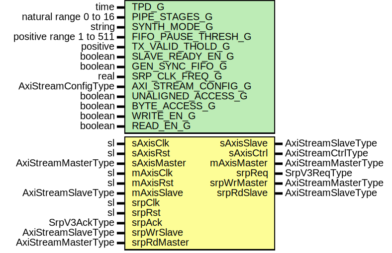

# Entity: SrpV3Core

- **File**: SrpV3Core.vhd
## Diagram

## Description

-----------------------------------------------------------------------------
 Title      : SRPv3 Protocol: https://confluence.slac.stanford.edu/x/cRmVD
-----------------------------------------------------------------------------
 Company    : SLAC National Accelerator Laboratory
-----------------------------------------------------------------------------
 Description: SLAC Register Protocol Version 3, Core FSM Logic
-----------------------------------------------------------------------------
 This file is part of 'SLAC Firmware Standard Library'.
 It is subject to the license terms in the LICENSE.txt file found in the
 top-level directory of this distribution and at:
    https://confluence.slac.stanford.edu/display/ppareg/LICENSE.html.
 No part of 'SLAC Firmware Standard Library', including this file,
 may be copied, modified, propagated, or distributed except according to
 the terms contained in the LICENSE.txt file.
-----------------------------------------------------------------------------
## Generics

| Generic name        | Type                    | Value      | Description        |
| ------------------- | ----------------------- | ---------- | ------------------ |
| TPD_G               | time                    | 1 ns       |                    |
| PIPE_STAGES_G       | natural range 0 to 16   | 1          |                    |
| SYNTH_MODE_G        | string                  | "inferred" |                    |
| FIFO_PAUSE_THRESH_G | positive range 1 to 511 | 256        |                    |
| TX_VALID_THOLD_G    | positive                | 1          |                    |
| SLAVE_READY_EN_G    | boolean                 | false      |                    |
| GEN_SYNC_FIFO_G     | boolean                 | false      |                    |
| SRP_CLK_FREQ_G      | real                    | 156.25E+6  |  units of Hz       |
| AXI_STREAM_CONFIG_G | AxiStreamConfigType     |            |                    |
| UNALIGNED_ACCESS_G  | boolean                 | false      |                    |
| BYTE_ACCESS_G       | boolean                 | false      |                    |
| WRITE_EN_G          | boolean                 | true       |  Write ops enabled |
| READ_EN_G           | boolean                 | true       |  Read ops enabled  |
## Ports

| Port name   | Direction | Type                | Description                                |
| ----------- | --------- | ------------------- | ------------------------------------------ |
| sAxisClk    | in        | sl                  | AXIS Slave Interface (sAxisClk domain)     |
| sAxisRst    | in        | sl                  |                                            |
| sAxisMaster | in        | AxiStreamMasterType |                                            |
| sAxisSlave  | out       | AxiStreamSlaveType  |                                            |
| sAxisCtrl   | out       | AxiStreamCtrlType   |                                            |
| mAxisClk    | in        | sl                  | AXIS Master Interface (mAxisClk domain)    |
| mAxisRst    | in        | sl                  |                                            |
| mAxisMaster | out       | AxiStreamMasterType |                                            |
| mAxisSlave  | in        | AxiStreamSlaveType  |                                            |
| srpClk      | in        | sl                  | Master AXI-Lite Interface (axilClk domain) |
| srpRst      | in        | sl                  |                                            |
| srpReq      | out       | SrpV3ReqType        |                                            |
| srpAck      | in        | SrpV3AckType        |                                            |
| srpWrMaster | out       | AxiStreamMasterType |                                            |
| srpWrSlave  | in        | AxiStreamSlaveType  |                                            |
| srpRdMaster | in        | AxiStreamMasterType |                                            |
| srpRdSlave  | out       | AxiStreamSlaveType  |                                            |
## Signals

| Name           | Type                | Description |
| -------------- | ------------------- | ----------- |
| r              | RegType             |             |
| rin            | RegType             |             |
| sCtrl          | AxiStreamCtrlType   |             |
| rxMaster       | AxiStreamMasterType |             |
| rxSlave        | AxiStreamSlaveType  |             |
| rxCtrl         | AxiStreamCtrlType   |             |
| txSlave        | AxiStreamSlaveType  |             |
| srpRdMasterInt | AxiStreamMasterType |             |
| srpRdSlaveInt  | AxiStreamSlaveType  |             |
| srpWrMasterInt | AxiStreamMasterType |             |
| srpWrSlaveInt  | AxiStreamSlaveType  |             |
## Constants

| Name              | Type                | Value                                                                                                                                                                                                                                                                                                                                                                                                                                                                                                                                                                                                                                                                                                                                                                                                                                                                                                                                                                                                                                                                                                                                                                                                                                                                                                                          | Description     |
| ----------------- | ------------------- | ------------------------------------------------------------------------------------------------------------------------------------------------------------------------------------------------------------------------------------------------------------------------------------------------------------------------------------------------------------------------------------------------------------------------------------------------------------------------------------------------------------------------------------------------------------------------------------------------------------------------------------------------------------------------------------------------------------------------------------------------------------------------------------------------------------------------------------------------------------------------------------------------------------------------------------------------------------------------------------------------------------------------------------------------------------------------------------------------------------------------------------------------------------------------------------------------------------------------------------------------------------------------------------------------------------------------------ | --------------- |
| TIMEOUT_C         | natural             |  (getTimeRatio(SRP_CLK_FREQ_G,  10.0) - 1)                                                                                                                                                                                                                                                                                                                                                                                                                                                                                                                                                                                                                                                                                                                                                                                                                                                                                                                                                                                                                                                                                                                                                                                                                                                  |  100 ms timeout |
| SRP_AXIS_CONFIG_C | AxiStreamConfigType |  (       TSTRB_EN_C    => false,        TDATA_BYTES_C => 4,        TDEST_BITS_C  => AXI_STREAM_CONFIG_G.TDEST_BITS_C,        TID_BITS_C    => AXI_STREAM_CONFIG_G.TID_BITS_C,        TKEEP_MODE_C  => TKEEP_COMP_C,        TUSER_BITS_C  => 2,        TUSER_MODE_C  => TUSER_FIRST_LAST_C)                                                                                                                                                                                                                                                                                                                                                                                                                                                                                                                                                                                                                                                                                                                                                                                                                   |                 |
| REG_INIT_C        | RegType             |  (       timer       => 0,        hdrCnt      => (others => '0'),        remVer      => (others => '0'),        timeoutSize => (others => '0'),        timeoutCnt  => (others => '0'),        txnCnt      => (others => '0'),        memResp     => (others => '0'),        timeout     => '0',        eofe        => '0',        frameError  => '0',        verMismatch => '0',        reqError    => '0',        rxSlave     => AXI_STREAM_SLAVE_INIT_C,        txMaster    => axiStreamMasterInit(SRP_AXIS_CONFIG_C),        state       => IDLE_S,        srpReq      => SRPV3_REQ_INIT_C,        srpWrMaster => axiStreamMasterInit(SRP_AXIS_CONFIG_C),        srpRdSlave  => AXI_STREAM_SLAVE_INIT_C) |                 |
## Types

| Name      | Type                                                                                                                                                                                                                                                                                                                                                                                                        | Description |
| --------- | ----------------------------------------------------------------------------------------------------------------------------------------------------------------------------------------------------------------------------------------------------------------------------------------------------------------------------------------------------------------------------------------------------------- | ----------- |
| StateType | ( IDLE_S,  BLOWOFF_RX_S,  BLOWOFF_READ_DATA_S,  HDR_REQ_S,  HDR_RESP_S,  READ_S,  WRITE_S,  WAIT_ACK_S,  FOOTER_S)  |             |
| RegType   |                                                                                                                                                                                                                                                                                                                                                                                                             |             |
## Processes
- comb: ( r, rxCtrl, rxMaster, srpAck, srpRdMasterInt, srpRst, srpWrSlaveInt, txSlave )
- seq: ( srpClk )
## Instantiations

- RX_FIFO: surf.SsiFifo
- TX_FIFO: surf.AxiStreamFifoV2
- U_Rx: surf.AxiStreamResize
- U_Tx: surf.AxiStreamResize
