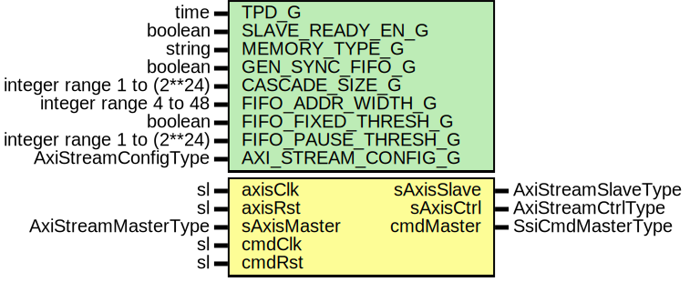

# Entity: SsiCmdMaster

- **File**: SsiCmdMaster.vhd
## Diagram

## Description

Title      : SSI Protocol: https://confluence.slac.stanford.edu/x/0oyfD
Company    : SLAC National Accelerator Laboratory
Description:
Block for Command protocol over the VC.
The receive packet is 4 x 32-bits.
Word 0 Data[1:0]   = VC        (unused, legacy)
Word 0 Data[7:2]   = Dest_ID   (unused, legacy)
Word 0 Data[31:8]  = CmdCtx[31:0] (unused, legacy)
Word 1 Data[7:0]   = OpCode[7:0]
Word 1 Data[31:8]  = Don't Care
Word 2             = Don't Care
Word 3             = Don't Care
This file is part of 'SLAC Firmware Standard Library'.
It is subject to the license terms in the LICENSE.txt file found in the
top-level directory of this distribution and at:
   https://confluence.slac.stanford.edu/display/ppareg/LICENSE.html.
No part of 'SLAC Firmware Standard Library', including this file,
may be copied, modified, propagated, or distributed except according to
the terms contained in the LICENSE.txt file.
## Generics

| Generic name        | Type                       | Value         | Description               |
| ------------------- | -------------------------- | ------------- | ------------------------- |
| TPD_G               | time                       | 1 ns          |                           |
| SLAVE_READY_EN_G    | boolean                    | false         | AXI Stream FIFO Config    |
| MEMORY_TYPE_G       | string                     | "distributed" |                           |
| GEN_SYNC_FIFO_G     | boolean                    | false         |                           |
| CASCADE_SIZE_G      | integer range 1 to (2**24) | 1             |                           |
| FIFO_ADDR_WIDTH_G   | integer range 4 to 48      | 5             |                           |
| FIFO_FIXED_THRESH_G | boolean                    | true          |                           |
| FIFO_PAUSE_THRESH_G | integer range 1 to (2**24) | 8             |                           |
| AXI_STREAM_CONFIG_G | AxiStreamConfigType        |               | AXI Stream Configuration  |
## Ports

| Port name   | Direction | Type                | Description              |
| ----------- | --------- | ------------------- | ------------------------ |
| axisClk     | in        | sl                  | Streaming Data Interface |
| axisRst     | in        | sl                  |                          |
| sAxisMaster | in        | AxiStreamMasterType |                          |
| sAxisSlave  | out       | AxiStreamSlaveType  |                          |
| sAxisCtrl   | out       | AxiStreamCtrlType   |                          |
| cmdClk      | in        | sl                  | Command signals          |
| cmdRst      | in        | sl                  |                          |
| cmdMaster   | out       | SsiCmdMasterType    |                          |
## Signals

| Name           | Type                | Description |
| -------------- | ------------------- | ----------- |
| fifoAxisMaster | AxiStreamMasterType |             |
| fifoAxisSlave  | AxiStreamSlaveType  |             |
| r              | RegType             |             |
| rin            | RegType             |             |
## Constants

| Name         | Type                | Value                                                                                                                       | Description |
| ------------ | ------------------- | --------------------------------------------------------------------------------------------------------------------------- | ----------- |
| REG_INIT_C   | RegType             |  (       txnNumber => (others => '0'),        cmdMaster => SSI_CMD_MASTER_INIT_C       ) |             |
| INT_CONFIG_C | AxiStreamConfigType |  ssiAxiStreamConfig(4)                                                                                                      |             |
## Types

| Name      | Type                                                                                             | Description |
| --------- | ------------------------------------------------------------------------------------------------ | ----------- |
| StateType | (IDLE_S,  CMD_S,  DUMP_S)  |             |
| RegType   |                                                                                                  |             |
## Processes
- comb: ( cmdRst, fifoAxisMaster, r )
- seq: ( cmdClk )
## Instantiations

- SlaveAxiStreamFifo: surf.AxiStreamFifoV2
