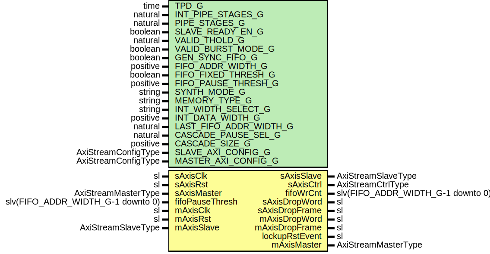

# Entity: SsiFifo

- **File**: SsiFifo.vhd
## Diagram

## Description

Title      : SSI Protocol: https://confluence.slac.stanford.edu/x/0oyfD
Company    : SLAC National Accelerator Laboratory
Description: Wrapper on the AxiStreamFifoV2 + inbound/outbound filters
             The filters remove all malformed SSI frames from being sent
             on the master AXI stream port.
Note: This module does NOT support interleaved tDEST
This file is part of 'SLAC Firmware Standard Library'.
It is subject to the license terms in the LICENSE.txt file found in the
top-level directory of this distribution and at:
   https://confluence.slac.stanford.edu/display/ppareg/LICENSE.html.
No part of 'SLAC Firmware Standard Library', including this file,
may be copied, modified, propagated, or distributed except according to
the terms contained in the LICENSE.txt file.
## Generics

| Generic name           | Type                | Value      | Description                                                                                                                                                                                                                    |
| ---------------------- | ------------------- | ---------- | ------------------------------------------------------------------------------------------------------------------------------------------------------------------------------------------------------------------------------ |
| TPD_G                  | time                | 1 ns       | General Configurations                                                                                                                                                                                                         |
| INT_PIPE_STAGES_G      | natural             | 0          | Internal FIFO setting                                                                                                                                                                                                          |
| PIPE_STAGES_G          | natural             | 1          |                                                                                                                                                                                                                                |
| SLAVE_READY_EN_G       | boolean             | true       |                                                                                                                                                                                                                                |
| VALID_THOLD_G          | natural             | 1          | Valid threshold should always be 1 when using interleaved TDEST       =1 = normal operation       =0 = only when frame ready       >1 = only when frame ready or # entries                                                     |
| VALID_BURST_MODE_G     | boolean             | false      | only used in VALID_THOLD_G>1                                                                                                                                                                                                   |
| GEN_SYNC_FIFO_G        | boolean             | false      | FIFO configurations                                                                                                                                                                                                            |
| FIFO_ADDR_WIDTH_G      | positive            | 9          |                                                                                                                                                                                                                                |
| FIFO_FIXED_THRESH_G    | boolean             | true       |                                                                                                                                                                                                                                |
| FIFO_PAUSE_THRESH_G    | positive            | 1          |                                                                                                                                                                                                                                |
| SYNTH_MODE_G           | string              | "inferred" |                                                                                                                                                                                                                                |
| MEMORY_TYPE_G          | string              | "block"    |                                                                                                                                                                                                                                |
| INT_WIDTH_SELECT_G     | string              | "WIDE"     | Internal FIFO width select, "WIDE", "NARROW" or "CUSTOM" WIDE uses wider of slave / master. NARROW  uses narrower. CUSOTM uses passed FIFO_DATA_WIDTH_G                                                                        |
| INT_DATA_WIDTH_G       | positive            | 16         |                                                                                                                                                                                                                                |
| LAST_FIFO_ADDR_WIDTH_G | natural             | 0          | If VALID_THOLD_G /=1, FIFO that stores on tLast transaction can be smaller.       Set to 0 for same size as primary FIFO (default)       Set >4 for custom size.       Use at own risk. Overflow of tLast FIFO is not checked  |
| CASCADE_PAUSE_SEL_G    | natural             | 0          | Index = 0 is output, index = n is input                                                                                                                                                                                        |
| CASCADE_SIZE_G         | positive            | 1          |                                                                                                                                                                                                                                |
| SLAVE_AXI_CONFIG_G     | AxiStreamConfigType |            | AXI Stream Port Configurations                                                                                                                                                                                                 |
| MASTER_AXI_CONFIG_G    | AxiStreamConfigType |            |                                                                                                                                                                                                                                |
## Ports

| Port name       | Direction | Type                              | Description                            |
| --------------- | --------- | --------------------------------- | -------------------------------------- |
| sAxisClk        | in        | sl                                | Slave Interface (sAxisClk domain)      |
| sAxisRst        | in        | sl                                |                                        |
| sAxisMaster     | in        | AxiStreamMasterType               |                                        |
| sAxisSlave      | out       | AxiStreamSlaveType                |                                        |
| sAxisCtrl       | out       | AxiStreamCtrlType                 |                                        |
| fifoPauseThresh | in        | slv(FIFO_ADDR_WIDTH_G-1 downto 0) | FIFO status & config (sAxisClk domain) |
| fifoWrCnt       | out       | slv(FIFO_ADDR_WIDTH_G-1 downto 0) |                                        |
| sAxisDropWord   | out       | sl                                |                                        |
| sAxisDropFrame  | out       | sl                                |                                        |
| mAxisDropWord   | out       | sl                                |                                        |
| mAxisDropFrame  | out       | sl                                |                                        |
| lockupRstEvent  | out       | sl                                |                                        |
| mAxisClk        | in        | sl                                | Master Interface (mAxisClk domain)     |
| mAxisRst        | in        | sl                                |                                        |
| mAxisMaster     | out       | AxiStreamMasterType               |                                        |
| mAxisSlave      | in        | AxiStreamSlaveType                |                                        |
## Signals

| Name         | Type                | Description |
| ------------ | ------------------- | ----------- |
| r            | RegType             |             |
| rin          | RegType             |             |
| rxMaster     | AxiStreamMasterType |             |
| rxSlave      | AxiStreamSlaveType  |             |
| rxCtrl       | AxiStreamCtrlType   |             |
| txMaster     | AxiStreamMasterType |             |
| txSlave      | AxiStreamSlaveType  |             |
| txTLastTUser | slv(7 downto 0)     |             |
| obAxisMaster | AxiStreamMasterType |             |
| obAxisSlave  | AxiStreamSlaveType  |             |
| fifoFull     | sl                  |             |
| fifoRst      | sl                  |             |
## Constants

| Name       | Type    | Value                                                                                                                                            | Description |
| ---------- | ------- | ------------------------------------------------------------------------------------------------------------------------------------------------ | ----------- |
| REG_INIT_C | RegType |  (       fifoRst => '0',        cnt     => x"0",        state   => WAIT_S) |             |
## Types

| Name      | Type                                                  | Description |
| --------- | ----------------------------------------------------- | ----------- |
| StateType | ( WAIT_S,  MON_S)  |             |
| RegType   |                                                       |             |
## Instantiations

- U_IbFilter: surf.SsiIbFrameFilter
**Description**
Inbound FIFO Filter

- U_Fifo: surf.AxiStreamFifoV2
**Description**
AXI Stream FIFO

- U_ObFilter: surf.SsiObFrameFilter
**Description**
Outbound FIFO Filter

