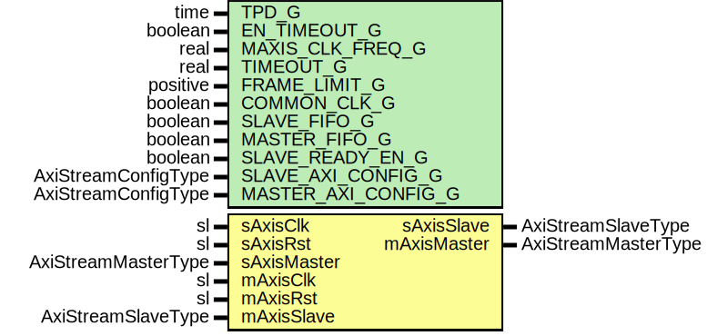

# Entity: SsiFrameLimiter

## Diagram

## Description

Title      : SSI Protocol: https://confluence.slac.stanford.edu/x/0oyfD
Company    : SLAC National Accelerator Laboratory
Description: Limits the amount of data being sent across a SSI AXIS bus
This file is part of 'SLAC Firmware Standard Library'.
It is subject to the license terms in the LICENSE.txt file found in the
top-level directory of this distribution and at:
   https://confluence.slac.stanford.edu/display/ppareg/LICENSE.html.
No part of 'SLAC Firmware Standard Library', including this file,
may be copied, modified, propagated, or distributed except according to
the terms contained in the LICENSE.txt file.
## Generics

| Generic name        | Type                | Value      | Description                                      |
| ------------------- | ------------------- | ---------- | ------------------------------------------------ |
| TPD_G               | time                | 1 ns       |                                                  |
| EN_TIMEOUT_G        | boolean             | true       |                                                  |
| MAXIS_CLK_FREQ_G    | real                | 156.25E+06 | In units of Hz                                   |
| TIMEOUT_G           | real                | 1.0E-3     | In units of seconds                              |
| FRAME_LIMIT_G       | positive            | 1024       | In units of MASTER_AXI_CONFIG_G.TDATA_BYTES_C    |
| COMMON_CLK_G        | boolean             | false      | True if sAxisClk and mAxisClk are the same clock |
| SLAVE_FIFO_G        | boolean             | false      |                                                  |
| MASTER_FIFO_G       | boolean             | false      |                                                  |
| SLAVE_READY_EN_G    | boolean             | true       |                                                  |
| SLAVE_AXI_CONFIG_G  | AxiStreamConfigType |            |                                                  |
| MASTER_AXI_CONFIG_G | AxiStreamConfigType |            |                                                  |
## Ports

| Port name   | Direction | Type                | Description |
| ----------- | --------- | ------------------- | ----------- |
| sAxisClk    | in        | sl                  | Slave Port  |
| sAxisRst    | in        | sl                  |             |
| sAxisMaster | in        | AxiStreamMasterType |             |
| sAxisSlave  | out       | AxiStreamSlaveType  |             |
| mAxisClk    | in        | sl                  | Master Port |
| mAxisRst    | in        | sl                  |             |
| mAxisMaster | out       | AxiStreamMasterType |             |
| mAxisSlave  | in        | AxiStreamSlaveType  |             |
## Signals

| Name     | Type                | Description |
| -------- | ------------------- | ----------- |
| r        | RegType             |             |
| rin      | RegType             |             |
| rxMaster | AxiStreamMasterType |             |
| rxSlave  | AxiStreamSlaveType  |             |
| txMaster | AxiStreamMasterType |             |
| txSlave  | AxiStreamSlaveType  |             |
## Constants

| Name         | Type    | Value                                                                                                                                                                                                                                                                                                         | Description |
| ------------ | ------- | ------------------------------------------------------------------------------------------------------------------------------------------------------------------------------------------------------------------------------------------------------------------------------------------------------------- | ----------- |
| TIMEOUT_C    | natural |  getTimeRatio(MAXIS_CLK_FREQ_G * TIMEOUT_G,  1.0)                                                                                                                                                                                                                          |             |
| SLAVE_FIFO_C | boolean |  ite ( SLAVE_FIFO_G or (COMMON_CLK_G=false) or (SLAVE_READY_EN_G = false),  true,  false)                                                                                                                                               |             |
| REG_INIT_C   | RegType |  (       cnt      => 0,        timer    => 0,        rxSlave  => AXI_STREAM_SLAVE_INIT_C,        txMaster => AXI_STREAM_MASTER_INIT_C,        state    => IDLE_S) |             |
## Types

| Name      | Type                                                   | Description |
| --------- | ------------------------------------------------------ | ----------- |
| StateType | ( IDLE_S,  MOVE_S)  |             |
| RegType   |                                                        |             |
## Processes
- comb: ( mAxisRst, r, rxMaster, txSlave )
- seq: ( mAxisClk )
