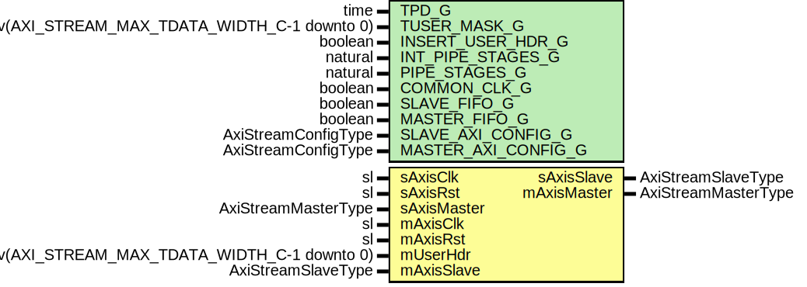

# Entity: SsiInsertSof

- **File**: SsiInsertSof.vhd
## Diagram

## Description

Title      : SSI Protocol: https://confluence.slac.stanford.edu/x/0oyfD
Company    : SLAC National Accelerator Laboratory
Description: Inserts the SOF for converting a generic AXIS into a SSI bus
This file is part of 'SLAC Firmware Standard Library'.
It is subject to the license terms in the LICENSE.txt file found in the
top-level directory of this distribution and at:
   https://confluence.slac.stanford.edu/display/ppareg/LICENSE.html.
No part of 'SLAC Firmware Standard Library', including this file,
may be copied, modified, propagated, or distributed except according to
the terms contained in the LICENSE.txt file.
## Generics

| Generic name        | Type                                         | Value           | Description                                                                |
| ------------------- | -------------------------------------------- | --------------- | -------------------------------------------------------------------------- |
| TPD_G               | time                                         | 1 ns            | General Configurations                                                     |
| TUSER_MASK_G        | slv(AXI_STREAM_MAX_TDATA_WIDTH_C-1 downto 0) | (others => '1') | '1' = masked off bit                                                       |
| INSERT_USER_HDR_G   | boolean                                      | false           | If True the module adds one user header word (mUserHdr = user header data) |
| INT_PIPE_STAGES_G   | natural                                      | 0               | FIFO configurations                                                        |
| PIPE_STAGES_G       | natural                                      | 1               |                                                                            |
| COMMON_CLK_G        | boolean                                      | false           | True if sAxisClk and mAxisClk are the same clock                           |
| SLAVE_FIFO_G        | boolean                                      | true            |                                                                            |
| MASTER_FIFO_G       | boolean                                      | true            |                                                                            |
| SLAVE_AXI_CONFIG_G  | AxiStreamConfigType                          |                 | AXI Stream Port Configurations                                             |
| MASTER_AXI_CONFIG_G | AxiStreamConfigType                          |                 |                                                                            |
## Ports

| Port name   | Direction | Type                                         | Description |
| ----------- | --------- | -------------------------------------------- | ----------- |
| sAxisClk    | in        | sl                                           | Slave Port  |
| sAxisRst    | in        | sl                                           |             |
| sAxisMaster | in        | AxiStreamMasterType                          |             |
| sAxisSlave  | out       | AxiStreamSlaveType                           |             |
| mAxisClk    | in        | sl                                           | Master Port |
| mAxisRst    | in        | sl                                           |             |
| mUserHdr    | in        | slv(AXI_STREAM_MAX_TDATA_WIDTH_C-1 downto 0) |             |
| mAxisMaster | out       | AxiStreamMasterType                          |             |
| mAxisSlave  | in        | AxiStreamSlaveType                           |             |
## Signals

| Name     | Type                | Description |
| -------- | ------------------- | ----------- |
| r        | RegType             |             |
| rin      | RegType             |             |
| rxMaster | AxiStreamMasterType |             |
| rxSlave  | AxiStreamSlaveType  |             |
| txMaster | AxiStreamMasterType |             |
| txSlave  | AxiStreamSlaveType  |             |
## Constants

| Name       | Type    | Value                                                                                                                                                                                       | Description |
| ---------- | ------- | ------------------------------------------------------------------------------------------------------------------------------------------------------------------------------------------- | ----------- |
| REG_INIT_C | RegType |  (       rxSlave  => AXI_STREAM_SLAVE_INIT_C,        txMaster => AXI_STREAM_MASTER_INIT_C,        state    => IDLE_S) |             |
## Types

| Name      | Type                                                   | Description |
| --------- | ------------------------------------------------------ | ----------- |
| StateType | ( IDLE_S,  MOVE_S)  |             |
| RegType   |                                                        |             |
## Processes
- comb: ( mAxisRst, mUserHdr, r, rxMaster, txSlave )
- seq: ( mAxisClk )
