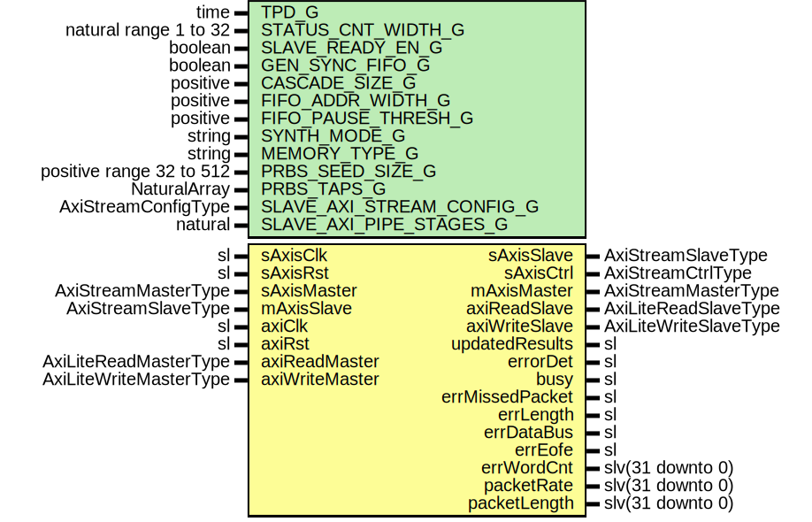

# Entity: SsiPrbsRx

- **File**: SsiPrbsRx.vhd
## Diagram

## Description

-----------------------------------------------------------------------------
 Title      : SSI Protocol: https://confluence.slac.stanford.edu/x/0oyfD
-----------------------------------------------------------------------------
 Company    : SLAC National Accelerator Laboratory
-----------------------------------------------------------------------------
 Description:   This module generates
                PseudoRandom Binary Sequence (PRBS) on Virtual Channel Lane.
-----------------------------------------------------------------------------
 This file is part of 'SLAC Firmware Standard Library'.
 It is subject to the license terms in the LICENSE.txt file found in the
 top-level directory of this distribution and at:
    https://confluence.slac.stanford.edu/display/ppareg/LICENSE.html.
 No part of 'SLAC Firmware Standard Library', including this file,
 may be copied, modified, propagated, or distributed except according to
 the terms contained in the LICENSE.txt file.
-----------------------------------------------------------------------------
## Generics

| Generic name              | Type                     | Value                             | Description             |
| ------------------------- | ------------------------ | --------------------------------- | ----------------------- |
| TPD_G                     | time                     | 1 ns                              | General Configurations  |
| STATUS_CNT_WIDTH_G        | natural range 1 to 32    | 32                                |                         |
| SLAVE_READY_EN_G          | boolean                  | true                              | FIFO configurations     |
| GEN_SYNC_FIFO_G           | boolean                  | false                             |                         |
| CASCADE_SIZE_G            | positive                 | 1                                 |                         |
| FIFO_ADDR_WIDTH_G         | positive                 | 9                                 |                         |
| FIFO_PAUSE_THRESH_G       | positive                 | 2**8                              |                         |
| SYNTH_MODE_G              | string                   | "inferred"                        |                         |
| MEMORY_TYPE_G             | string                   | "block"                           |                         |
| PRBS_SEED_SIZE_G          | positive range 32 to 512 | 32                                | PRBS Config             |
| PRBS_TAPS_G               | NaturalArray             | (0 => 31, 1 => 6, 2 => 2, 3 => 1) |                         |
| SLAVE_AXI_STREAM_CONFIG_G | AxiStreamConfigType      |                                   | AXI Stream IO Config    |
| SLAVE_AXI_PIPE_STAGES_G   | natural                  | 0                                 |                         |
## Ports

| Port name       | Direction | Type                   | Description                                                     |
| --------------- | --------- | ---------------------- | --------------------------------------------------------------- |
| sAxisClk        | in        | sl                     | Streaming RX Data Interface (sAxisClk domain)                   |
| sAxisRst        | in        | sl                     |                                                                 |
| sAxisMaster     | in        | AxiStreamMasterType    |                                                                 |
| sAxisSlave      | out       | AxiStreamSlaveType     |                                                                 |
| sAxisCtrl       | out       | AxiStreamCtrlType      |                                                                 |
| mAxisMaster     | out       | AxiStreamMasterType    | Optional: TX Data Interface with EOFE tagging (sAxisClk domain) |
| mAxisSlave      | in        | AxiStreamSlaveType     |                                                                 |
| axiClk          | in        | sl                     | Optional: AXI-Lite Register Interface (axiClk domain)           |
| axiRst          | in        | sl                     |                                                                 |
| axiReadMaster   | in        | AxiLiteReadMasterType  |                                                                 |
| axiReadSlave    | out       | AxiLiteReadSlaveType   |                                                                 |
| axiWriteMaster  | in        | AxiLiteWriteMasterType |                                                                 |
| axiWriteSlave   | out       | AxiLiteWriteSlaveType  |                                                                 |
| updatedResults  | out       | sl                     | Error Detection Signals (sAxisClk domain)                       |
| errorDet        | out       | sl                     |  '1' if any error detected                                      |
| busy            | out       | sl                     |                                                                 |
| errMissedPacket | out       | sl                     |                                                                 |
| errLength       | out       | sl                     |                                                                 |
| errDataBus      | out       | sl                     |                                                                 |
| errEofe         | out       | sl                     |                                                                 |
| errWordCnt      | out       | slv(31 downto 0)       |                                                                 |
| packetRate      | out       | slv(31 downto 0)       |                                                                 |
| packetLength    | out       | slv(31 downto 0)       |                                                                 |
## Signals

| Name                | Type                                                                                                       | Description |
| ------------------- | ---------------------------------------------------------------------------------------------------------- | ----------- |
| r                   | RegType                                                                                                    |             |
| rin                 | RegType                                                                                                    |             |
| rxAxisMaster        | AxiStreamMasterType                                                                                        |             |
| rxAxisSlave         | AxiStreamSlaveType                                                                                         |             |
| txAxisMaster        | AxiStreamMasterType                                                                                        |             |
| txAxisSlave         | AxiStreamSlaveType                                                                                         |             |
| bypCheck            | sl                                                                                                         |             |
| axisCtrl            | AxiStreamCtrlArray(1 downto 0)                                                                             |             |
| rAxiLite            | LocRegType                                                                                                 |             |
| rinAxiLite          | LocRegType                                                                                                 |             |
| errBitStrbSync      | sl                                                                                                         |             |
| errWordStrbSync     | sl                                                                                                         |             |
| errDataBusSync      | sl                                                                                                         |             |
| errEofeSync         | sl                                                                                                         |             |
| errLengthSync       | sl                                                                                                         |             |
| errMissedPacketSync | sl                                                                                                         |             |
| overflow            | slv(1 downto 0)                                                                                            |             |
| pause               | slv(1 downto 0)                                                                                            |             |
| cntOut              | SlVectorArray(STATUS_SIZE_C-1 downto 0,  STATUS_CNT_WIDTH_G-1 downto 0) |             |
| packetLengthSync    | slv(31 downto 0)                                                                                           |             |
| packetRateSync      | slv(31 downto 0)                                                                                           |             |
| errWordCntSync      | slv(31 downto 0)                                                                                           |             |
| pause1Cnt           | slv(STATUS_CNT_WIDTH_G-1 downto 0)                                                                         |             |
| overflow1Cnt        | slv(STATUS_CNT_WIDTH_G-1 downto 0)                                                                         |             |
| pause0Cnt           | slv(STATUS_CNT_WIDTH_G-1 downto 0)                                                                         |             |
| overflow0Cnt        | slv(STATUS_CNT_WIDTH_G-1 downto 0)                                                                         |             |
| errWordStrbCnt      | slv(STATUS_CNT_WIDTH_G-1 downto 0)                                                                         |             |
| errDataBusCnt       | slv(STATUS_CNT_WIDTH_G-1 downto 0)                                                                         |             |
| errEofeCnt          | slv(STATUS_CNT_WIDTH_G-1 downto 0)                                                                         |             |
| errLengthCnt        | slv(STATUS_CNT_WIDTH_G-1 downto 0)                                                                         |             |
| errMissedPacketCnt  | slv(STATUS_CNT_WIDTH_G-1 downto 0)                                                                         |             |
## Constants

| Name              | Type                | Value                                                                                                                                                                                                                                                                                                                                                                                                                                                                                                                                                                                                                                                                                                                                                                                                                                                                                                                                                                                                                                                                                                                                                                                                                                                                                                                                                                                                                                                                                                                                                                                                                                                                                                                                      | Description |
| ----------------- | ------------------- | ------------------------------------------------------------------------------------------------------------------------------------------------------------------------------------------------------------------------------------------------------------------------------------------------------------------------------------------------------------------------------------------------------------------------------------------------------------------------------------------------------------------------------------------------------------------------------------------------------------------------------------------------------------------------------------------------------------------------------------------------------------------------------------------------------------------------------------------------------------------------------------------------------------------------------------------------------------------------------------------------------------------------------------------------------------------------------------------------------------------------------------------------------------------------------------------------------------------------------------------------------------------------------------------------------------------------------------------------------------------------------------------------------------------------------------------------------------------------------------------------------------------------------------------------------------------------------------------------------------------------------------------------------------------------------------------------------------------------------------------ | ----------- |
| MAX_CNT_C         | slv(31 downto 0)    |  (others => '1')                                                                                                                                                                                                                                                                                                                                                                                                                                                                                                                                                                                                                                                                                                                                                                                                                                                                                                                                                                                                                                                                                                                                                                                                                                                                                                                                                                                                                                                                                                                                                                                                                                                                                                                           |             |
| PRBS_BYTES_C      | natural             |  wordCount(PRBS_SEED_SIZE_G,  8)                                                                                                                                                                                                                                                                                                                                                                                                                                                                                                                                                                                                                                                                                                                                                                                                                                                                                                                                                                                                                                                                                                                                                                                                                                                                                                                                                                                                                                                                                                                                                                                                                                                                        |             |
| PRBS_SSI_CONFIG_C | AxiStreamConfigType |  (       TSTRB_EN_C    => false,        TDATA_BYTES_C => PRBS_BYTES_C,        TDEST_BITS_C  => 8,        TID_BITS_C    => 8,        TKEEP_MODE_C  => TKEEP_COMP_C,        TUSER_BITS_C  => 8,        TUSER_MODE_C  => TUSER_FIRST_LAST_C)                                                                                                                                                                                                                                                                                                                                                                                                                                                                                                                                                                                                                                                                                                                                                                                                                                                                                                                                                                                                                                                                                                                                                                                                                                                                                |             |
| REG_INIT_C        | RegType             |  (       busy            => '1',        packetLength    => toSlv(2,  32),        errorDet        => '0',        eofe            => '0',        errLength       => '0',        updatedResults  => '0',        errMissedPacket => '0',        errDataBus      => '0',        errWordStrb     => '0',        txCnt           => (others => '0'),        bitPntr         => (others => '0'),        errorBits       => (others => '0'),        errWordCnt      => (others => '0'),        eventCnt        => toSlv(1,  PRBS_SEED_SIZE_G),        randomData      => (others => '0'),        dataCnt         => (others => '0'),        stopTime        => (others => '0'),        startTime       => (others => '1'),        packetRate      => (others => '1'),        rxAxisSlave     => AXI_STREAM_SLAVE_INIT_C,        txAxisMaster    => AXI_STREAM_MASTER_INIT_C,        state           => IDLE_S) |             |
| STATUS_SIZE_C     | positive            |  10                                                                                                                                                                                                                                                                                                                                                                                                                                                                                                                                                                                                                                                                                                                                                                                                                                                                                                                                                                                                                                                                                                                                                                                                                                                                                                                                                                                                                                                                                                                                                                                                                                                                                                                                        |             |
| LOC_REG_INIT_C    | LocRegType          |  (       cntRst        => '1',        bypCheck      => '0',        dummy         => (others => '0'),        rollOverEn    => (others => '0'),        axiReadSlave  => AXI_LITE_READ_SLAVE_INIT_C,        axiWriteSlave => AXI_LITE_WRITE_SLAVE_INIT_C)                                                                                                                                                                                                                                                                                                                                                                                                                                                                                                                                                                                                                                                                                                                                                                                                                                                                                                                                                                                                                                                                                                                                                                                                                                                                                                      |             |
## Types

| Name       | Type                                                                                                 | Description |
| ---------- | ---------------------------------------------------------------------------------------------------- | ----------- |
| StateType  | ( IDLE_S,  LENGTH_S,  DATA_S)  |             |
| RegType    |                                                                                                      |             |
| LocRegType |                                                                                                      |             |
## Processes
- comb: ( bypCheck, r, rxAxisMaster, sAxisRst, txAxisSlave )
- seq: ( sAxisClk )
- combAxiLite: ( axiReadMaster, axiRst, axiWriteMaster, errDataBusCnt,
                          errDataBusSync, errEofeCnt, errEofeSync,
                          errLengthCnt, errLengthSync, errMissedPacketCnt,
                          errMissedPacketSync, errWordCntSync, errWordStrbCnt,
                          errWordStrbSync, overflow, overflow0Cnt,
                          overflow1Cnt, packetLengthSync, packetRateSync,
                          pause, pause0Cnt, pause1Cnt, rAxiLite )
**Description**
-----------------------------  Configuration Register ----------------------------- 
- seqAxiLite: ( axiClk )
## Instantiations

- AxiStreamFifo_Rx: surf.AxiStreamFifoV2
- U_Tx: surf.AxiStreamGearbox
- U_bypCheck: surf.Synchronizer
- SyncFifo_Inst: surf.SynchronizerFifo
- SyncStatusVec_Inst: surf.SyncStatusVector
