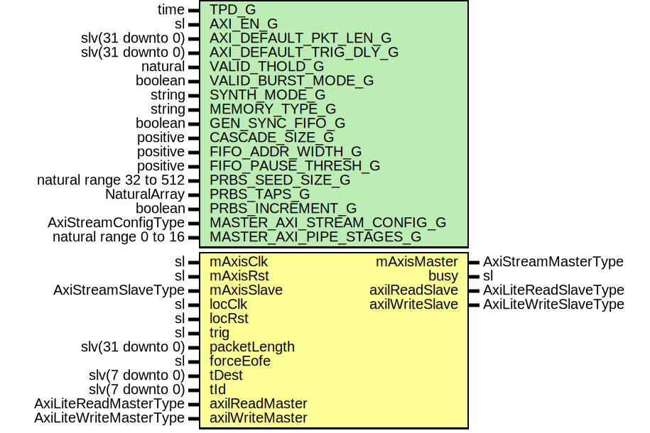

# Entity: SsiPrbsTx

## Diagram

## Description

Title      : SSI Protocol: https://confluence.slac.stanford.edu/x/0oyfD
Company    : SLAC National Accelerator Laboratory
Description:   This module generates
               PseudoRandom Binary Sequence (PRBS) on Virtual Channel Lane.
This file is part of 'SLAC Firmware Standard Library'.
It is subject to the license terms in the LICENSE.txt file found in the
top-level directory of this distribution and at:
   https://confluence.slac.stanford.edu/display/ppareg/LICENSE.html.
No part of 'SLAC Firmware Standard Library', including this file,
may be copied, modified, propagated, or distributed except according to
the terms contained in the LICENSE.txt file.
## Generics

| Generic name               | Type                    | Value                             | Description                               |
| -------------------------- | ----------------------- | --------------------------------- | ----------------------------------------- |
| TPD_G                      | time                    | 1 ns                              | General Configurations                    |
| AXI_EN_G                   | sl                      | '1'                               |                                           |
| AXI_DEFAULT_PKT_LEN_G      | slv(31 downto 0)        | x"00000FFF"                       |                                           |
| AXI_DEFAULT_TRIG_DLY_G     | slv(31 downto 0)        | x"00000000"                       |                                           |
| VALID_THOLD_G              | natural                 | 1                                 | FIFO Configurations                       |
| VALID_BURST_MODE_G         | boolean                 | false                             |                                           |
| SYNTH_MODE_G               | string                  | "inferred"                        |                                           |
| MEMORY_TYPE_G              | string                  | "block"                           |                                           |
| GEN_SYNC_FIFO_G            | boolean                 | false                             |                                           |
| CASCADE_SIZE_G             | positive                | 1                                 |                                           |
| FIFO_ADDR_WIDTH_G          | positive                | 9                                 |                                           |
| FIFO_PAUSE_THRESH_G        | positive                | 2**8                              |                                           |
| PRBS_SEED_SIZE_G           | natural range 32 to 512 | 32                                | PRBS Configurations                       |
| PRBS_TAPS_G                | NaturalArray            | (0 => 31, 1 => 6, 2 => 2, 3 => 1) |                                           |
| PRBS_INCREMENT_G           | boolean                 | false                             | Increment mode by default instead of PRBS |
| MASTER_AXI_STREAM_CONFIG_G | AxiStreamConfigType     |                                   | AXI Stream Configurations                 |
| MASTER_AXI_PIPE_STAGES_G   | natural range 0 to 16   | 0                                 |                                           |
## Ports

| Port name       | Direction | Type                   | Description                                           |
| --------------- | --------- | ---------------------- | ----------------------------------------------------- |
| mAxisClk        | in        | sl                     | Master Port (mAxisClk)                                |
| mAxisRst        | in        | sl                     |                                                       |
| mAxisMaster     | out       | AxiStreamMasterType    |                                                       |
| mAxisSlave      | in        | AxiStreamSlaveType     |                                                       |
| locClk          | in        | sl                     | Trigger Signal (locClk domain)                        |
| locRst          | in        | sl                     |                                                       |
| trig            | in        | sl                     |                                                       |
| packetLength    | in        | slv(31 downto 0)       |                                                       |
| forceEofe       | in        | sl                     |                                                       |
| busy            | out       | sl                     |                                                       |
| tDest           | in        | slv(7 downto 0)        |                                                       |
| tId             | in        | slv(7 downto 0)        |                                                       |
| axilReadMaster  | in        | AxiLiteReadMasterType  | Optional: Axi-Lite Register Interface (locClk domain) |
| axilReadSlave   | out       | AxiLiteReadSlaveType   |                                                       |
| axilWriteMaster | in        | AxiLiteWriteMasterType |                                                       |
| axilWriteSlave  | out       | AxiLiteWriteSlaveType  |                                                       |
## Signals

| Name    | Type               | Description |
| ------- | ------------------ | ----------- |
| r       | RegType            |             |
| rin     | RegType            |             |
| txSlave | AxiStreamSlaveType |             |
| txCtrl  | AxiStreamCtrlType  |             |
## Constants

| Name              | Type                | Value                                                                                                                                                                                                                                                                                                                                                                                                                                                                                                                                                                                                                                                                                                                                                                                                                                                                                                                                                                                                                                                                                                                                                                                                                                                                                                                                                                                                                                                                                                                                                                 | Description |
| ----------------- | ------------------- | --------------------------------------------------------------------------------------------------------------------------------------------------------------------------------------------------------------------------------------------------------------------------------------------------------------------------------------------------------------------------------------------------------------------------------------------------------------------------------------------------------------------------------------------------------------------------------------------------------------------------------------------------------------------------------------------------------------------------------------------------------------------------------------------------------------------------------------------------------------------------------------------------------------------------------------------------------------------------------------------------------------------------------------------------------------------------------------------------------------------------------------------------------------------------------------------------------------------------------------------------------------------------------------------------------------------------------------------------------------------------------------------------------------------------------------------------------------------------------------------------------------------------------------------------------------------- | ----------- |
| PRBS_BYTES_C      | natural             |  wordCount(PRBS_SEED_SIZE_G,  8)                                                                                                                                                                                                                                                                                                                                                                                                                                                                                                                                                                                                                                                                                                                                                                                                                                                                                                                                                                                                                                                                                                                                                                                                                                                                                                                                                                                                                                                                                                   |             |
| PRBS_SSI_CONFIG_C | AxiStreamConfigType |  (       TSTRB_EN_C    => false,        TDATA_BYTES_C => PRBS_BYTES_C,        TDEST_BITS_C  => 8,        TID_BITS_C    => 8,        TKEEP_MODE_C  => MASTER_AXI_STREAM_CONFIG_G.TKEEP_MODE_C,        TUSER_BITS_C  => 2,        TUSER_MODE_C  => MASTER_AXI_STREAM_CONFIG_G.TUSER_MODE_C)                                                                                                                                                                                                                                                                                                                                                                                                                                                                                                                                                                                                                                                                                                                                                                                                                                                                                                                                                                                                                                                           |             |
| REG_INIT_C        | RegType             |  (       busy           => '1',        overflow       => '0',        length         => (others => '0'),        packetLength   => AXI_DEFAULT_PKT_LEN_G,        dataCnt        => (others => '0'),        trigDly        => AXI_DEFAULT_TRIG_DLY_G,        trigDlyCnt     => (others => '0'),        eventCnt       => toSlv(1,  PRBS_SEED_SIZE_G),        randomData     => (others => '0'),        txAxisMaster   => AXI_STREAM_MASTER_INIT_C,        state          => IDLE_S,        axiEn          => AXI_EN_G,        oneShot        => '0',        trig           => '0',        trigger        => '0',        cntData        => toSl(PRBS_INCREMENT_G),        tDest          => X"00",        tId            => X"00",        axilReadSlave  => AXI_LITE_READ_SLAVE_INIT_C,        axilWriteSlave => AXI_LITE_WRITE_SLAVE_INIT_C) |             |
## Types

| Name      | Type                                                                                                                                                  | Description |
| --------- | ----------------------------------------------------------------------------------------------------------------------------------------------------- | ----------- |
| StateType | ( IDLE_S,  SEED_RAND_S,  LENGTH_S,  DATA_S)  |             |
| RegType   |                                                                                                                                                       |             |
## Processes
- comb: ( axilReadMaster, axilWriteMaster, forceEofe, locRst,
                   packetLength, r, tDest, tId, trig, txCtrl, txSlave )
- seq: ( locClk )
## Instantiations

- AxiStreamFifo_Inst: surf.AxiStreamFifoV2
