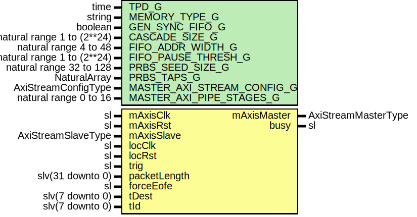

# Entity: SsiPrbsTxOld

## Diagram

## Description

Title      : SSI Protocol: https://confluence.slac.stanford.edu/x/0oyfD
Company    : SLAC National Accelerator Laboratory
Description:   This module generates
               PseudoRandom Binary Sequence (PRBS) on Virtual Channel Lane.
This file is part of 'SLAC Firmware Standard Library'.
It is subject to the license terms in the LICENSE.txt file found in the
top-level directory of this distribution and at:
   https://confluence.slac.stanford.edu/display/ppareg/LICENSE.html.
No part of 'SLAC Firmware Standard Library', including this file,
may be copied, modified, propagated, or distributed except according to
the terms contained in the LICENSE.txt file.
## Generics

| Generic name               | Type                       | Value                             | Description                |
| -------------------------- | -------------------------- | --------------------------------- | -------------------------- |
| TPD_G                      | time                       | 1 ns                              | General Configurations     |
| MEMORY_TYPE_G              | string                     | "block"                           | FIFO Configurations        |
| GEN_SYNC_FIFO_G            | boolean                    | false                             |                            |
| CASCADE_SIZE_G             | natural range 1 to (2**24) | 1                                 |                            |
| FIFO_ADDR_WIDTH_G          | natural range 4 to 48      | 9                                 |                            |
| FIFO_PAUSE_THRESH_G        | natural range 1 to (2**24) | 2**8                              |                            |
| PRBS_SEED_SIZE_G           | natural range 32 to 128    | 32                                | PRBS Configurations        |
| PRBS_TAPS_G                | NaturalArray               | (0 => 31, 1 => 6, 2 => 2, 3 => 1) |                            |
| MASTER_AXI_STREAM_CONFIG_G | AxiStreamConfigType        |                                   | AXI Stream Configurations  |
| MASTER_AXI_PIPE_STAGES_G   | natural range 0 to 16      | 0                                 |                            |
## Ports

| Port name    | Direction | Type                | Description                    |
| ------------ | --------- | ------------------- | ------------------------------ |
| mAxisClk     | in        | sl                  | Master Port (mAxisClk)         |
| mAxisRst     | in        | sl                  |                                |
| mAxisMaster  | out       | AxiStreamMasterType |                                |
| mAxisSlave   | in        | AxiStreamSlaveType  |                                |
| locClk       | in        | sl                  | Trigger Signal (locClk domain) |
| locRst       | in        | sl                  |                                |
| trig         | in        | sl                  |                                |
| packetLength | in        | slv(31 downto 0)    |                                |
| forceEofe    | in        | sl                  |                                |
| busy         | out       | sl                  |                                |
| tDest        | in        | slv(7 downto 0)     |                                |
| tId          | in        | slv(7 downto 0)     |                                |
## Signals

| Name   | Type              | Description |
| ------ | ----------------- | ----------- |
| r      | RegType           |             |
| rin    | RegType           |             |
| txCtrl | AxiStreamCtrlType |             |
## Constants

| Name              | Type                | Value                                                                                                                                                                                                                                                                                                                                                                                                                          | Description |
| ----------------- | ------------------- | ------------------------------------------------------------------------------------------------------------------------------------------------------------------------------------------------------------------------------------------------------------------------------------------------------------------------------------------------------------------------------------------------------------------------------ | ----------- |
| PRBS_BYTES_C      | natural             |  (PRBS_SEED_SIZE_G/8)                                                                                                                                                                                                                                                                                                                                                                                                          |             |
| PRBS_SSI_CONFIG_C | AxiStreamConfigType |  ssiAxiStreamConfig(PRBS_BYTES_C,  TKEEP_COMP_C)                                                                                                                                                                                                                                                                                                                                            |             |
| REG_INIT_C        | RegType             |  (       '1',        '0',        (others => '0'),        (others => '0'),        (others => '0'),        (others => '0'),        AXI_STREAM_MASTER_INIT_C,        IDLE_S) |             |
## Types

| Name      | Type                                                                                                                                                  | Description |
| --------- | ----------------------------------------------------------------------------------------------------------------------------------------------------- | ----------- |
| StateType | ( IDLE_S,  SEED_RAND_S,  LENGTH_S,  DATA_S)  |             |
| RegType   |                                                                                                                                                       |             |
## Processes
- comb: ( forceEofe, locRst, packetLength, r, tDest, tId, trig, txCtrl )
- seq: ( locClk )
## Instantiations

- AxiStreamFifo_Inst: surf.AxiStreamFifoV2
