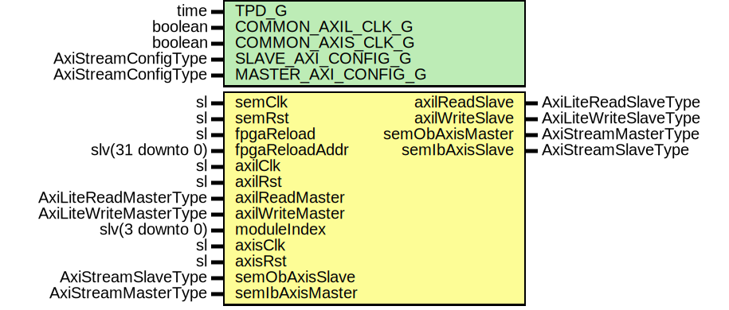

# Entity: SsiSem

## Diagram

## Description

Company    : SLAC National Accelerator Laboratory
Description: SSI wrapper for 7-series SEM module
This file is part of 'SLAC Firmware Standard Library'.
It is subject to the license terms in the LICENSE.txt file found in the
top-level directory of this distribution and at:
   https://confluence.slac.stanford.edu/display/ppareg/LICENSE.html.
No part of 'SLAC Firmware Standard Library', including this file,
may be copied, modified, propagated, or distributed except according to
the terms contained in the LICENSE.txt file.
## Generics

| Generic name        | Type                | Value | Description |
| ------------------- | ------------------- | ----- | ----------- |
| TPD_G               | time                | 1 ns  |             |
| COMMON_AXIL_CLK_G   | boolean             | false |             |
| COMMON_AXIS_CLK_G   | boolean             | false |             |
| SLAVE_AXI_CONFIG_G  | AxiStreamConfigType |       |             |
| MASTER_AXI_CONFIG_G | AxiStreamConfigType |       |             |
## Ports

| Port name       | Direction | Type                   | Description         |
| --------------- | --------- | ---------------------- | ------------------- |
| semClk          | in        | sl                     | SEM clock and reset |
| semRst          | in        | sl                     |                     |
| fpgaReload      | in        | sl                     | IPROG Interface     |
| fpgaReloadAddr  | in        | slv(31 downto 0)       |                     |
| axilClk         | in        | sl                     | AXI-Lite Interface  |
| axilRst         | in        | sl                     |                     |
| axilReadMaster  | in        | AxiLiteReadMasterType  |                     |
| axilReadSlave   | out       | AxiLiteReadSlaveType   |                     |
| axilWriteMaster | in        | AxiLiteWriteMasterType |                     |
| axilWriteSlave  | out       | AxiLiteWriteSlaveType  |                     |
| moduleIndex     | in        | slv(3 downto 0)        |                     |
| axisClk         | in        | sl                     | AXI-Lite Interface  |
| axisRst         | in        | sl                     |                     |
| semObAxisMaster | out       | AxiStreamMasterType    |                     |
| semObAxisSlave  | in        | AxiStreamSlaveType     |                     |
| semIbAxisMaster | in        | AxiStreamMasterType    |                     |
| semIbAxisSlave  | out       | AxiStreamSlaveType     |                     |
## Signals

| Name           | Type                   | Description |
| -------------- | ---------------------- | ----------- |
| r              | RegType                |             |
| rin            | RegType                |             |
| axiReadMaster  | AxiLiteReadMasterType  |             |
| axiReadSlave   | AxiLiteReadSlaveType   |             |
| axiWriteMaster | AxiLiteWriteMasterType |             |
| axiWriteSlave  | AxiLiteWriteSlaveType  |             |
| txAxisMaster   | AxiStreamMasterType    |             |
| txAxisCtrl     | AxiStreamCtrlType      |             |
| rxAxisMaster   | AxiStreamMasterType    |             |
| rxAxisSlave    | AxiStreamSlaveType     |             |
| statusIdle     | sl                     |             |
| statusHalted   | sl                     |             |
| semIb          | SemIbType              |             |
| semOb          | SemObType              |             |
| idx            | slv(3 downto 0)        |             |
## Constants

| Name              | Type                | Value                                                                                                                                                                                                                                                                                                                                                                                                                                                                                                                                                                                                                                | Description |
| ----------------- | ------------------- | ------------------------------------------------------------------------------------------------------------------------------------------------------------------------------------------------------------------------------------------------------------------------------------------------------------------------------------------------------------------------------------------------------------------------------------------------------------------------------------------------------------------------------------------------------------------------------------------------------------------------------------ | ----------- |
| SEM_AXIS_CONFIG_C | AxiStreamConfigType |  ssiAxiStreamConfig(8)                                                                                                                                                                                                                                                                                                                                                                                                                                                                                                                                                                                                               |             |
| RET_CHAR_C        | character           |  cr                                                                                                                                                                                                                                                                                                                                                                                                                                                                                                                                                                                                                                  |             |
| RET_SLV_C         | slv(7 downto 0)     |  conv_std_logic_vector(character'pos(RET_CHAR_C),  8)                                                                                                                                                                                                                                                                                                                                                                                                                                                                                                                                             |             |
| REG_INIT_C        | RegType             |  (       sofNext          => '1',        count            => (others => '0'),        heartbeatCount   => (others => '0'),        iprogIcapReqLast => '0',        semIb            => SEM_IB_INIT_C,        axiWriteSlave    => AXI_LITE_WRITE_SLAVE_INIT_C,        axiReadSlave     => AXI_LITE_READ_SLAVE_INIT_C,        txSsiMaster      => ssiMasterInit(SEM_AXIS_CONFIG_C)) |             |
## Types

| Name    | Type | Description |
| ------- | ---- | ----------- |
| RegType |      |             |
## Processes
- comb: ( axiReadMaster, axiWriteMaster, idx, r, rxAxisMaster, semOb,
                   semRst, statusHalted, statusIdle, txAxisCtrl )
- seq: ( semClk )
## Instantiations

- U_Sem: surf.SemWrapper
- U_SyncFifo: surf.SynchronizerFifo
**Description**
Sync the Module index

- U_AxiLiteAsync: surf.AxiLiteAsync
**Description**
Synchronize AXI-Lite bus to semClk

- U_TxFifo: surf.AxiStreamFifoV2
**Description**
Synchronize AXIS bus to semClk

- U_RxFifo: surf.AxiStreamFifoV2
