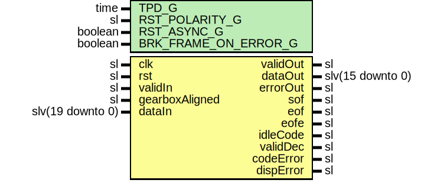

# Entity: SspDecoder8b10b

- **File**: SspDecoder8b10b.vhd
## Diagram

## Description

-----------------------------------------------------------------------------
 Company    : SLAC National Accelerator Laboratory
-----------------------------------------------------------------------------
 Description: SimpleStreamingProtocol - A simple protocol layer for inserting
 idle and framing control characters into a raw data stream. This module
 ties the framing core to an RTL 8b10b encoder.
-----------------------------------------------------------------------------
 This file is part of 'SLAC Firmware Standard Library'.
 It is subject to the license terms in the LICENSE.txt file found in the
 top-level directory of this distribution and at:
    https://confluence.slac.stanford.edu/display/ppareg/LICENSE.html.
 No part of 'SLAC Firmware Standard Library', including this file,
 may be copied, modified, propagated, or distributed except according to
 the terms contained in the LICENSE.txt file.
-----------------------------------------------------------------------------
## Generics

| Generic name         | Type    | Value | Description |
| -------------------- | ------- | ----- | ----------- |
| TPD_G                | time    | 1 ns  |             |
| RST_POLARITY_G       | sl      | '0'   |             |
| RST_ASYNC_G          | boolean | true  |             |
| BRK_FRAME_ON_ERROR_G | boolean | true  |             |
## Ports

| Port name      | Direction | Type             | Description        |
| -------------- | --------- | ---------------- | ------------------ |
| clk            | in        | sl               | Clock and Reset    |
| rst            | in        | sl               |                    |
| validIn        | in        | sl               | Encoded Input      |
| gearboxAligned | in        | sl               |                    |
| dataIn         | in        | slv(19 downto 0) |                    |
| validOut       | out       | sl               | Framing Output     |
| dataOut        | out       | slv(15 downto 0) |                    |
| errorOut       | out       | sl               |                    |
| sof            | out       | sl               |                    |
| eof            | out       | sl               |                    |
| eofe           | out       | sl               |                    |
| idleCode       | out       | sl               | Decoder Monitoring |
| validDec       | out       | sl               |                    |
| codeError      | out       | sl               |                    |
| dispError      | out       | sl               |                    |
## Signals

| Name         | Type             | Description |
| ------------ | ---------------- | ----------- |
| codeErrorVec | slv(1 downto 0)  |             |
| dispErrorVec | slv(1 downto 0)  |             |
| idleInt      | sl               |             |
| validDecInt  | sl               |             |
| codeErrorInt | sl               |             |
| dispErrorInt | sl               |             |
| framedData   | slv(15 downto 0) |             |
| framedDataK  | slv(1 downto 0)  |             |
| idle         | sl               |             |
## Instantiations

- Decoder8b10b_1: surf.Decoder8b10b
- SspDeframer_1: surf.SspDeframer
