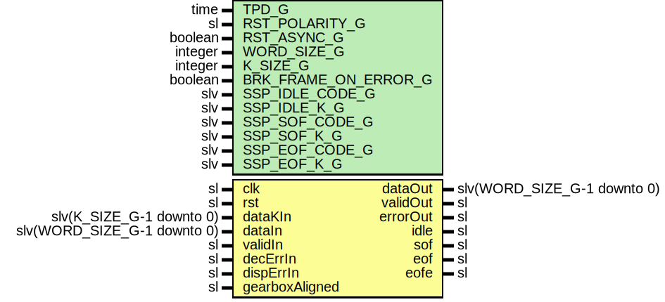

# Entity: SspDeframer

## Diagram

## Description

Company    : SLAC National Accelerator Laboratory
Description: SimpleStreamingProtocol - A simple protocol layer for inserting
idle and framing control characters into a raw data stream. The input of
module should be attached to an 8b10b decoder.
This file is part of 'SLAC Firmware Standard Library'.
It is subject to the license terms in the LICENSE.txt file found in the
top-level directory of this distribution and at:
   https://confluence.slac.stanford.edu/display/ppareg/LICENSE.html.
No part of 'SLAC Firmware Standard Library', including this file,
may be copied, modified, propagated, or distributed except according to
the terms contained in the LICENSE.txt file.
## Generics

| Generic name         | Type    | Value | Description |
| -------------------- | ------- | ----- | ----------- |
| TPD_G                | time    | 1 ns  |             |
| RST_POLARITY_G       | sl      | '0'   |             |
| RST_ASYNC_G          | boolean | true  |             |
| WORD_SIZE_G          | integer | 16    |             |
| K_SIZE_G             | integer | 2     |             |
| BRK_FRAME_ON_ERROR_G | boolean | true  |             |
| SSP_IDLE_CODE_G      | slv     |       |             |
| SSP_IDLE_K_G         | slv     |       |             |
| SSP_SOF_CODE_G       | slv     |       |             |
| SSP_SOF_K_G          | slv     |       |             |
| SSP_EOF_CODE_G       | slv     |       |             |
| SSP_EOF_K_G          | slv     |       |             |
## Ports

| Port name      | Direction | Type                        | Description      |
| -------------- | --------- | --------------------------- | ---------------- |
| clk            | in        | sl                          | Clock and Reset  |
| rst            | in        | sl                          |                  |
| dataKIn        | in        | slv(K_SIZE_G-1 downto 0)    | Input Interface  |
| dataIn         | in        | slv(WORD_SIZE_G-1 downto 0) |                  |
| validIn        | in        | sl                          |                  |
| decErrIn       | in        | sl                          |                  |
| dispErrIn      | in        | sl                          | Unused           |
| gearboxAligned | in        | sl                          |                  |
| dataOut        | out       | slv(WORD_SIZE_G-1 downto 0) | Output Interface |
| validOut       | out       | sl                          |                  |
| errorOut       | out       | sl                          |                  |
| idle           | out       | sl                          |                  |
| sof            | out       | sl                          |                  |
| eof            | out       | sl                          |                  |
| eofe           | out       | sl                          |                  |
## Signals

| Name | Type    | Description |
| ---- | ------- | ----------- |
| r    | RegType |             |
| rin  | RegType |             |
## Constants

| Name       | Type    | Value                                                                                                                                                                                                                                                                                                                                                                                                                                                                                                                                                                                                                                                                                                                                                                                                     | Description |
| ---------- | ------- | --------------------------------------------------------------------------------------------------------------------------------------------------------------------------------------------------------------------------------------------------------------------------------------------------------------------------------------------------------------------------------------------------------------------------------------------------------------------------------------------------------------------------------------------------------------------------------------------------------------------------------------------------------------------------------------------------------------------------------------------------------------------------------------------------------- | ----------- |
| WAIT_SOF_S | sl      |  '0'                                                                                                                                                                                                                                                                                                                                                                                                                                                                                                                                                                                                                                                                                                                                                                                                      |             |
| WAIT_EOF_S | sl      |  '1'                                                                                                                                                                                                                                                                                                                                                                                                                                                                                                                                                                                                                                                                                                                                                                                                      |             |
| REG_INIT_C | RegType |  (       state     => WAIT_SOF_S,        iDataOut  => (others => '0'),        iValidOut => '0',        iSof      => '0',        iEof      => '0',        iEofe     => '0',        dataOut   => (others => '0'),        validOut  => '0',        errorOut  => '0',        idle      => '0',        sof       => '0',        eof       => '0',        eofe      => '0') |             |
## Types

| Name    | Type | Description |
| ------- | ---- | ----------- |
| RegType |      |             |
## Processes
- comb: ( dataIn, dataKIn, decErrIn, gearboxAligned, r, rst, validIn )
- seq: ( clk, rst )
**Description**
Sequential process

