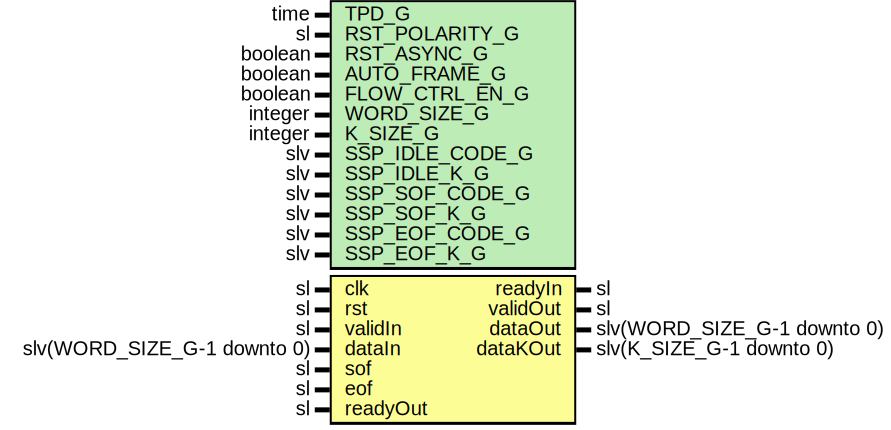

# Entity: SspFramer

- **File**: SspFramer.vhd
## Diagram

## Description

Company    : SLAC National Accelerator Laboratory
Description: SimpleStreamingProtocol - A simple protocol layer for inserting
idle and framing control characters into a raw data stream. The output of
module should be attached to an 8b10b encoder.
This file is part of 'SLAC Firmware Standard Library'.
It is subject to the license terms in the LICENSE.txt file found in the
top-level directory of this distribution and at:
   https://confluence.slac.stanford.edu/display/ppareg/LICENSE.html.
No part of 'SLAC Firmware Standard Library', including this file,
may be copied, modified, propagated, or distributed except according to
the terms contained in the LICENSE.txt file.
## Generics

| Generic name    | Type    | Value | Description |
| --------------- | ------- | ----- | ----------- |
| TPD_G           | time    | 1 ns  |             |
| RST_POLARITY_G  | sl      | '0'   |             |
| RST_ASYNC_G     | boolean | true  |             |
| AUTO_FRAME_G    | boolean | true  |             |
| FLOW_CTRL_EN_G  | boolean | false |             |
| WORD_SIZE_G     | integer | 16    |             |
| K_SIZE_G        | integer | 2     |             |
| SSP_IDLE_CODE_G | slv     |       |             |
| SSP_IDLE_K_G    | slv     |       |             |
| SSP_SOF_CODE_G  | slv     |       |             |
| SSP_SOF_K_G     | slv     |       |             |
| SSP_EOF_CODE_G  | slv     |       |             |
| SSP_EOF_K_G     | slv     |       |             |
## Ports

| Port name | Direction | Type                        | Description     |
| --------- | --------- | --------------------------- | --------------- |
| clk       | in        | sl                          | Clock and Reset |
| rst       | in        | sl                          |                 |
| validIn   | in        | sl                          | Inbound Ports   |
| readyIn   | out       | sl                          |                 |
| dataIn    | in        | slv(WORD_SIZE_G-1 downto 0) |                 |
| sof       | in        | sl                          |                 |
| eof       | in        | sl                          |                 |
| validOut  | out       | sl                          | Outbound Ports  |
| readyOut  | in        | sl                          |                 |
| dataOut   | out       | slv(WORD_SIZE_G-1 downto 0) |                 |
| dataKOut  | out       | slv(K_SIZE_G-1 downto 0)    |                 |
## Signals

| Name | Type    | Description |
| ---- | ------- | ----------- |
| r    | RegType |             |
| rin  | RegType |             |
## Constants

| Name       | Type    | Value                                                                                                                                                                                                                                                                                                                 | Description |
| ---------- | ------- | --------------------------------------------------------------------------------------------------------------------------------------------------------------------------------------------------------------------------------------------------------------------------------------------------------------------- | ----------- |
| REG_INIT_C | RegType |  (       readyIn  => '0',        validOut => toSl(not FLOW_CTRL_EN_G),        dataKOut => (others => '0'),        dataOut  => (others => '0'),        state    => IDLE_S) |             |
## Types

| Name      | Type                                                                                              | Description |
| --------- | ------------------------------------------------------------------------------------------------- | ----------- |
| StateType | ( IDLE_S,  DATA_S,  EOF_S)  |             |
| RegType   |                                                                                                   |             |
## Processes
- comb: ( dataIn, eof, r, readyOut, rst, sof, validIn )
- seq: ( clk, rst )
**Description**
Sequential process

