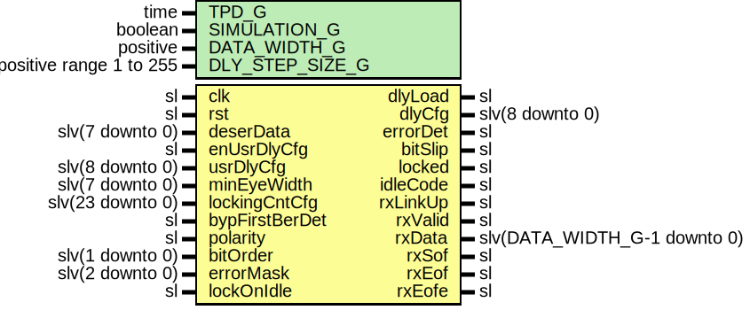

# Entity: SspLowSpeedDecoderLane

- **File**: SspLowSpeedDecoderLane.vhd
## Diagram

## Description

-----------------------------------------------------------------------------
 Company    : SLAC National Accelerator Laboratory
-----------------------------------------------------------------------------
 Description: PLL and Deserialization
-----------------------------------------------------------------------------
 This file is part of 'SLAC Firmware Standard Library'.
 It is subject to the license terms in the LICENSE.txt file found in the
 top-level directory of this distribution and at:
    https://confluence.slac.stanford.edu/display/ppareg/LICENSE.html.
 No part of 'SLAC Firmware Standard Library', including this file,
 may be copied, modified, propagated, or distributed except according to
 the terms contained in the LICENSE.txt file.
-----------------------------------------------------------------------------
## Generics

| Generic name    | Type                    | Value | Description |
| --------------- | ----------------------- | ----- | ----------- |
| TPD_G           | time                    | 1 ns  |             |
| SIMULATION_G    | boolean                 | false |             |
| DATA_WIDTH_G    | positive                | 10    |             |
| DLY_STEP_SIZE_G | positive range 1 to 255 | 1     |             |
## Ports

| Port name      | Direction | Type                         | Description               |
| -------------- | --------- | ---------------------------- | ------------------------- |
| clk            | in        | sl                           | Clock and Reset Interface |
| rst            | in        | sl                           |                           |
| deserData      | in        | slv(7 downto 0)              | Deserialization Interface |
| dlyLoad        | out       | sl                           |                           |
| dlyCfg         | out       | slv(8 downto 0)              |                           |
| enUsrDlyCfg    | in        | sl                           | Config/Status Interface   |
| usrDlyCfg      | in        | slv(8 downto 0)              |                           |
| minEyeWidth    | in        | slv(7 downto 0)              |                           |
| lockingCntCfg  | in        | slv(23 downto 0)             |                           |
| bypFirstBerDet | in        | sl                           |                           |
| polarity       | in        | sl                           |                           |
| bitOrder       | in        | slv(1 downto 0)              |                           |
| errorMask      | in        | slv(2 downto 0)              |                           |
| lockOnIdle     | in        | sl                           |                           |
| errorDet       | out       | sl                           |                           |
| bitSlip        | out       | sl                           |                           |
| locked         | out       | sl                           |                           |
| idleCode       | out       | sl                           |                           |
| rxLinkUp       | out       | sl                           | SSP Frame Output          |
| rxValid        | out       | sl                           |                           |
| rxData         | out       | slv(DATA_WIDTH_G-1 downto 0) |                           |
| rxSof          | out       | sl                           |                           |
| rxEof          | out       | sl                           |                           |
| rxEofe         | out       | sl                           |                           |
## Signals

| Name            | Type                           | Description |
| --------------- | ------------------------------ | ----------- |
| deserDataMask   | slv(7 downto 0)                |             |
| reset           | sl                             |             |
| gearboxAligned  | sl                             |             |
| slip            | sl                             |             |
| validOut        | sl                             |             |
| idle            | sl                             |             |
| encodeValid     | sl                             |             |
| encodeData      | slv(ENCODE_WIDTH_C-1 downto 0) |             |
| decodeValid     | sl                             |             |
| decodeOutOfSync | sl                             |             |
| decodeCodeErr   | sl                             |             |
| decodeDispErr   | sl                             |             |
| codeError       | sl                             |             |
| lineCodeErr     | sl                             |             |
| lineCodeDispErr | sl                             |             |
| linkOutOfSync   | sl                             |             |
## Constants

| Name           | Type     | Value                                                                                                               | Description |
| -------------- | -------- | ------------------------------------------------------------------------------------------------------------------- | ----------- |
| ENCODE_WIDTH_C | positive |  ite(DATA_WIDTH_G = 16,  20,  DATA_WIDTH_G+2) |             |
## Processes
- unnamed: ( clk )
- unnamed: ( decodeCodeErr, gearboxAligned, idle, lockOnIdle )
## Instantiations

- U_reset: surf.RstPipeline
- U_Gearbox: surf.Gearbox
- U_GearboxAligner: surf.SelectIoRxGearboxAligner
