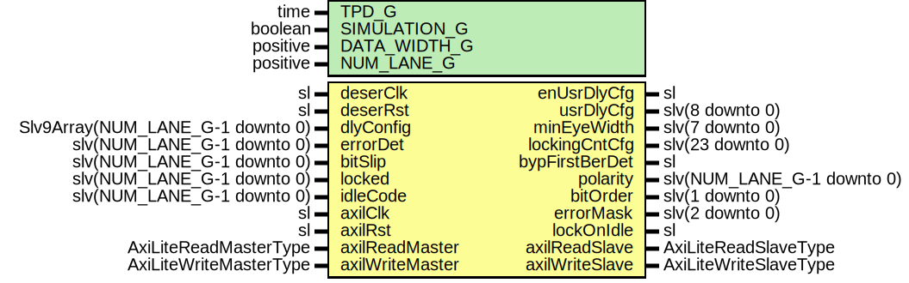

# Entity: SspLowSpeedDecoderReg

- **File**: SspLowSpeedDecoderReg.vhd
## Diagram

## Description

Company    : SLAC National Accelerator Laboratory
Description:  SSP Decoder Registers
This file is part of 'SLAC Firmware Standard Library'.
It is subject to the license terms in the LICENSE.txt file found in the
top-level directory of this distribution and at:
   https://confluence.slac.stanford.edu/display/ppareg/LICENSE.html.
No part of 'SLAC Firmware Standard Library', including this file,
may be copied, modified, propagated, or distributed except according to
the terms contained in the LICENSE.txt file.
## Generics

| Generic name | Type     | Value | Description |
| ------------ | -------- | ----- | ----------- |
| TPD_G        | time     | 1 ns  |             |
| SIMULATION_G | boolean  | false |             |
| DATA_WIDTH_G | positive | 10    |             |
| NUM_LANE_G   | positive | 1     |             |
## Ports

| Port name       | Direction | Type                             | Description                                 |
| --------------- | --------- | -------------------------------- | ------------------------------------------- |
| deserClk        | in        | sl                               | Deserialization Interface (deserClk domain) |
| deserRst        | in        | sl                               |                                             |
| dlyConfig       | in        | Slv9Array(NUM_LANE_G-1 downto 0) |                                             |
| errorDet        | in        | slv(NUM_LANE_G-1 downto 0)       |                                             |
| bitSlip         | in        | slv(NUM_LANE_G-1 downto 0)       |                                             |
| locked          | in        | slv(NUM_LANE_G-1 downto 0)       |                                             |
| idleCode        | in        | slv(NUM_LANE_G-1 downto 0)       |                                             |
| enUsrDlyCfg     | out       | sl                               |                                             |
| usrDlyCfg       | out       | slv(8 downto 0)                  |                                             |
| minEyeWidth     | out       | slv(7 downto 0)                  |                                             |
| lockingCntCfg   | out       | slv(23 downto 0)                 |                                             |
| bypFirstBerDet  | out       | sl                               |                                             |
| polarity        | out       | slv(NUM_LANE_G-1 downto 0)       |                                             |
| bitOrder        | out       | slv(1 downto 0)                  |                                             |
| errorMask       | out       | slv(2 downto 0)                  |                                             |
| lockOnIdle      | out       | sl                               |                                             |
| axilClk         | in        | sl                               | AXI-Lite Interface (axilClk domain)         |
| axilRst         | in        | sl                               |                                             |
| axilReadMaster  | in        | AxiLiteReadMasterType            |                                             |
| axilReadSlave   | out       | AxiLiteReadSlaveType             |                                             |
| axilWriteMaster | in        | AxiLiteWriteMasterType           |                                             |
| axilWriteSlave  | out       | AxiLiteWriteSlaveType            |                                             |
## Signals

| Name        | Type                                                                                                   | Description |
| ----------- | ------------------------------------------------------------------------------------------------------ | ----------- |
| r           | RegType                                                                                                |             |
| rin         | RegType                                                                                                |             |
| statusIn    | slv(STATUS_SIZE_C-1 downto 0)                                                                          |             |
| statusOut   | slv(STATUS_SIZE_C-1 downto 0)                                                                          |             |
| statusCnt   | SlVectorArray(STATUS_SIZE_C-1 downto 0,  STATUS_WIDTH_C-1 downto 0) |             |
| readMaster  | AxiLiteReadMasterType                                                                                  |             |
| readSlave   | AxiLiteReadSlaveType                                                                                   |             |
| writeMaster | AxiLiteWriteMasterType                                                                                 |             |
| writeSlave  | AxiLiteWriteSlaveType                                                                                  |             |
## Constants

| Name           | Type     | Value                                                                                                                                                                                                                                                                                                                                                                                                                                                                                                                                                                                                                                                                                                                                                                                                                                                                                                                                                                                                                                                                                                                                                                                                                                               | Description |
| -------------- | -------- | --------------------------------------------------------------------------------------------------------------------------------------------------------------------------------------------------------------------------------------------------------------------------------------------------------------------------------------------------------------------------------------------------------------------------------------------------------------------------------------------------------------------------------------------------------------------------------------------------------------------------------------------------------------------------------------------------------------------------------------------------------------------------------------------------------------------------------------------------------------------------------------------------------------------------------------------------------------------------------------------------------------------------------------------------------------------------------------------------------------------------------------------------------------------------------------------------------------------------------------------------- | ----------- |
| STATUS_SIZE_C  | positive |  3*NUM_LANE_G                                                                                                                                                                                                                                                                                                                                                                                                                                                                                                                                                                                                                                                                                                                                                                                                                                                                                                                                                                                                                                                                                                                                                                                                                                       |             |
| STATUS_WIDTH_C | positive |  16                                                                                                                                                                                                                                                                                                                                                                                                                                                                                                                                                                                                                                                                                                                                                                                                                                                                                                                                                                                                                                                                                                                                                                                                                                                 |             |
| REG_INIT_C     | RegType  |  (       enUsrDlyCfg    => ite(SIMULATION_G,  '1',  '0'),        usrDlyCfg      => toSlv(219,  9),        minEyeWidth    => toSlv(80,  8),        lockingCntCfg  => ite(SIMULATION_G,  x"00_0004",  x"00_FFFF"),        bypFirstBerDet => '1',        polarity       => (others => '0'),        bitOrder       => (others => '0'),        errorMask      => (others => '0'),        lockOnIdle     => '0',        cntRst         => '1',        rollOverEn     => (others => '0'),        readSlave      => AXI_LITE_READ_SLAVE_INIT_C,        writeSlave     => AXI_LITE_WRITE_SLAVE_INIT_C) |             |
## Types

| Name    | Type | Description |
| ------- | ---- | ----------- |
| RegType |      |             |
## Processes
- comb: ( deserRst, dlyConfig, idleCode, r, readMaster, statusCnt,
                   statusOut, writeMaster )
- seq: ( deserClk )
## Instantiations

- U_AxiLiteAsync: surf.AxiLiteAsync
- U_SyncStatusVector: surf.SyncStatusVector
