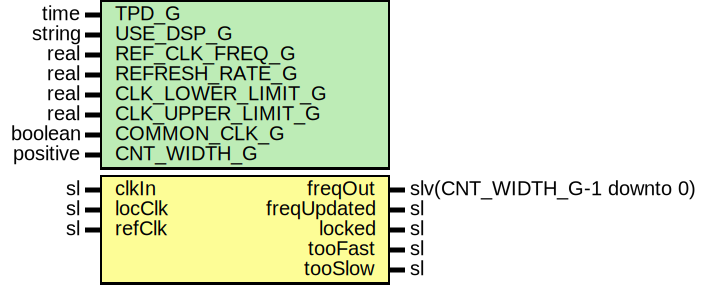

# Entity: SyncClockFreq

- **File**: SyncClockFreq.vhd
## Diagram

## Description

Company    : SLAC National Accelerator Laboratory
Description:   This module measures the frequency of an input clock
               with respect to a stable reference clock.
This file is part of 'SLAC Firmware Standard Library'.
It is subject to the license terms in the LICENSE.txt file found in the
top-level directory of this distribution and at:
   https://confluence.slac.stanford.edu/display/ppareg/LICENSE.html.
No part of 'SLAC Firmware Standard Library', including this file,
may be copied, modified, propagated, or distributed except according to
the terms contained in the LICENSE.txt file.
## Generics

| Generic name      | Type     | Value    | Description                                                   |
| ----------------- | -------- | -------- | ------------------------------------------------------------- |
| TPD_G             | time     | 1 ns     | Simulation FF output delay                                    |
| USE_DSP_G         | string   | "no"     | "no" for no DSP implementation, "yes" to use DSP slices       |
| REF_CLK_FREQ_G    | real     | 200.0E+6 | Reference Clock frequency, units of Hz                        |
| REFRESH_RATE_G    | real     | 1.0E+3   | Refresh rate, units of Hz                                     |
| CLK_LOWER_LIMIT_G | real     | 159.0E+6 | Lower Limit for clock lock, units of Hz                       |
| CLK_UPPER_LIMIT_G | real     | 161.0E+6 | Lower Limit for clock lock, units of Hz                       |
| COMMON_CLK_G      | boolean  | false    | Set to true if (locClk = refClk) to save resources else false |
| CNT_WIDTH_G       | positive | 32       |                                                               |
## Ports

| Port name   | Direction | Type                        | Description                                       |
| ----------- | --------- | --------------------------- | ------------------------------------------------- |
| freqOut     | out       | slv(CNT_WIDTH_G-1 downto 0) | units of Hz                                       |
| freqUpdated | out       | sl                          |                                                   |
| locked      | out       | sl                          | '1' CLK_LOWER_LIMIT_G < clkIn < CLK_UPPER_LIMIT_G |
| tooFast     | out       | sl                          | '1' when clkIn > CLK_UPPER_LIMIT_G                |
| tooSlow     | out       | sl                          | '1' when clkIn < CLK_LOWER_LIMIT_G                |
| clkIn       | in        | sl                          | Input clock to measure                            |
| locClk      | in        | sl                          | System clock                                      |
| refClk      | in        | sl                          |                                                   |
## Signals

| Name       | Type                        | Description |
| ---------- | --------------------------- | ----------- |
| updated    | sl                          |             |
| lockedDet  | sl                          |             |
| tooFastDet | sl                          |             |
| tooSlowDet | sl                          |             |
| wrEn       | sl                          |             |
| doneAccum  | sl                          |             |
| freqHertz  | slv(CNT_WIDTH_G-1 downto 0) |             |
| cntIn      | slv(CNT_WIDTH_G-1 downto 0) |             |
| cntOut     | slv(CNT_WIDTH_G-1 downto 0) |             |
| cntStable  | slv(CNT_WIDTH_G-1 downto 0) |             |
| cntAccum   | slv(CNT_WIDTH_G-1 downto 0) |             |
| accum      | slv(CNT_WIDTH_G-1 downto 0) |             |
| cntOutDly  | slv(CNT_WIDTH_G-1 downto 0) |             |
| diffCnt    | slv(CNT_WIDTH_G-1 downto 0) |             |
## Constants

| Name              | Type    | Value                                                                             | Description |
| ----------------- | ------- | --------------------------------------------------------------------------------- | ----------- |
| REFRESH_MAX_CNT_C | natural |  getTimeRatio(REF_CLK_FREQ_G,  REFRESH_RATE_G) |             |
| CLK_LOWER_LIMIT_C | natural |  getTimeRatio(CLK_LOWER_LIMIT_G,  1.0E+0)      | lower limit |
| CLK_UPPER_LIMIT_C | natural |  getTimeRatio(CLK_UPPER_LIMIT_G,  1.0E+0)      | upper limit |
## Processes
- unnamed: ( clkIn )
**Description**
Free Running Counter

- unnamed: ( refClk )
- unnamed: ( locClk )
**Description**
Clock Monitoring Process

## Instantiations

- SynchronizerFifo_In: surf.SynchronizerFifo
**Description**
Calculate the frequency of the input clock

- U_Sync: surf.SynchronizerFifo
