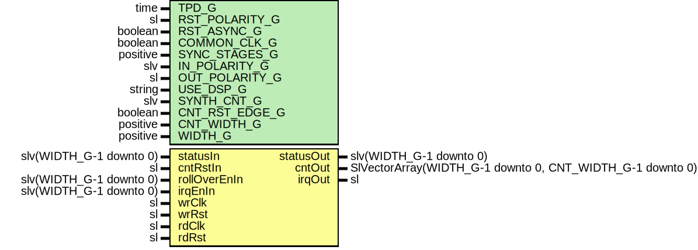

# Entity: SyncStatusVector

- **File**: SyncStatusVector.vhd
## Diagram

## Description

Company    : SLAC National Accelerator Laboratory
Description: General Purpose Status Vector and Status Counter module
This file is part of 'SLAC Firmware Standard Library'.
It is subject to the license terms in the LICENSE.txt file found in the
top-level directory of this distribution and at:
   https://confluence.slac.stanford.edu/display/ppareg/LICENSE.html.
No part of 'SLAC Firmware Standard Library', including this file,
may be copied, modified, propagated, or distributed except according to
the terms contained in the LICENSE.txt file.
## Generics

| Generic name   | Type     | Value | Description                                                             |
| -------------- | -------- | ----- | ----------------------------------------------------------------------- |
| TPD_G          | time     | 1 ns  | Simulation FF output delay                                              |
| RST_POLARITY_G | sl       | '1'   | '1' for active HIGH reset, '0' for active LOW reset                     |
| RST_ASYNC_G    | boolean  | false | true if reset is asynchronous, false if reset is synchronous            |
| COMMON_CLK_G   | boolean  | false | True if wrClk and rdClk are the same clock                              |
| SYNC_STAGES_G  | positive | 3     | Synchronization stages between statusIn and statusOut                   |
| IN_POLARITY_G  | slv      | "1"   | 0 for active LOW, 1 for active HIGH (for statusIn port)                 |
| OUT_POLARITY_G | sl       | '1'   | 0 for active LOW, 1 for active HIGH (for irqOut port)                   |
| USE_DSP_G      | string   | "no"  | "no" for no DSP implementation, "yes" to use DSP slices                 |
| SYNTH_CNT_G    | slv      | "1"   | Set to 1 for synthesising counter RTL, '0' to not synthesis the counter |
| CNT_RST_EDGE_G | boolean  | true  | true if counter reset should be edge detected, else level detected      |
| CNT_WIDTH_G    | positive | 32    | Counters' width                                                         |
| WIDTH_G        | positive | 16    |                                                                         |
## Ports

| Port name    | Direction | Type                                                      | Description                                                                                                                                                                                                                                                                                                            |
| ------------ | --------- | --------------------------------------------------------- | ---------------------------------------------------------------------------------------------------------------------------------------------------------------------------------------------------------------------------------------------------------------------------------------------------------------------- |
| statusIn     | in        | slv(WIDTH_G-1 downto 0)                                   | Data to be 'synced'                                                                                                                                                                                                                                                                                                    |
| statusOut    | out       | slv(WIDTH_G-1 downto 0)                                   | Synced data                                                                                                                                                                                                                                                                                                            |
| cntRstIn     | in        | sl                                                        | Status Bit Counters Signals (rdClk domain)cntRstIn:    This input is the common resets all the counters                                                                                                                                                                                                                |
| rollOverEnIn | in        | slv(WIDTH_G-1 downto 0)                                   | No roll over for all counters by default                                                                                                                                                                                                                                                                               |
| cntOut       | out       | SlVectorArray(WIDTH_G-1 downto 0, CNT_WIDTH_G-1 downto 0) | cntOut:   This output is counter value vector array.    The remapping of cntOut to a SLV array (outside of this module) is has followed:          for i in WIDTH_G-1 to 0 loop             for j in CNT_WIDTH_G-1 to 0 loop                MySlvArray(i)(j) <= cntOut(i, j);             end loop;          end loop;  |
| irqEnIn      | in        | slv(WIDTH_G-1 downto 0)                                   | All bits disabled by default                                                                                                                                                                                                                                                                                           |
| irqOut       | out       | sl                                                        | irqOut:   This output is interrupt output signal.                                                                                                                                                                                                                                                                      |
| wrClk        | in        | sl                                                        | Clocks and Reset Ports                                                                                                                                                                                                                                                                                                 |
| wrRst        | in        | sl                                                        |                                                                                                                                                                                                                                                                                                                        |
| rdClk        | in        | sl                                                        |                                                                                                                                                                                                                                                                                                                        |
| rdRst        | in        | sl                                                        |                                                                                                                                                                                                                                                                                                                        |
## Signals

| Name         | Type                    | Description |
| ------------ | ----------------------- | ----------- |
| r            | RegType                 |             |
| rin          | RegType                 |             |
| statusStrobe | slv(WIDTH_G-1 downto 0) |             |
## Constants

| Name       | Type    | Value                                                                                    | Description |
| ---------- | ------- | ---------------------------------------------------------------------------------------- | ----------- |
| REG_INIT_C | RegType |  (       not(OUT_POLARITY_G),        (others => '0')) |             |
## Types

| Name    | Type | Description |
| ------- | ---- | ----------- |
| RegType |      |             |
## Processes
- comb: ( irqEnIn, r, rdRst, statusStrobe )
- seq: ( rdClk, rdRst )
## Instantiations

- SyncVec_Inst: surf.SynchronizerVector
- SyncOneShotCntVec_Inst: surf.SynchronizerOneShotCntVector
