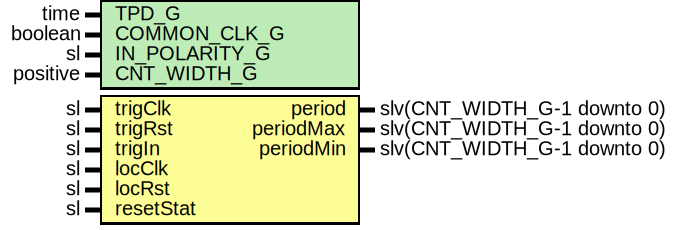

# Entity: SyncTrigPeriod

## Diagram

## Description

Company    : SLAC National Accelerator Laboratory
Description: This module measures the trigger period between triggers
This file is part of 'SLAC Firmware Standard Library'.
It is subject to the license terms in the LICENSE.txt file found in the
top-level directory of this distribution and at:
   https://confluence.slac.stanford.edu/display/ppareg/LICENSE.html.
No part of 'SLAC Firmware Standard Library', including this file,
may be copied, modified, propagated, or distributed except according to
the terms contained in the LICENSE.txt file.
## Generics

| Generic name  | Type     | Value | Description                                 |
| ------------- | -------- | ----- | ------------------------------------------- |
| TPD_G         | time     | 1 ns  | Simulation FF output delay                  |
| COMMON_CLK_G  | boolean  | false | true if trigClk & locClk are the same clock |
| IN_POLARITY_G | sl       | '1'   | 0 for active LOW, 1 for active HIGH         |
| CNT_WIDTH_G   | positive | 32    |                                             |
## Ports

| Port name | Direction | Type                        | Description                           |
| --------- | --------- | --------------------------- | ------------------------------------- |
| trigClk   | in        | sl                          | Trigger Input (trigClk domain)        |
| trigRst   | in        | sl                          |                                       |
| trigIn    | in        | sl                          |                                       |
| locClk    | in        | sl                          | Trigger Period Output (locClk domain) |
| locRst    | in        | sl                          |                                       |
| resetStat | in        | sl                          |                                       |
| period    | out       | slv(CNT_WIDTH_G-1 downto 0) | units of clock cycles                 |
| periodMax | out       | slv(CNT_WIDTH_G-1 downto 0) | units of clock cycles                 |
| periodMin | out       | slv(CNT_WIDTH_G-1 downto 0) |                                       |
## Signals

| Name | Type    | Description |
| ---- | ------- | ----------- |
| r    | RegType |             |
| rin  | RegType |             |
| trig | sl      |             |
## Constants

| Name       | Type                        | Value                                                                                                                                                                                                                                                                                                                      | Description |
| ---------- | --------------------------- | -------------------------------------------------------------------------------------------------------------------------------------------------------------------------------------------------------------------------------------------------------------------------------------------------------------------------- | ----------- |
| MAX_CNT_C  | slv(CNT_WIDTH_G-1 downto 0) |  (others => '1')                                                                                                                                                                                                                                                                                                           |             |
| REG_INIT_C | RegType                     |  (       armed     => '0',        cnt       => (others => '0'),        period    => (others => '0'),        periodMax => (others => '0'),        periodMin => (others => '1')) |             |
## Types

| Name    | Type | Description |
| ------- | ---- | ----------- |
| RegType |      |             |
## Processes
- comb: ( locRst, r, resetStat, trig )
- seq: ( locClk )
## Instantiations

- U_OneShot: surf.SynchronizerOneShot
