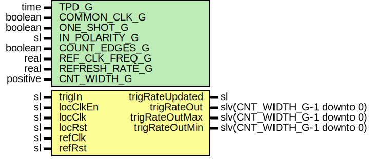

# Entity: SyncTrigRate

- **File**: SyncTrigRate.vhd
## Diagram

## Description

-----------------------------------------------------------------------------
 Company    : SLAC National Accelerator Laboratory
-----------------------------------------------------------------------------
 Description: This module measures the trigger rate of a trigger
-----------------------------------------------------------------------------
 This file is part of 'SLAC Firmware Standard Library'.
 It is subject to the license terms in the LICENSE.txt file found in the
 top-level directory of this distribution and at:
    https://confluence.slac.stanford.edu/display/ppareg/LICENSE.html.
 No part of 'SLAC Firmware Standard Library', including this file,
 may be copied, modified, propagated, or distributed except according to
 the terms contained in the LICENSE.txt file.
-----------------------------------------------------------------------------
## Generics

| Generic name   | Type     | Value    | Description                                 |
| -------------- | -------- | -------- | ------------------------------------------- |
| TPD_G          | time     | 1 ns     |  Simulation FF output delay                 |
| COMMON_CLK_G   | boolean  | false    |  true if locClk & refClk are the same clock |
| ONE_SHOT_G     | boolean  | false    |                                             |
| IN_POLARITY_G  | sl       | '1'      |  0 for active LOW, 1 for active HIGH        |
| COUNT_EDGES_G  | boolean  | false    |  Count edges or high time                   |
| REF_CLK_FREQ_G | real     | 200.0E+6 |  units of Hz                                |
| REFRESH_RATE_G | real     | 1.0E+0   |  units of Hz                                |
| CNT_WIDTH_G    | positive | 32       |                                             |
## Ports

| Port name       | Direction | Type                        | Description                         |
| --------------- | --------- | --------------------------- | ----------------------------------- |
| trigIn          | in        | sl                          | Trigger Input (locClk domain)       |
| trigRateUpdated | out       | sl                          | Trigger Rate Output (locClk domain) |
| trigRateOut     | out       | slv(CNT_WIDTH_G-1 downto 0) |  units of REFRESH_RATE_G            |
| trigRateOutMax  | out       | slv(CNT_WIDTH_G-1 downto 0) |  units of REFRESH_RATE_G            |
| trigRateOutMin  | out       | slv(CNT_WIDTH_G-1 downto 0) |  units of REFRESH_RATE_G            |
| locClkEn        | in        | sl                          | Clocks                              |
| locClk          | in        | sl                          |                                     |
| locRst          | in        | sl                          |                                     |
| refClk          | in        | sl                          |                                     |
| refRst          | in        | sl                          |                                     |
## Signals

| Name        | Type                        | Description |
| ----------- | --------------------------- | ----------- |
| r           | RegType                     |             |
| rin         | RegType                     |             |
| trig        | sl                          |             |
| trigLast    | sl                          |             |
| updated     | sl                          |             |
| trigCnt     | slv(CNT_WIDTH_G-1 downto 0) |             |
| trigCntSync | slv(CNT_WIDTH_G-1 downto 0) |             |
| rstStat     | sl                          |             |
## Constants

| Name       | Type    | Value                                                                                                                                                                                                                                    | Description |
| ---------- | ------- | ---------------------------------------------------------------------------------------------------------------------------------------------------------------------------------------------------------------------------------------- | ----------- |
| TIMEOUT_C  | natural |  getTimeRatio(REF_CLK_FREQ_G,  REFRESH_RATE_G)-1                                                                                                                                                      |             |
| REG_INIT_C | RegType |  (       updated    => '0',        timer      => 0,        trigCntDly => (others => '0'),        rate       => (others => '0')) |             |
## Types

| Name    | Type | Description |
| ------- | ---- | ----------- |
| RegType |      |             |
## Processes
- unnamed: ( locClk )
- comb: ( r, trigCntSync )
- seq: ( refClk )
## Instantiations

- SyncIn_trigCnt: surf.SynchronizerFifo
- U_Sync: surf.SyncMinMax
