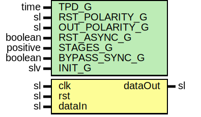

# Entity: Synchronizer

- **File**: Synchronizer.vhd
## Diagram

## Description

Company    : SLAC National Accelerator Laboratory
Description: A simple multi Flip FLop synchronization module.
             Sets attributes to keep synthesis for mucking with FF chain.
This file is part of 'SLAC Firmware Standard Library'.
It is subject to the license terms in the LICENSE.txt file found in the
top-level directory of this distribution and at:
   https://confluence.slac.stanford.edu/display/ppareg/LICENSE.html.
No part of 'SLAC Firmware Standard Library', including this file,
may be copied, modified, propagated, or distributed except according to
the terms contained in the LICENSE.txt file.
## Generics

| Generic name   | Type     | Value | Description                                                   |
| -------------- | -------- | ----- | ------------------------------------------------------------- |
| TPD_G          | time     | 1 ns  |                                                               |
| RST_POLARITY_G | sl       | '1'   | '1' for active HIGH reset, '0' for active LOW reset           |
| OUT_POLARITY_G | sl       | '1'   | 0 for active LOW, 1 for active HIGH                           |
| RST_ASYNC_G    | boolean  | false | Reset is asynchronous                                         |
| STAGES_G       | positive | 2     |                                                               |
| BYPASS_SYNC_G  | boolean  | false | Bypass Synchronizer module for synchronous data configuration |
| INIT_G         | slv      | "0"   |                                                               |
## Ports

| Port name | Direction | Type | Description           |
| --------- | --------- | ---- | --------------------- |
| clk       | in        | sl   | clock to be SYNC'd to |
| rst       | in        | sl   | Optional reset        |
| dataIn    | in        | sl   | Data to be 'synced'   |
| dataOut   | out       | sl   |                       |
## Signals

| Name               | Type                     | Description |
| ------------------ | ------------------------ | ----------- |
| crossDomainSyncReg | slv(STAGES_G-1 downto 0) |             |
| rin                | slv(STAGES_G-1 downto 0) |             |
## Constants

| Name   | Type                     | Value                                                                                                                 | Description |
| ------ | ------------------------ | --------------------------------------------------------------------------------------------------------------------- | ----------- |
| INIT_C | slv(STAGES_G-1 downto 0) |  ite(INIT_G = "0",  slvZero(STAGES_G),  INIT_G) |             |
