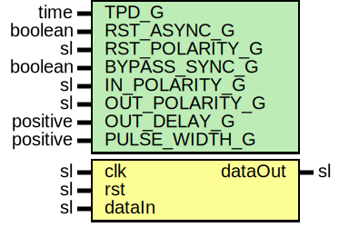

# Entity: SynchronizerOneShot

## Diagram

## Description

Company    : SLAC National Accelerator Laboratory
Description: One-Shot Pulser that has to cross clock domains
This file is part of 'SLAC Firmware Standard Library'.
It is subject to the license terms in the LICENSE.txt file found in the
top-level directory of this distribution and at:
   https://confluence.slac.stanford.edu/display/ppareg/LICENSE.html.
No part of 'SLAC Firmware Standard Library', including this file,
may be copied, modified, propagated, or distributed except according to
the terms contained in the LICENSE.txt file.
## Generics

| Generic name   | Type     | Value | Description                                              |
| -------------- | -------- | ----- | -------------------------------------------------------- |
| TPD_G          | time     | 1 ns  | Simulation FF output delay                               |
| RST_ASYNC_G    | boolean  | false |                                                          |
| RST_POLARITY_G | sl       | '1'   | '1' for active HIGH reset, '0' for active LOW reset      |
| BYPASS_SYNC_G  | boolean  | false | Bypass RstSync module for synchronous data configuration |
| IN_POLARITY_G  | sl       | '1'   | 0 for active LOW, 1 for active HIGH                      |
| OUT_POLARITY_G | sl       | '1'   | 0 for active LOW, 1 for active HIGH                      |
| OUT_DELAY_G    | positive | 3     | Stages in output sync chain                              |
| PULSE_WIDTH_G  | positive | 1     |                                                          |
## Ports

| Port name | Direction | Type | Description           |
| --------- | --------- | ---- | --------------------- |
| clk       | in        | sl   | Clock to be SYNC'd to |
| rst       | in        | sl   |                       |
| dataIn    | in        | sl   | Trigger to be sync'd  |
| dataOut   | out       | sl   |                       |
## Signals

| Name     | Type    | Description |
| -------- | ------- | ----------- |
| r        | RegType |             |
| rin      | RegType |             |
| pulseRst | sl      |             |
| edgeDet  | sl      |             |
## Constants

| Name       | Type    | Value                                                                            | Description |
| ---------- | ------- | -------------------------------------------------------------------------------- | ----------- |
| REG_INIT_C | RegType |  (       dataOut => '0',        counter => 0) |             |
## Types

| Name    | Type | Description |
| ------- | ---- | ----------- |
| RegType |      |             |
## Instantiations

- Sync_Pulse: surf.SynchronizerEdge
