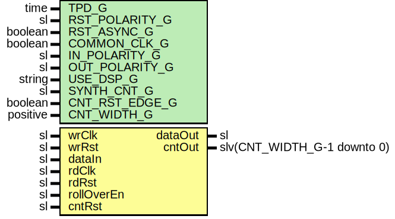

# Entity: SynchronizerOneShotCnt

- **File**: SynchronizerOneShotCnt.vhd
## Diagram

## Description

Company    : SLAC National Accelerator Laboratory
Description: Wrapper for SynchronizerOneShot with counter output
This file is part of 'SLAC Firmware Standard Library'.
It is subject to the license terms in the LICENSE.txt file found in the
top-level directory of this distribution and at:
   https://confluence.slac.stanford.edu/display/ppareg/LICENSE.html.
No part of 'SLAC Firmware Standard Library', including this file,
may be copied, modified, propagated, or distributed except according to
the terms contained in the LICENSE.txt file.
## Generics

| Generic name   | Type     | Value | Description                                                             |
| -------------- | -------- | ----- | ----------------------------------------------------------------------- |
| TPD_G          | time     | 1 ns  | Simulation FF output delay                                              |
| RST_POLARITY_G | sl       | '1'   | '1' for active HIGH reset, '0' for active LOW reset                     |
| RST_ASYNC_G    | boolean  | false | true if reset is asynchronous, false if reset is synchronous            |
| COMMON_CLK_G   | boolean  | false | True if wrClk and rdClk are the same clock                              |
| IN_POLARITY_G  | sl       | '1'   | 0 for active LOW, 1 for active HIGH (dataIn port)                       |
| OUT_POLARITY_G | sl       | '1'   | 0 for active LOW, 1 for active HIGH (dataOut port)                      |
| USE_DSP_G      | string   | "no"  | "no" for no DSP implementation, "yes" to use DSP slices                 |
| SYNTH_CNT_G    | sl       | '1'   | Set to 1 for synthesising counter RTL, '0' to not synthesis the counter |
| CNT_RST_EDGE_G | boolean  | true  | true if counter reset should be edge detected, else level detected      |
| CNT_WIDTH_G    | positive | 16    |                                                                         |
## Ports

| Port name  | Direction | Type                        | Description                         |
| ---------- | --------- | --------------------------- | ----------------------------------- |
| wrClk      | in        | sl                          | Write Ports (wrClk domain)          |
| wrRst      | in        | sl                          |                                     |
| dataIn     | in        | sl                          | trigger to be sync'd                |
| rdClk      | in        | sl                          | clock to be SYNC'd to               |
| rdRst      | in        | sl                          |                                     |
| rollOverEn | in        | sl                          | '1' allows roll over of the counter |
| cntRst     | in        | sl                          | Optional counter reset              |
| dataOut    | out       | sl                          | synced one-shot pulse               |
| cntOut     | out       | slv(CNT_WIDTH_G-1 downto 0) |                                     |
## Signals

| Name           | Type                        | Description |
| -------------- | --------------------------- | ----------- |
| r              | RegType                     |             |
| rin            | RegType                     |             |
| syncRst        | sl                          |             |
| cntRstSync     | sl                          |             |
| rollOverEnSync | sl                          |             |
| cntOutSync     | slv(CNT_WIDTH_G-1 downto 0) |             |
## Constants

| Name       | Type                        | Value                                                                                                             | Description |
| ---------- | --------------------------- | ----------------------------------------------------------------------------------------------------------------- | ----------- |
| MAX_CNT_C  | slv(CNT_WIDTH_G-1 downto 0) |  (others => '1')                                                                                                  |             |
| REG_INIT_C | RegType                     |  (       dataInDly => not(IN_POLARITY_G),        cntOut    => (others => '0')) |             |
## Types

| Name    | Type | Description |
| ------- | ---- | ----------- |
| RegType |      |             |
## Instantiations

- SyncOneShot_0: surf.SynchronizerOneShot
- Synchronizer_1: surf.Synchronizer
