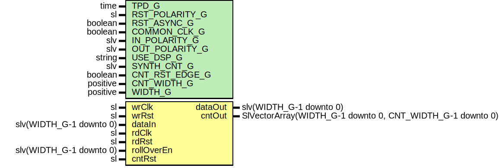

# Entity: SynchronizerOneShotCntVector

- **File**: SynchronizerOneShotCntVector.vhd
## Diagram

## Description

Company    : SLAC National Accelerator Laboratory
Description: Wrapper for multiple SynchronizerOneShotCnt modules
This file is part of 'SLAC Firmware Standard Library'.
It is subject to the license terms in the LICENSE.txt file found in the
top-level directory of this distribution and at:
   https://confluence.slac.stanford.edu/display/ppareg/LICENSE.html.
No part of 'SLAC Firmware Standard Library', including this file,
may be copied, modified, propagated, or distributed except according to
the terms contained in the LICENSE.txt file.
## Generics

| Generic name   | Type     | Value | Description                                                             |
| -------------- | -------- | ----- | ----------------------------------------------------------------------- |
| TPD_G          | time     | 1 ns  | Simulation FF output delay                                              |
| RST_POLARITY_G | sl       | '1'   | '1' for active HIGH reset, '0' for active LOW reset                     |
| RST_ASYNC_G    | boolean  | false | true if reset is asynchronous, false if reset is synchronous            |
| COMMON_CLK_G   | boolean  | false | True if wrClk and rdClk are the same clock                              |
| IN_POLARITY_G  | slv      | "1"   | 0 for active LOW, 1 for active HIGH (dataIn port)                       |
| OUT_POLARITY_G | slv      | "1"   | 0 for active LOW, 1 for active HIGH (dataOut port)                      |
| USE_DSP_G      | string   | "no"  | "no" for no DSP implementation, "yes" to use DSP slices                 |
| SYNTH_CNT_G    | slv      | "1"   | Set to 1 for synthesising counter RTL, '0' to not synthesis the counter |
| CNT_RST_EDGE_G | boolean  | true  | true if counter reset should be edge detected, else level detected      |
| CNT_WIDTH_G    | positive | 16    |                                                                         |
| WIDTH_G        | positive | 16    |                                                                         |
## Ports

| Port name  | Direction | Type                                                      | Description                         |
| ---------- | --------- | --------------------------------------------------------- | ----------------------------------- |
| wrClk      | in        | sl                                                        | Write Ports (wrClk domain)          |
| wrRst      | in        | sl                                                        |                                     |
| dataIn     | in        | slv(WIDTH_G-1 downto 0)                                   | Data to be 'synced'                 |
| rdClk      | in        | sl                                                        | clock to be SYNC'd to               |
| rdRst      | in        | sl                                                        |                                     |
| rollOverEn | in        | slv(WIDTH_G-1 downto 0)                                   | '1' allows roll over of the counter |
| cntRst     | in        | sl                                                        | Optional counter reset              |
| dataOut    | out       | slv(WIDTH_G-1 downto 0)                                   | Synced data                         |
| cntOut     | out       | SlVectorArray(WIDTH_G-1 downto 0, CNT_WIDTH_G-1 downto 0) |                                     |
## Signals

| Name           | Type                         | Description |
| -------------- | ---------------------------- | ----------- |
| cntWrDomain    | MySlvArray                   |             |
| cntRdDomain    | MySlvArray                   |             |
| r              | RegType                      |             |
| rin            | RegType                      |             |
| cntRstSync     | sl                           |             |
| rollOverEnSync | slv(WIDTH_G-1 downto 0)      |             |
| wrEn           | sl                           |             |
| tReady         | sl                           |             |
| almostFull     | sl                           |             |
| rdValid        | sl                           |             |
| rdData         | slv(FIFO_WIDTH_C-1 downto 0) |             |
## Constants

| Name           | Type                    | Value                                                                                                                                               | Description |
| -------------- | ----------------------- | --------------------------------------------------------------------------------------------------------------------------------------------------- | ----------- |
| IN_POLARITY_C  | slv(WIDTH_G-1 downto 0) |  fillVectorArray(IN_POLARITY_G)                                                                                                                     |             |
| OUT_POLARITY_C | slv(WIDTH_G-1 downto 0) |  fillVectorArray(OUT_POLARITY_G)                                                                                                                    |             |
| SYNTH_CNT_C    | slv(WIDTH_G-1 downto 0) |  fillVectorArray(SYNTH_CNT_G)                                                                                                                       |             |
| FIFO_WIDTH_C   | positive                |  CNT_WIDTH_G + bitSize(WIDTH_G-1)                                                                                                                   |             |
| REG_INIT_C     | RegType                 |  (       tValid => '0',        tData  => (others => '0'),        index  => 0) |             |
## Types

| Name       | Type | Description |
| ---------- | ---- | ----------- |
| MySlvArray |      |             |
| RegType    |      |             |
## Functions
- fillVectorArray (INPUT : slv)  return slv 
