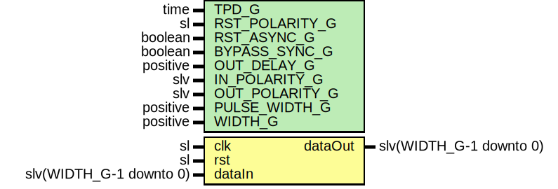

# Entity: SynchronizerOneShotVector

## Diagram

## Description

Company    : SLAC National Accelerator Laboratory
Description: Wrapper for multiple SynchronizerOneShot modules
This file is part of 'SLAC Firmware Standard Library'.
It is subject to the license terms in the LICENSE.txt file found in the
top-level directory of this distribution and at:
   https://confluence.slac.stanford.edu/display/ppareg/LICENSE.html.
No part of 'SLAC Firmware Standard Library', including this file,
may be copied, modified, propagated, or distributed except according to
the terms contained in the LICENSE.txt file.
## Generics

| Generic name   | Type     | Value | Description                                              |
| -------------- | -------- | ----- | -------------------------------------------------------- |
| TPD_G          | time     | 1 ns  | Simulation FF output delay                               |
| RST_POLARITY_G | sl       | '1'   | '1' for active HIGH reset, '0' for active LOW reset      |
| RST_ASYNC_G    | boolean  | false | Reset is asynchronous                                    |
| BYPASS_SYNC_G  | boolean  | false | Bypass RstSync module for synchronous data configuration |
| OUT_DELAY_G    | positive | 3     | Delay between deassertion of async and sync resets       |
| IN_POLARITY_G  | slv      | "1"   | 0 for active LOW, 1 for active HIGH                      |
| OUT_POLARITY_G | slv      | "1"   | 0 for active LOW, 1 for active HIGH                      |
| PULSE_WIDTH_G  | positive | 1     | one-shot pulse width duration (units of clk cycles)      |
| WIDTH_G        | positive | 16    |                                                          |
## Ports

| Port name | Direction | Type                    | Description           |
| --------- | --------- | ----------------------- | --------------------- |
| clk       | in        | sl                      | Clock to be SYNC'd to |
| rst       | in        | sl                      | Optional reset        |
| dataIn    | in        | slv(WIDTH_G-1 downto 0) | Data to be 'synced'   |
| dataOut   | out       | slv(WIDTH_G-1 downto 0) |                       |
## Constants

| Name           | Type                | Value                            | Description |
| -------------- | ------------------- | -------------------------------- | ----------- |
| IN_POLARITY_C  | PolarityVectorArray |  FillVectorArray(IN_POLARITY_G)  |             |
| OUT_POLARITY_C | PolarityVectorArray |  FillVectorArray(OUT_POLARITY_G) |             |
## Types

| Name                | Type | Description |
| ------------------- | ---- | ----------- |
| PolarityVectorArray |      |             |
## Functions
- FillVectorArray (INPUT : slv)  return PolarityVectorArray 
