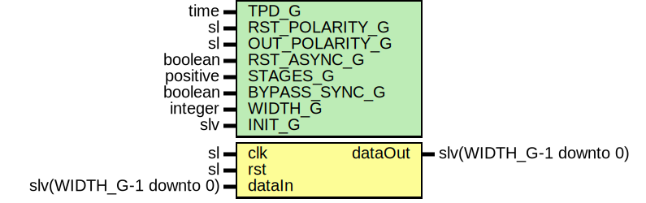

# Entity: SynchronizerVector

## Diagram

## Description

Company    : SLAC National Accelerator Laboratory
Description: Wrapper for multiple SynchronizerVector modules
This file is part of 'SLAC Firmware Standard Library'.
It is subject to the license terms in the LICENSE.txt file found in the
top-level directory of this distribution and at:
   https://confluence.slac.stanford.edu/display/ppareg/LICENSE.html.
No part of 'SLAC Firmware Standard Library', including this file,
may be copied, modified, propagated, or distributed except according to
the terms contained in the LICENSE.txt file.
## Generics

| Generic name   | Type     | Value | Description                                                   |
| -------------- | -------- | ----- | ------------------------------------------------------------- |
| TPD_G          | time     | 1 ns  |                                                               |
| RST_POLARITY_G | sl       | '1'   | '1' for active HIGH reset, '0' for active LOW reset           |
| OUT_POLARITY_G | sl       | '1'   | 0 for active LOW, 1 for active HIGH                           |
| RST_ASYNC_G    | boolean  | false | Reset is asynchronous                                         |
| STAGES_G       | positive | 2     |                                                               |
| BYPASS_SYNC_G  | boolean  | false | Bypass Synchronizer module for synchronous data configuration |
| WIDTH_G        | integer  | 16    |                                                               |
| INIT_G         | slv      | "0"   |                                                               |
## Ports

| Port name | Direction | Type                    | Description           |
| --------- | --------- | ----------------------- | --------------------- |
| clk       | in        | sl                      | clock to be SYNC'd to |
| rst       | in        | sl                      | Optional reset        |
| dataIn    | in        | slv(WIDTH_G-1 downto 0) | Data to be 'synced'   |
| dataOut   | out       | slv(WIDTH_G-1 downto 0) |                       |
## Signals

| Name               | Type     | Description |
| ------------------ | -------- | ----------- |
| crossDomainSyncReg | RegArray |             |
| rin                | RegArray |             |
## Constants

| Name   | Type     | Value                    | Description |
| ------ | -------- | ------------------------ | ----------- |
| INIT_C | RegArray |  FillVectorArray(INIT_G) |             |
## Types

| Name     | Type | Description |
| -------- | ---- | ----------- |
| RegArray |      |             |
## Functions
- FillVectorArray (INPUT : slv)  return RegArray 
