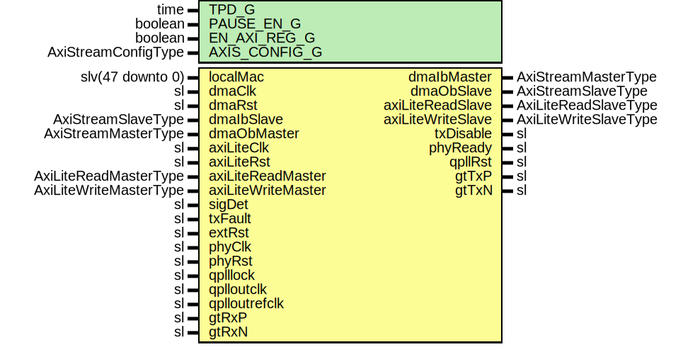

# Entity: TenGigEthGth7

- **File**: TenGigEthGth7.vhd
## Diagram

## Description

-----------------------------------------------------------------------------
 Company    : SLAC National Accelerator Laboratory
-----------------------------------------------------------------------------
 Description: 10GBASE-R Ethernet for Gth7
-----------------------------------------------------------------------------
 This file is part of 'SLAC Firmware Standard Library'.
 It is subject to the license terms in the LICENSE.txt file found in the
 top-level directory of this distribution and at:
    https://confluence.slac.stanford.edu/display/ppareg/LICENSE.html.
 No part of 'SLAC Firmware Standard Library', including this file,
 may be copied, modified, propagated, or distributed except according to
 the terms contained in the LICENSE.txt file.
-----------------------------------------------------------------------------
## Generics

| Generic name  | Type                | Value              | Description                   |
| ------------- | ------------------- | ------------------ | ----------------------------- |
| TPD_G         | time                | 1 ns               |                               |
| PAUSE_EN_G    | boolean             | true               |                               |
| EN_AXI_REG_G  | boolean             | false              | AXI-Lite Configurations       |
| AXIS_CONFIG_G | AxiStreamConfigType | EMAC_AXIS_CONFIG_C | AXI Streaming Configurations  |
## Ports

| Port name          | Direction | Type                   | Description              |
| ------------------ | --------- | ---------------------- | ------------------------ |
| localMac           | in        | slv(47 downto 0)       | Local Configurations     |
| dmaClk             | in        | sl                     | Streaming DMA Interface  |
| dmaRst             | in        | sl                     |                          |
| dmaIbMaster        | out       | AxiStreamMasterType    |                          |
| dmaIbSlave         | in        | AxiStreamSlaveType     |                          |
| dmaObMaster        | in        | AxiStreamMasterType    |                          |
| dmaObSlave         | out       | AxiStreamSlaveType     |                          |
| axiLiteClk         | in        | sl                     | Slave AXI-Lite Interface |
| axiLiteRst         | in        | sl                     |                          |
| axiLiteReadMaster  | in        | AxiLiteReadMasterType  |                          |
| axiLiteReadSlave   | out       | AxiLiteReadSlaveType   |                          |
| axiLiteWriteMaster | in        | AxiLiteWriteMasterType |                          |
| axiLiteWriteSlave  | out       | AxiLiteWriteSlaveType  |                          |
| sigDet             | in        | sl                     | SFP+ Ports               |
| txFault            | in        | sl                     |                          |
| txDisable          | out       | sl                     |                          |
| extRst             | in        | sl                     | Misc. Signals            |
| phyClk             | in        | sl                     |                          |
| phyRst             | in        | sl                     |                          |
| phyReady           | out       | sl                     |                          |
| qplllock           | in        | sl                     | Quad PLL Ports           |
| qplloutclk         | in        | sl                     |                          |
| qplloutrefclk      | in        | sl                     |                          |
| qpllRst            | out       | sl                     |                          |
| gtTxP              | out       | sl                     | MGT Ports                |
| gtTxN              | out       | sl                     |                          |
| gtRxP              | in        | sl                     |                          |
| gtRxN              | in        | sl                     |                          |
## Signals

| Name                | Type                   | Description |
| ------------------- | ---------------------- | ----------- |
| mAxiReadMaster      | AxiLiteReadMasterType  |             |
| mAxiReadSlave       | AxiLiteReadSlaveType   |             |
| mAxiWriteMaster     | AxiLiteWriteMasterType |             |
| mAxiWriteSlave      | AxiLiteWriteSlaveType  |             |
| phyRxd              | slv(63 downto 0)       |             |
| phyRxc              | slv(7 downto 0)        |             |
| phyTxd              | slv(63 downto 0)       |             |
| phyTxc              | slv(7 downto 0)        |             |
| areset              | sl                     |             |
| txClk322            | sl                     |             |
| txUsrClk            | sl                     |             |
| txUsrClk2           | sl                     |             |
| txUsrRdy            | sl                     |             |
| drpReqGnt           | sl                     |             |
| drpEn               | sl                     |             |
| drpWe               | sl                     |             |
| drpAddr             | slv(15 downto 0)       |             |
| drpDi               | slv(15 downto 0)       |             |
| drpRdy              | sl                     |             |
| drpDo               | slv(15 downto 0)       |             |
| configurationVector | slv(535 downto 0)      |             |
| config              | TenGigEthConfig        |             |
| status              | TenGigEthStatus        |             |
| macRxAxisMaster     | AxiStreamMasterType    |             |
| macRxAxisCtrl       | AxiStreamCtrlType      |             |
| macTxAxisMaster     | AxiStreamMasterType    |             |
| macTxAxisSlave      | AxiStreamSlaveType     |             |
## Instantiations

- U_AxiLiteAsync: surf.AxiLiteAsync
 **Description**
----------------
 Synchronization
----------------

- U_Sync: surf.SynchronizerVector
- U_MAC: surf.EthMacTop
 **Description**
------------------
 Ethernet MAC core
------------------

- U_TenGigEthGth7Core: TenGigEthGth7Core
 **Description**
---------------
 10GBASE-R core
---------------

- U_TenGigEthRst: surf.TenGigEthRst
 **Description**
-----------------------------------
 10GBASE-R's Reset Module
-----------------------------------

- U_TenGigEthReg: surf.TenGigEthReg
 **Description**
------------------------------
 Configuration/Status Register
------------------------------

