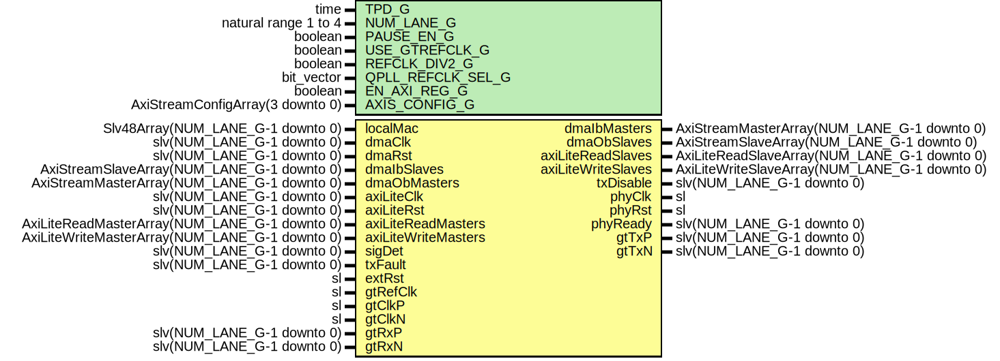

# Entity: TenGigEthGth7Wrapper

- **File**: TenGigEthGth7Wrapper.vhd
## Diagram

## Description

Company    : SLAC National Accelerator Laboratory
Description: Gth7 Wrapper for 10GBASE-R Ethernet
Note: This module supports up to a MGT QUAD of 10GigE interfaces
This file is part of 'SLAC Firmware Standard Library'.
It is subject to the license terms in the LICENSE.txt file found in the
top-level directory of this distribution and at:
   https://confluence.slac.stanford.edu/display/ppareg/LICENSE.html.
No part of 'SLAC Firmware Standard Library', including this file,
may be copied, modified, propagated, or distributed except according to
the terms contained in the LICENSE.txt file.
## Generics

| Generic name      | Type                             | Value                          | Description                                                |
| ----------------- | -------------------------------- | ------------------------------ | ---------------------------------------------------------- |
| TPD_G             | time                             | 1 ns                           |                                                            |
| NUM_LANE_G        | natural range 1 to 4             | 1                              |                                                            |
| PAUSE_EN_G        | boolean                          | true                           |                                                            |
| USE_GTREFCLK_G    | boolean                          | false                          |  FALSE: gtClkP/N,  TRUE: gtRefClk                          |
| REFCLK_DIV2_G     | boolean                          | false                          |  FALSE: gtClkP/N = 156.25 MHz,  TRUE: gtClkP/N = 312.5 MHz |
| QPLL_REFCLK_SEL_G | bit_vector                       | "001"                          |                                                            |
| EN_AXI_REG_G      | boolean                          | false                          | AXI-Lite Configurations                                    |
| AXIS_CONFIG_G     | AxiStreamConfigArray(3 downto 0) | (others => EMAC_AXIS_CONFIG_C) | AXI Streaming Configurations                               |
## Ports

| Port name           | Direction | Type                                           | Description              |
| ------------------- | --------- | ---------------------------------------------- | ------------------------ |
| localMac            | in        | Slv48Array(NUM_LANE_G-1 downto 0)              | Local Configurations     |
| dmaClk              | in        | slv(NUM_LANE_G-1 downto 0)                     | Streaming DMA Interface  |
| dmaRst              | in        | slv(NUM_LANE_G-1 downto 0)                     |                          |
| dmaIbMasters        | out       | AxiStreamMasterArray(NUM_LANE_G-1 downto 0)    |                          |
| dmaIbSlaves         | in        | AxiStreamSlaveArray(NUM_LANE_G-1 downto 0)     |                          |
| dmaObMasters        | in        | AxiStreamMasterArray(NUM_LANE_G-1 downto 0)    |                          |
| dmaObSlaves         | out       | AxiStreamSlaveArray(NUM_LANE_G-1 downto 0)     |                          |
| axiLiteClk          | in        | slv(NUM_LANE_G-1 downto 0)                     | Slave AXI-Lite Interface |
| axiLiteRst          | in        | slv(NUM_LANE_G-1 downto 0)                     |                          |
| axiLiteReadMasters  | in        | AxiLiteReadMasterArray(NUM_LANE_G-1 downto 0)  |                          |
| axiLiteReadSlaves   | out       | AxiLiteReadSlaveArray(NUM_LANE_G-1 downto 0)   |                          |
| axiLiteWriteMasters | in        | AxiLiteWriteMasterArray(NUM_LANE_G-1 downto 0) |                          |
| axiLiteWriteSlaves  | out       | AxiLiteWriteSlaveArray(NUM_LANE_G-1 downto 0)  |                          |
| sigDet              | in        | slv(NUM_LANE_G-1 downto 0)                     | SFP+ Ports               |
| txFault             | in        | slv(NUM_LANE_G-1 downto 0)                     |                          |
| txDisable           | out       | slv(NUM_LANE_G-1 downto 0)                     |                          |
| extRst              | in        | sl                                             | Misc. Signals            |
| phyClk              | out       | sl                                             |                          |
| phyRst              | out       | sl                                             |                          |
| phyReady            | out       | slv(NUM_LANE_G-1 downto 0)                     |                          |
| gtRefClk            | in        | sl                                             | 156.25 MHz only          |
| gtClkP              | in        | sl                                             |                          |
| gtClkN              | in        | sl                                             |                          |
| gtTxP               | out       | slv(NUM_LANE_G-1 downto 0)                     | MGT Ports                |
| gtTxN               | out       | slv(NUM_LANE_G-1 downto 0)                     |                          |
| gtRxP               | in        | slv(NUM_LANE_G-1 downto 0)                     |                          |
| gtRxN               | in        | slv(NUM_LANE_G-1 downto 0)                     |                          |
## Signals

| Name          | Type                       | Description |
| ------------- | -------------------------- | ----------- |
| phyClock      | sl                         |             |
| phyReset      | sl                         |             |
| qplllock      | sl                         |             |
| qplloutclk    | sl                         |             |
| qplloutrefclk | sl                         |             |
| qpllRst       | slv(NUM_LANE_G-1 downto 0) |             |
| qpllReset     | sl                         |             |
## Instantiations

- TenGigEthGth7Clk_Inst: surf.TenGigEthGth7Clk
**Description**
Common Clock Module

