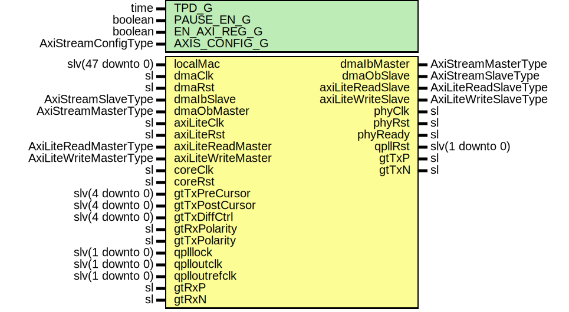

# Entity: TenGigEthGthUltraScale

## Diagram

## Description

Company    : SLAC National Accelerator Laboratory
Description: 10GBASE-R Ethernet for GTH Ultra Scale
This file is part of 'SLAC Firmware Standard Library'.
It is subject to the license terms in the LICENSE.txt file found in the
top-level directory of this distribution and at:
   https://confluence.slac.stanford.edu/display/ppareg/LICENSE.html.
No part of 'SLAC Firmware Standard Library', including this file,
may be copied, modified, propagated, or distributed except according to
the terms contained in the LICENSE.txt file.
## Generics

| Generic name  | Type                | Value              | Description                   |
| ------------- | ------------------- | ------------------ | ----------------------------- |
| TPD_G         | time                | 1 ns               |                               |
| PAUSE_EN_G    | boolean             | true               |                               |
| EN_AXI_REG_G  | boolean             | false              | AXI-Lite Configurations       |
| AXIS_CONFIG_G | AxiStreamConfigType | EMAC_AXIS_CONFIG_C | AXI Streaming Configurations  |
## Ports

| Port name          | Direction | Type                   | Description                 |
| ------------------ | --------- | ---------------------- | --------------------------- |
| localMac           | in        | slv(47 downto 0)       | Local Configurations        |
| dmaClk             | in        | sl                     | Streaming DMA Interface     |
| dmaRst             | in        | sl                     |                             |
| dmaIbMaster        | out       | AxiStreamMasterType    |                             |
| dmaIbSlave         | in        | AxiStreamSlaveType     |                             |
| dmaObMaster        | in        | AxiStreamMasterType    |                             |
| dmaObSlave         | out       | AxiStreamSlaveType     |                             |
| axiLiteClk         | in        | sl                     | Slave AXI-Lite Interface    |
| axiLiteRst         | in        | sl                     |                             |
| axiLiteReadMaster  | in        | AxiLiteReadMasterType  |                             |
| axiLiteReadSlave   | out       | AxiLiteReadSlaveType   |                             |
| axiLiteWriteMaster | in        | AxiLiteWriteMasterType |                             |
| axiLiteWriteSlave  | out       | AxiLiteWriteSlaveType  |                             |
| coreClk            | in        | sl                     | Misc. Signals               |
| coreRst            | in        | sl                     |                             |
| phyClk             | out       | sl                     |                             |
| phyRst             | out       | sl                     |                             |
| phyReady           | out       | sl                     |                             |
| gtTxPreCursor      | in        | slv(4 downto 0)        | Transceiver Debug Interface |
| gtTxPostCursor     | in        | slv(4 downto 0)        |                             |
| gtTxDiffCtrl       | in        | slv(4 downto 0)        |                             |
| gtRxPolarity       | in        | sl                     |                             |
| gtTxPolarity       | in        | sl                     |                             |
| qplllock           | in        | slv(1 downto 0)        | Quad PLL Ports              |
| qplloutclk         | in        | slv(1 downto 0)        |                             |
| qplloutrefclk      | in        | slv(1 downto 0)        |                             |
| qpllRst            | out       | slv(1 downto 0)        |                             |
| gtTxP              | out       | sl                     | MGT Ports                   |
| gtTxN              | out       | sl                     |                             |
| gtRxP              | in        | sl                     |                             |
| gtRxN              | in        | sl                     |                             |
## Signals

| Name            | Type                   | Description |
| --------------- | ---------------------- | ----------- |
| mAxiReadMaster  | AxiLiteReadMasterType  |             |
| mAxiReadSlave   | AxiLiteReadSlaveType   |             |
| mAxiWriteMaster | AxiLiteWriteMasterType |             |
| mAxiWriteSlave  | AxiLiteWriteSlaveType  |             |
| phyRxd          | slv(63 downto 0)       |             |
| phyRxc          | slv(7 downto 0)        |             |
| phyTxd          | slv(63 downto 0)       |             |
| phyTxc          | slv(7 downto 0)        |             |
| txGtClk         | sl                     |             |
| phyClock        | sl                     |             |
| phyReset        | sl                     |             |
| config          | TenGigEthConfig        |             |
| status          | TenGigEthStatus        |             |
| macRxAxisMaster | AxiStreamMasterType    |             |
| macRxAxisCtrl   | AxiStreamCtrlType      |             |
| macTxAxisMaster | AxiStreamMasterType    |             |
| macTxAxisSlave  | AxiStreamSlaveType     |             |
## Instantiations

- U_AxiLiteAsync: surf.AxiLiteAsync
**Description**
Synchronization

- U_MAC: surf.EthMacTop
**Description**
Ethernet MAC core

- U_TenGigEthGthUltraScaleCore: TenGigEthGthUltraScale156p25MHzCore
**Description**
10GBASE-R core

- U_TenGigEthRst: surf.TenGigEthGthUltraScaleRst
**Description**
10GBASE-R's Reset Module

- U_TenGigEthReg: surf.TenGigEthReg
**Description**
Configuration/Status Register

