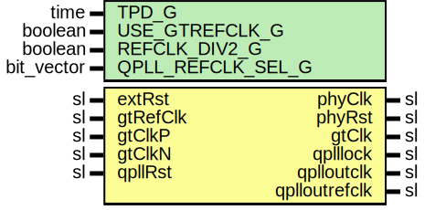

# Entity: TenGigEthGtx7Clk

## Diagram

## Description

Company    : SLAC National Accelerator Laboratory
Description: 10GBASE-R Ethernet's Clock Module
This file is part of 'SLAC Firmware Standard Library'.
It is subject to the license terms in the LICENSE.txt file found in the
top-level directory of this distribution and at:
   https://confluence.slac.stanford.edu/display/ppareg/LICENSE.html.
No part of 'SLAC Firmware Standard Library', including this file,
may be copied, modified, propagated, or distributed except according to
the terms contained in the LICENSE.txt file.
## Generics

| Generic name      | Type       | Value | Description                                                |
| ----------------- | ---------- | ----- | ---------------------------------------------------------- |
| TPD_G             | time       | 1 ns  |                                                            |
| USE_GTREFCLK_G    | boolean    | false |  FALSE: gtClkP/N,  TRUE: gtRefClk                          |
| REFCLK_DIV2_G     | boolean    | false |  FALSE: gtClkP/N = 156.25 MHz,  TRUE: gtClkP/N = 312.5 MHz |
| QPLL_REFCLK_SEL_G | bit_vector | "001" |                                                            |
## Ports

| Port name     | Direction | Type | Description     |
| ------------- | --------- | ---- | --------------- |
| extRst        | in        | sl   | async reset     |
| phyClk        | out       | sl   |                 |
| phyRst        | out       | sl   |                 |
| gtRefClk      | in        | sl   | 156.25 MHz only |
| gtClkP        | in        | sl   |                 |
| gtClkN        | in        | sl   |                 |
| gtClk         | out       | sl   |                 |
| qplllock      | out       | sl   | Quad PLL Ports  |
| qplloutclk    | out       | sl   |                 |
| qplloutrefclk | out       | sl   |                 |
| qpllRst       | in        | sl   |                 |
## Signals

| Name         | Type | Description |
| ------------ | ---- | ----------- |
| refClockDiv2 | sl   |             |
| refClock     | sl   |             |
| refClk       | sl   |             |
| phyClock     | sl   |             |
| phyReset     | sl   |             |
| pwrUpRst     | sl   |             |
| qpllReset    | sl   |             |
## Constants

| Name              | Type       | Value                                                                                                                  | Description |
| ----------------- | ---------- | ---------------------------------------------------------------------------------------------------------------------- | ----------- |
| QPLL_REFCLK_SEL_C | bit_vector |  ite(USE_GTREFCLK_G,  "111",  QPLL_REFCLK_SEL_G) |             |
## Instantiations

- PwrUpRst_Inst: surf.PwrUpRst
- Synchronizer_0: surf.Synchronizer
- IBUFDS_GTE2_Inst: IBUFDS_GTE2
- CLK156_BUFG: BUFG
- Gtx7QuadPll_Inst: surf.Gtx7QuadPll
