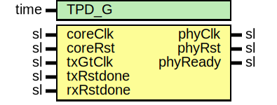

# Entity: TenGigEthGtyUltraScaleRst

- **File**: TenGigEthGtyUltraScaleRst.vhd
## Diagram

## Description

Company    : SLAC National Accelerator Laboratory
Description: 10GBASE-R Ethernet Reset Module
This file is part of 'SLAC Firmware Standard Library'.
It is subject to the license terms in the LICENSE.txt file found in the
top-level directory of this distribution and at:
   https://confluence.slac.stanford.edu/display/ppareg/LICENSE.html.
No part of 'SLAC Firmware Standard Library', including this file,
may be copied, modified, propagated, or distributed except according to
the terms contained in the LICENSE.txt file.
## Generics

| Generic name | Type | Value | Description |
| ------------ | ---- | ----- | ----------- |
| TPD_G        | time | 1 ns  |             |
## Ports

| Port name | Direction | Type | Description |
| --------- | --------- | ---- | ----------- |
| coreClk   | in        | sl   |             |
| coreRst   | in        | sl   |             |
| txGtClk   | in        | sl   |             |
| txRstdone | in        | sl   |             |
| rxRstdone | in        | sl   |             |
| phyClk    | out       | sl   |             |
| phyRst    | out       | sl   |             |
| phyReady  | out       | sl   |             |
## Signals

| Name     | Type | Description |
| -------- | ---- | ----------- |
| phyClock | sl   |             |
| ready    | sl   |             |
## Instantiations

- U_RstSync: surf.RstSync
- U_Sync: surf.Synchronizer
