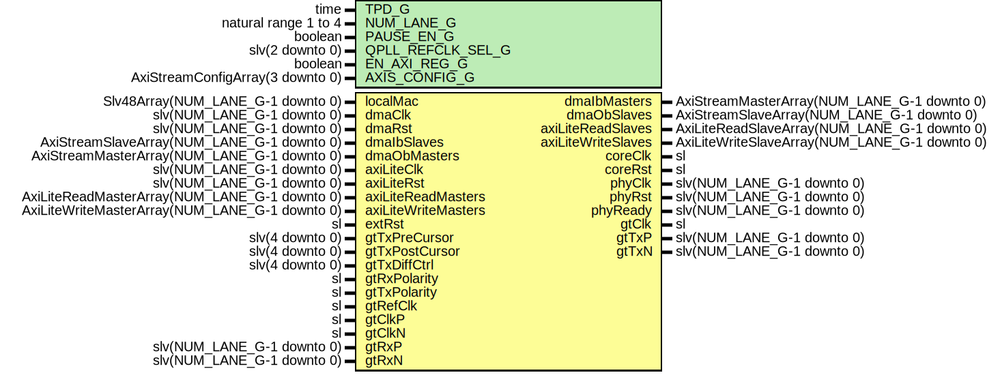

# Entity: TenGigEthGtyUltraScaleWrapper

- **File**: TenGigEthGtyUltraScaleWrapper.vhd
## Diagram

## Description

-----------------------------------------------------------------------------
 Company    : SLAC National Accelerator Laboratory
-----------------------------------------------------------------------------
 Description: GTH Ultra Scale Wrapper for 10GBASE-R Ethernet
 Note: This module supports up to a MGT QUAD of 10GigE interfaces
-----------------------------------------------------------------------------
 This file is part of 'SLAC Firmware Standard Library'.
 It is subject to the license terms in the LICENSE.txt file found in the
 top-level directory of this distribution and at:
    https://confluence.slac.stanford.edu/display/ppareg/LICENSE.html.
 No part of 'SLAC Firmware Standard Library', including this file,
 may be copied, modified, propagated, or distributed except according to
 the terms contained in the LICENSE.txt file.
-----------------------------------------------------------------------------
## Generics

| Generic name      | Type                             | Value                          | Description                   |
| ----------------- | -------------------------------- | ------------------------------ | ----------------------------- |
| TPD_G             | time                             | 1 ns                           |                               |
| NUM_LANE_G        | natural range 1 to 4             | 1                              |                               |
| PAUSE_EN_G        | boolean                          | true                           |                               |
| QPLL_REFCLK_SEL_G | slv(2 downto 0)                  | "001"                          | QUAD PLL Configurations       |
| EN_AXI_REG_G      | boolean                          | false                          | AXI-Lite Configurations       |
| AXIS_CONFIG_G     | AxiStreamConfigArray(3 downto 0) | (others => EMAC_AXIS_CONFIG_C) | AXI Streaming Configurations  |
## Ports

| Port name           | Direction | Type                                           | Description                 |
| ------------------- | --------- | ---------------------------------------------- | --------------------------- |
| localMac            | in        | Slv48Array(NUM_LANE_G-1 downto 0)              | Local Configurations        |
| dmaClk              | in        | slv(NUM_LANE_G-1 downto 0)                     | Streaming DMA Interface     |
| dmaRst              | in        | slv(NUM_LANE_G-1 downto 0)                     |                             |
| dmaIbMasters        | out       | AxiStreamMasterArray(NUM_LANE_G-1 downto 0)    |                             |
| dmaIbSlaves         | in        | AxiStreamSlaveArray(NUM_LANE_G-1 downto 0)     |                             |
| dmaObMasters        | in        | AxiStreamMasterArray(NUM_LANE_G-1 downto 0)    |                             |
| dmaObSlaves         | out       | AxiStreamSlaveArray(NUM_LANE_G-1 downto 0)     |                             |
| axiLiteClk          | in        | slv(NUM_LANE_G-1 downto 0)                     | Slave AXI-Lite Interface    |
| axiLiteRst          | in        | slv(NUM_LANE_G-1 downto 0)                     |                             |
| axiLiteReadMasters  | in        | AxiLiteReadMasterArray(NUM_LANE_G-1 downto 0)  |                             |
| axiLiteReadSlaves   | out       | AxiLiteReadSlaveArray(NUM_LANE_G-1 downto 0)   |                             |
| axiLiteWriteMasters | in        | AxiLiteWriteMasterArray(NUM_LANE_G-1 downto 0) |                             |
| axiLiteWriteSlaves  | out       | AxiLiteWriteSlaveArray(NUM_LANE_G-1 downto 0)  |                             |
| extRst              | in        | sl                                             | Misc. Signals               |
| coreClk             | out       | sl                                             |                             |
| coreRst             | out       | sl                                             |                             |
| phyClk              | out       | slv(NUM_LANE_G-1 downto 0)                     |                             |
| phyRst              | out       | slv(NUM_LANE_G-1 downto 0)                     |                             |
| phyReady            | out       | slv(NUM_LANE_G-1 downto 0)                     |                             |
| gtClk               | out       | sl                                             |                             |
| gtTxPreCursor       | in        | slv(4 downto 0)                                | Transceiver Debug Interface |
| gtTxPostCursor      | in        | slv(4 downto 0)                                |                             |
| gtTxDiffCtrl        | in        | slv(4 downto 0)                                |                             |
| gtRxPolarity        | in        | sl                                             |                             |
| gtTxPolarity        | in        | sl                                             |                             |
| gtRefClk            | in        | sl                                             | MGT Clock Port (156.25 MHz) |
| gtClkP              | in        | sl                                             |                             |
| gtClkN              | in        | sl                                             |                             |
| gtTxP               | out       | slv(NUM_LANE_G-1 downto 0)                     | MGT Ports                   |
| gtTxN               | out       | slv(NUM_LANE_G-1 downto 0)                     |                             |
| gtRxP               | in        | slv(NUM_LANE_G-1 downto 0)                     |                             |
| gtRxN               | in        | slv(NUM_LANE_G-1 downto 0)                     |                             |
## Signals

| Name          | Type                  | Description |
| ------------- | --------------------- | ----------- |
| qplllock      | slv(1 downto 0)       |             |
| qplloutclk    | slv(1 downto 0)       |             |
| qplloutrefclk | slv(1 downto 0)       |             |
| qpllRst       | Slv2Array(3 downto 0) |             |
| qpllReset     | slv(1 downto 0)       |             |
| coreClock     | sl                    |             |
| coreReset     | sl                    |             |
## Instantiations

- PwrUpRst_Inst: surf.PwrUpRst
**Description**
---------------
 Power Up Reset
---------------

- TenGigEthGtyUltraScaleClk_Inst: surf.TenGigEthGtyUltraScaleClk
**Description**
--------------------
 Common Clock Module
--------------------

