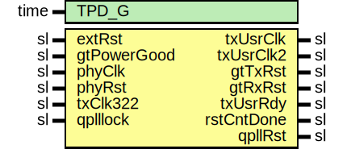

# Entity: TenGigEthRst

- **File**: TenGigEthRst.vhd
## Diagram

## Description

-----------------------------------------------------------------------------
 Company    : SLAC National Accelerator Laboratory
-----------------------------------------------------------------------------
 Description: 10GbE Reset Module
-----------------------------------------------------------------------------
 This file is part of 'SLAC Firmware Standard Library'.
 It is subject to the license terms in the LICENSE.txt file found in the
 top-level directory of this distribution and at:
    https://confluence.slac.stanford.edu/display/ppareg/LICENSE.html.
 No part of 'SLAC Firmware Standard Library', including this file,
 may be copied, modified, propagated, or distributed except according to
 the terms contained in the LICENSE.txt file.
-----------------------------------------------------------------------------
## Generics

| Generic name | Type | Value | Description |
| ------------ | ---- | ----- | ----------- |
| TPD_G        | time | 1 ns  |             |
## Ports

| Port name   | Direction | Type | Description    |
| ----------- | --------- | ---- | -------------- |
| extRst      | in        | sl   |  async reset   |
| gtPowerGood | in        | sl   |                |
| phyClk      | in        | sl   |                |
| phyRst      | in        | sl   |                |
| txClk322    | in        | sl   |                |
| txUsrClk    | out       | sl   |                |
| txUsrClk2   | out       | sl   |                |
| gtTxRst     | out       | sl   |                |
| gtRxRst     | out       | sl   |                |
| txUsrRdy    | out       | sl   |                |
| rstCntDone  | out       | sl   |                |
| qplllock    | in        | sl   | Quad PLL Ports |
| qpllRst     | out       | sl   |                |
## Signals

| Name     | Type            | Description |
| -------- | --------------- | ----------- |
| txClock  | sl              |             |
| txReset  | sl              |             |
| txReady  | sl              |             |
| rstCnt   | slv(8 downto 0) |             |
| rstPulse | slv(3 downto 0) |             |
## Processes
- unnamed: ( phyClk )
- unnamed: ( txClock )
## Instantiations

- CLK312_BUFG: BUFG
- Synchronizer_1: surf.Synchronizer
- Synchronizer_2: surf.Synchronizer
