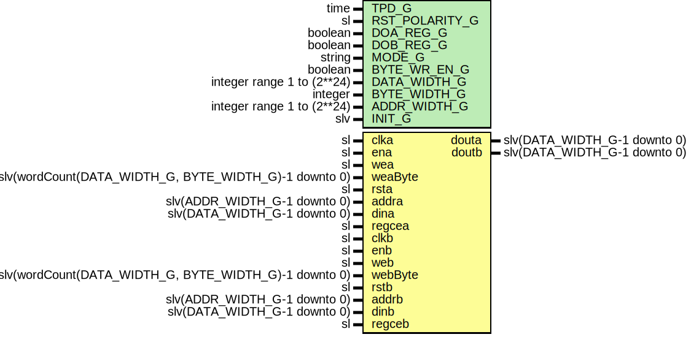

# Entity: TrueDualPortRam

- **File**: TrueDualPortRam.vhd
## Diagram

## Description

Company    : SLAC National Accelerator Laboratory
Description: This will infer this module as Block RAM only
NOTE: TDP ram with read enable logic is not supported.
This file is part of 'SLAC Firmware Standard Library'.
It is subject to the license terms in the LICENSE.txt file found in the
top-level directory of this distribution and at:
   https://confluence.slac.stanford.edu/display/ppareg/LICENSE.html.
No part of 'SLAC Firmware Standard Library', including this file,
may be copied, modified, propagated, or distributed except according to
the terms contained in the LICENSE.txt file.
## Generics

| Generic name   | Type                       | Value        | Description                                 |
| -------------- | -------------------------- | ------------ | ------------------------------------------- |
| TPD_G          | time                       | 1 ns         |                                             |
| RST_POLARITY_G | sl                         | '1'          | '1' for active high rst, '0' for active low |
| DOA_REG_G      | boolean                    | false        | Extra output register on doutA.             |
| DOB_REG_G      | boolean                    | false        | Extra output register on doutB.             |
| MODE_G         | string                     | "read-first" |                                             |
| BYTE_WR_EN_G   | boolean                    | false        |                                             |
| DATA_WIDTH_G   | integer range 1 to (2**24) | 18           |                                             |
| BYTE_WIDTH_G   | integer                    | 8            | Should be multiple of 8 or 9.               |
| ADDR_WIDTH_G   | integer range 1 to (2**24) | 9            |                                             |
| INIT_G         | slv                        | "0"          |                                             |
## Ports

| Port name | Direction | Type                                                  | Description                                                        |
| --------- | --------- | ----------------------------------------------------- | ------------------------------------------------------------------ |
| clka      | in        | sl                                                    | Port A                                                             |
| ena       | in        | sl                                                    |                                                                    |
| wea       | in        | sl                                                    |                                                                    |
| weaByte   | in        | slv(wordCount(DATA_WIDTH_G, BYTE_WIDTH_G)-1 downto 0) |                                                                    |
| rsta      | in        | sl                                                    |                                                                    |
| addra     | in        | slv(ADDR_WIDTH_G-1 downto 0)                          |                                                                    |
| dina      | in        | slv(DATA_WIDTH_G-1 downto 0)                          |                                                                    |
| douta     | out       | slv(DATA_WIDTH_G-1 downto 0)                          |                                                                    |
| regcea    | in        | sl                                                    | Clock enable for extra output reg. Only used when DOA_REG_G = true |
| clkb      | in        | sl                                                    | Port B                                                             |
| enb       | in        | sl                                                    |                                                                    |
| web       | in        | sl                                                    |                                                                    |
| webByte   | in        | slv(wordCount(DATA_WIDTH_G, BYTE_WIDTH_G)-1 downto 0) |                                                                    |
| rstb      | in        | sl                                                    |                                                                    |
| addrb     | in        | slv(ADDR_WIDTH_G-1 downto 0)                          |                                                                    |
| dinb      | in        | slv(DATA_WIDTH_G-1 downto 0)                          |                                                                    |
| doutb     | out       | slv(DATA_WIDTH_G-1 downto 0)                          |                                                                    |
| regceb    | in        | sl                                                    |                                                                    |
## Signals

| Name       | Type                              | Description |
| ---------- | --------------------------------- | ----------- |
| doutAInt   | slv(FULL_DATA_WIDTH_C-1 downto 0) |             |
| doutBInt   | slv(FULL_DATA_WIDTH_C-1 downto 0) |             |
| weaByteInt | slv(weaByte'range)                |             |
| webByteInt | slv(webByte'range)                |             |
## Constants

| Name              | Type                              | Value                                                                                                                          | Description |
| ----------------- | --------------------------------- | ------------------------------------------------------------------------------------------------------------------------------ | ----------- |
| BYTE_WIDTH_C      | natural                           |  ite(BYTE_WR_EN_G,  BYTE_WIDTH_G,  DATA_WIDTH_G)         |             |
| NUM_BYTES_C       | natural                           |  wordCount(DATA_WIDTH_G,  BYTE_WIDTH_C)                                                     |             |
| FULL_DATA_WIDTH_C | natural                           |  NUM_BYTES_C*BYTE_WIDTH_C                                                                                                      |             |
| INIT_C            | slv(FULL_DATA_WIDTH_C-1 downto 0) |  ite(INIT_G = "0",  slvZero(FULL_DATA_WIDTH_C),  INIT_G) |             |
## Types

| Name     | Type | Description   |
| -------- | ---- | ------------- |
| mem_type |      | Shared memory |
