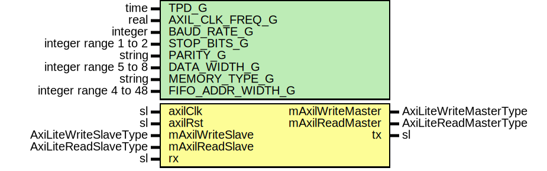

# Entity: UartAxiLiteMaster

- **File**: UartAxiLiteMaster.vhd
## Diagram

## Description

-----------------------------------------------------------------------------
 Title      : UART Memory Protocol: https://confluence.slac.stanford.edu/x/uSDoDQ
-----------------------------------------------------------------------------
 Company    : SLAC National Accelerator Laboratory
-----------------------------------------------------------------------------
 Description: Ties together everything needed for a full duplex UART.
 This includes Baud Rate Generator, Transmitter, Receiver and FIFOs.
-----------------------------------------------------------------------------
 This file is part of 'SLAC Firmware Standard Library'.
 It is subject to the license terms in the LICENSE.txt file found in the
 top-level directory of this distribution and at:
    https://confluence.slac.stanford.edu/display/ppareg/LICENSE.html.
 No part of 'SLAC Firmware Standard Library', including this file,
 may be copied, modified, propagated, or distributed except according to
 the terms contained in the LICENSE.txt file.
-----------------------------------------------------------------------------
## Generics

| Generic name      | Type                  | Value         | Description          |
| ----------------- | --------------------- | ------------- | -------------------- |
| TPD_G             | time                  | 1 ns          |                      |
| AXIL_CLK_FREQ_G   | real                  | 125.0e6       |                      |
| BAUD_RATE_G       | integer               | 115200        |                      |
| STOP_BITS_G       | integer range 1 to 2  | 1             |                      |
| PARITY_G          | string                | "NONE"        |  "NONE" "ODD" "EVEN" |
| DATA_WIDTH_G      | integer range 5 to 8  | 8             |                      |
| MEMORY_TYPE_G     | string                | "distributed" |                      |
| FIFO_ADDR_WIDTH_G | integer range 4 to 48 | 5             |                      |
## Ports

| Port name        | Direction | Type                   | Description                 |
| ---------------- | --------- | ---------------------- | --------------------------- |
| axilClk          | in        | sl                     |                             |
| axilRst          | in        | sl                     |                             |
| mAxilWriteMaster | out       | AxiLiteWriteMasterType | Transmit parallel interface |
| mAxilWriteSlave  | in        | AxiLiteWriteSlaveType  |                             |
| mAxilReadMaster  | out       | AxiLiteReadMasterType  |                             |
| mAxilReadSlave   | in        | AxiLiteReadSlaveType   |                             |
| tx               | out       | sl                     | Serial IO                   |
| rx               | in        | sl                     |                             |
## Signals

| Name        | Type            | Description |
| ----------- | --------------- | ----------- |
| uartRxData  | slv(7 downto 0) |             |
| uartRxValid | sl              |             |
| uartRxReady | sl              |             |
| uartTxData  | slv(7 downto 0) |             |
| uartTxValid | sl              |             |
| uartTxReady | sl              |             |
## Instantiations

- U_UartWrapper_1: surf.UartWrapper
- U_Fsm: surf.UartAxiLiteMasterFsm
**Description**
 [in]
---------------------
 Finite State Machine
---------------------

