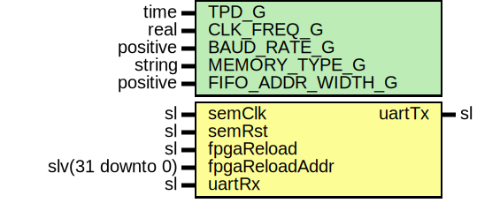

# Entity: UartSem

## Diagram

## Description

Company    : SLAC National Accelerator Laboratory
Description: UART wrapper for 7-series SEM module
This file is part of 'SLAC Firmware Standard Library'.
It is subject to the license terms in the LICENSE.txt file found in the
top-level directory of this distribution and at:
   https://confluence.slac.stanford.edu/display/ppareg/LICENSE.html.
No part of 'SLAC Firmware Standard Library', including this file,
may be copied, modified, propagated, or distributed except according to
the terms contained in the LICENSE.txt file.
## Generics

| Generic name      | Type     | Value    | Description |
| ----------------- | -------- | -------- | ----------- |
| TPD_G             | time     | 1 ns     |             |
| CLK_FREQ_G        | real     | 100.0E+6 |             |
| BAUD_RATE_G       | positive | 115200   |             |
| MEMORY_TYPE_G     | string   | "block"  |             |
| FIFO_ADDR_WIDTH_G | positive | 5        |             |
## Ports

| Port name      | Direction | Type             | Description           |
| -------------- | --------- | ---------------- | --------------------- |
| semClk         | in        | sl               | Clock and Reset       |
| semRst         | in        | sl               |                       |
| fpgaReload     | in        | sl               | IPROG Interface       |
| fpgaReloadAddr | in        | slv(31 downto 0) |                       |
| uartTx         | out       | sl               | UART Serial Interface |
| uartRx         | in        | sl               |                       |
## Signals

| Name    | Type      | Description |
| ------- | --------- | ----------- |
| wrData  | sl        |             |
| wrValid | sl        |             |
| wrFull  | sl        |             |
| wrReady | sl        |             |
| rdData  | sl        |             |
| rdValid | sl        |             |
| rdEmpty | sl        |             |
| rdReady | sl        |             |
| semIb   | SemIbType |             |
| semOb   | SemObType |             |
## Instantiations

- U_Sem: surf.SemWrapper
- U_Uart: surf.UartWrapper
**Description**
 UART Serdes Core

