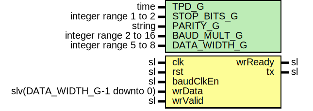

# Entity: UartTx

## Diagram

## Description

Company    : SLAC National Accelerator Laboratory
Description: Uart Transmitter
This file is part of 'SLAC Firmware Standard Library'.
It is subject to the license terms in the LICENSE.txt file found in the
top-level directory of this distribution and at:
   https://confluence.slac.stanford.edu/display/ppareg/LICENSE.html.
No part of 'SLAC Firmware Standard Library', including this file,
may be copied, modified, propagated, or distributed except according to
the terms contained in the LICENSE.txt file.
## Generics

| Generic name | Type                  | Value  | Description         |
| ------------ | --------------------- | ------ | ------------------- |
| TPD_G        | time                  | 1 ns   |                     |
| STOP_BITS_G  | integer range 1 to 2  | 1      |                     |
| PARITY_G     | string                | "NONE" | "NONE" "ODD" "EVEN" |
| BAUD_MULT_G  | integer range 2 to 16 | 16     |                     |
| DATA_WIDTH_G | integer range 5 to 8  | 8      |                     |
## Ports

| Port name | Direction | Type                         | Description |
| --------- | --------- | ---------------------------- | ----------- |
| clk       | in        | sl                           |             |
| rst       | in        | sl                           |             |
| baudClkEn | in        | sl                           |             |
| wrData    | in        | slv(DATA_WIDTH_G-1 downto 0) |             |
| wrValid   | in        | sl                           |             |
| wrReady   | out       | sl                           |             |
| tx        | out       | sl                           |             |
## Signals

| Name | Type    | Description |
| ---- | ------- | ----------- |
| r    | RegType |             |
| rin  | RegType |             |
## Constants

| Name              | Type    | Value                                                                                                                                                                                                                                                                                                                                                                                                                                                                                         | Description |
| ----------------- | ------- | --------------------------------------------------------------------------------------------------------------------------------------------------------------------------------------------------------------------------------------------------------------------------------------------------------------------------------------------------------------------------------------------------------------------------------------------------------------------------------------------- | ----------- |
| PARITY_BITS_C     | integer |  ite(PARITY_G = "NONE",  0,  1)                                                                                                                                                                                                                                                                                                                                                                                         |             |
| START_BIT_C       | integer |  1                                                                                                                                                                                                                                                                                                                                                                                                                                                                                            |             |
| SHIFT_REG_WIDTH_C | integer |  START_BIT_C + DATA_WIDTH_G + PARITY_BITS_C + STOP_BITS_G                                                                                                                                                                                                                                                                                                                                                                                                                                     |             |
| REG_INIT_C        | RegType |  (       wrReady        => '0',        holdReg        => (others => '0'),        parity         => '0',        txState        => WAIT_DATA_S,        baudClkEnCount => (others => '0'),        shiftReg       => (others => '1'),        shiftCount     => (others => '0')) |             |
## Types

| Name      | Type                                                                                                                                                    | Description |
| --------- | ------------------------------------------------------------------------------------------------------------------------------------------------------- | ----------- |
| StateType | (WAIT_DATA_S,  SYNC_EN_S,  WAIT_S,  TX_BIT_S)  |             |
| RegType   |                                                                                                                                                         |             |
## Processes
- comb: ( baudClkEn, r, rst, wrData, wrValid )
- seq: ( clk )
