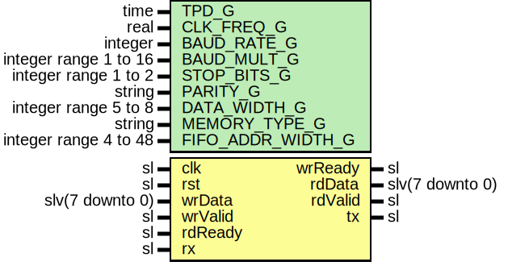

# Entity: UartWrapper

- **File**: UartWrapper.vhd
## Diagram

## Description

Company    : SLAC National Accelerator Laboratory
Description: Ties together everything needed for a full duplex UART.
This includes Baud Rate Generator, Transmitter, Receiver and FIFOs.
This file is part of 'SLAC Firmware Standard Library'.
It is subject to the license terms in the LICENSE.txt file found in the
top-level directory of this distribution and at:
   https://confluence.slac.stanford.edu/display/ppareg/LICENSE.html.
No part of 'SLAC Firmware Standard Library', including this file,
may be copied, modified, propagated, or distributed except according to
the terms contained in the LICENSE.txt file.
## Generics

| Generic name      | Type                  | Value         | Description         |
| ----------------- | --------------------- | ------------- | ------------------- |
| TPD_G             | time                  | 1 ns          |                     |
| CLK_FREQ_G        | real                  | 125.0e6       |                     |
| BAUD_RATE_G       | integer               | 115200        |                     |
| BAUD_MULT_G       | integer range 1 to 16 | 16            |                     |
| STOP_BITS_G       | integer range 1 to 2  | 1             |                     |
| PARITY_G          | string                | "NONE"        | "NONE" "ODD" "EVEN" |
| DATA_WIDTH_G      | integer range 5 to 8  | 8             |                     |
| MEMORY_TYPE_G     | string                | "distributed" |                     |
| FIFO_ADDR_WIDTH_G | integer range 4 to 48 | 4             |                     |
## Ports

| Port name | Direction | Type            | Description                 |
| --------- | --------- | --------------- | --------------------------- |
| clk       | in        | sl              |                             |
| rst       | in        | sl              |                             |
| wrData    | in        | slv(7 downto 0) | Transmit parallel interface |
| wrValid   | in        | sl              |                             |
| wrReady   | out       | sl              |                             |
| rdData    | out       | slv(7 downto 0) | Receive parallel interface  |
| rdValid   | out       | sl              |                             |
| rdReady   | in        | sl              |                             |
| tx        | out       | sl              | Serial IO                   |
| rx        | in        | sl              |                             |
## Signals

| Name           | Type            | Description |
| -------------- | --------------- | ----------- |
| uartTxData     | slv(7 downto 0) |             |
| uartTxValid    | sl              |             |
| uartTxReady    | sl              |             |
| uartTxRdEn     | sl              |             |
| fifoTxData     | slv(7 downto 0) |             |
| fifoTxValid    | sl              |             |
| fifoTxReady    | sl              |             |
| uartRxData     | slv(7 downto 0) |             |
| uartRxValid    | sl              |             |
| uartRxValidInt | sl              |             |
| uartRxReady    | sl              |             |
| fifoRxData     | slv(7 downto 0) |             |
| fifoRxValid    | sl              |             |
| fifoRxReady    | sl              |             |
| fifoRxRdEn     | sl              |             |
| baudClkEn      | sl              |             |
## Instantiations

- U_UartBrg_1: surf.UartBrg
- U_UartTx_1: surf.UartTx
**Description**
[out]
UART transmitter

- U_Fifo_Tx: surf.Fifo
- U_UartRx_1: surf.UartRx
**Description**
[out]
UART Receiver

- U_Fifo_Rx: surf.Fifo
