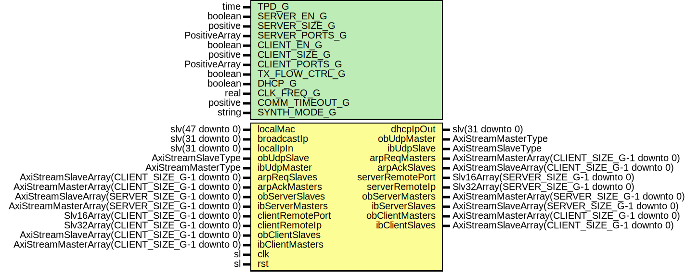

# Entity: UdpEngine

## Diagram

## Description

Company    : SLAC National Accelerator Laboratory
Description: Top-Level UDP/DHCP Module
This file is part of 'SLAC Firmware Standard Library'.
It is subject to the license terms in the LICENSE.txt file found in the
top-level directory of this distribution and at:
   https://confluence.slac.stanford.edu/display/ppareg/LICENSE.html.
No part of 'SLAC Firmware Standard Library', including this file,
may be copied, modified, propagated, or distributed except according to
the terms contained in the LICENSE.txt file.
## Generics

| Generic name   | Type          | Value       | Description                                                                                   |
| -------------- | ------------- | ----------- | --------------------------------------------------------------------------------------------- |
| TPD_G          | time          | 1 ns        | Simulation Generics                                                                           |
| SERVER_EN_G    | boolean       | true        | UDP Server Generics                                                                           |
| SERVER_SIZE_G  | positive      | 1           |                                                                                               |
| SERVER_PORTS_G | PositiveArray | (0 => 8192) |                                                                                               |
| CLIENT_EN_G    | boolean       | true        | UDP Client Generics                                                                           |
| CLIENT_SIZE_G  | positive      | 1           |                                                                                               |
| CLIENT_PORTS_G | PositiveArray | (0 => 8193) |                                                                                               |
| TX_FLOW_CTRL_G | boolean       | true        | True: Blow off the UDP TX data if link down, False: Backpressure until TX link is up          |
| DHCP_G         | boolean       | false       |                                                                                               |
| CLK_FREQ_G     | real          | 156.25E+06  | In units of Hz                                                                                |
| COMM_TIMEOUT_G | positive      | 30          | In units of seconds, Client's Communication timeout before re-ARPing or DHCP discover/request |
| SYNTH_MODE_G   | string        | "inferred"  |                                                                                               |
## Ports

| Port name        | Direction | Type                                           | Description                        |
| ---------------- | --------- | ---------------------------------------------- | ---------------------------------- |
| localMac         | in        | slv(47 downto 0)                               |  big-Endian configuration          |
| broadcastIp      | in        | slv(31 downto 0)                               |  big-Endian configuration          |
| localIpIn        | in        | slv(31 downto 0)                               |  big-Endian configuration          |
| dhcpIpOut        | out       | slv(31 downto 0)                               |  big-Endian configuration          |
| obUdpMaster      | out       | AxiStreamMasterType                            | Interface to IPV4 Engine           |
| obUdpSlave       | in        | AxiStreamSlaveType                             |                                    |
| ibUdpMaster      | in        | AxiStreamMasterType                            |                                    |
| ibUdpSlave       | out       | AxiStreamSlaveType                             |                                    |
| arpReqMasters    | out       | AxiStreamMasterArray(CLIENT_SIZE_G-1 downto 0) | Interface to ARP Engine            |
| arpReqSlaves     | in        | AxiStreamSlaveArray(CLIENT_SIZE_G-1 downto 0)  |                                    |
| arpAckMasters    | in        | AxiStreamMasterArray(CLIENT_SIZE_G-1 downto 0) |                                    |
| arpAckSlaves     | out       | AxiStreamSlaveArray(CLIENT_SIZE_G-1 downto 0)  |                                    |
| serverRemotePort | out       | Slv16Array(SERVER_SIZE_G-1 downto 0)           |  big-Endian configuration          |
| serverRemoteIp   | out       | Slv32Array(SERVER_SIZE_G-1 downto 0)           |  big-Endian configuration          |
| obServerMasters  | out       | AxiStreamMasterArray(SERVER_SIZE_G-1 downto 0) |  tData is big-Endian configuration |
| obServerSlaves   | in        | AxiStreamSlaveArray(SERVER_SIZE_G-1 downto 0)  |                                    |
| ibServerMasters  | in        | AxiStreamMasterArray(SERVER_SIZE_G-1 downto 0) |                                    |
| ibServerSlaves   | out       | AxiStreamSlaveArray(SERVER_SIZE_G-1 downto 0)  |  tData is big-Endian configuration |
| clientRemotePort | in        | Slv16Array(CLIENT_SIZE_G-1 downto 0)           |  big-Endian configuration          |
| clientRemoteIp   | in        | Slv32Array(CLIENT_SIZE_G-1 downto 0)           |  big-Endian configuration          |
| obClientMasters  | out       | AxiStreamMasterArray(CLIENT_SIZE_G-1 downto 0) |  tData is big-Endian configuration |
| obClientSlaves   | in        | AxiStreamSlaveArray(CLIENT_SIZE_G-1 downto 0)  |                                    |
| ibClientMasters  | in        | AxiStreamMasterArray(CLIENT_SIZE_G-1 downto 0) |                                    |
| ibClientSlaves   | out       | AxiStreamSlaveArray(CLIENT_SIZE_G-1 downto 0)  |  tData is big-Endian configuration |
| clk              | in        | sl                                             | Clock and Reset                    |
| rst              | in        | sl                                             |                                    |
## Signals

| Name            | Type                                 | Description |
| --------------- | ------------------------------------ | ----------- |
| clientRemoteDet | slv(CLIENT_SIZE_G-1 downto 0)        |             |
| clientRemoteMac | Slv48Array(CLIENT_SIZE_G-1 downto 0) |             |
| remotePort      | Slv16Array(SERVER_SIZE_G-1 downto 0) |             |
| remoteIp        | Slv32Array(SERVER_SIZE_G-1 downto 0) |             |
| serverRemoteMac | Slv48Array(SERVER_SIZE_G-1 downto 0) |             |
| obUdpMasters    | AxiStreamMasterArray(1 downto 0)     |             |
| obUdpSlaves     | AxiStreamSlaveArray(1 downto 0)      |             |
| ibDhcpMaster    | AxiStreamMasterType                  |             |
| ibDhcpSlave     | AxiStreamSlaveType                   |             |
| obDhcpMaster    | AxiStreamMasterType                  |             |
| obDhcpSlave     | AxiStreamSlaveType                   |             |
| localIp         | slv(31 downto 0)                     |             |
## Instantiations

- U_UdpEngineRx: surf.UdpEngineRx
