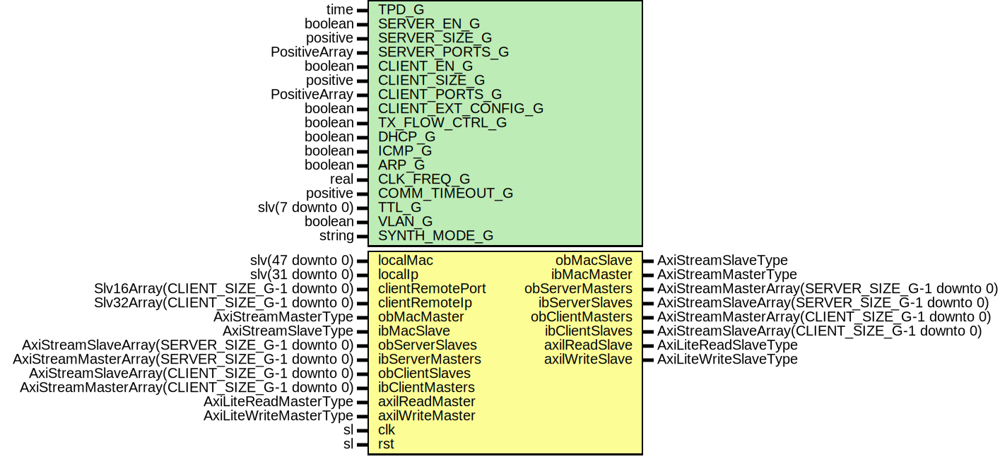

# Entity: UdpEngineWrapper

- **File**: UdpEngineWrapper.vhd
## Diagram

## Description

-----------------------------------------------------------------------------
 Company    : SLAC National Accelerator Laboratory
-----------------------------------------------------------------------------
 Description: Wrapper for UdpEngine
-----------------------------------------------------------------------------
 This file is part of 'SLAC Firmware Standard Library'.
 It is subject to the license terms in the LICENSE.txt file found in the
 top-level directory of this distribution and at:
    https://confluence.slac.stanford.edu/display/ppareg/LICENSE.html.
 No part of 'SLAC Firmware Standard Library', including this file,
 may be copied, modified, propagated, or distributed except according to
 the terms contained in the LICENSE.txt file.
-----------------------------------------------------------------------------
## Generics

| Generic name        | Type            | Value       | Description                                                                                    |
| ------------------- | --------------- | ----------- | ---------------------------------------------------------------------------------------------- |
| TPD_G               | time            | 1 ns        | Simulation Generics                                                                            |
| SERVER_EN_G         | boolean         | true        | UDP Server Generics                                                                            |
| SERVER_SIZE_G       | positive        | 1           |                                                                                                |
| SERVER_PORTS_G      | PositiveArray   | (0 => 8192) |                                                                                                |
| CLIENT_EN_G         | boolean         | true        | UDP Client Generics                                                                            |
| CLIENT_SIZE_G       | positive        | 1           |                                                                                                |
| CLIENT_PORTS_G      | PositiveArray   | (0 => 8193) |                                                                                                |
| CLIENT_EXT_CONFIG_G | boolean         | false       |                                                                                                |
| TX_FLOW_CTRL_G      | boolean         | true        |  True: Blow off the UDP TX data if link down, False: Backpressure until TX link is up          |
| DHCP_G              | boolean         | false       |                                                                                                |
| ICMP_G              | boolean         | true        |                                                                                                |
| ARP_G               | boolean         | true        |                                                                                                |
| CLK_FREQ_G          | real            | 156.25E+06  |  In units of Hz                                                                                |
| COMM_TIMEOUT_G      | positive        | 30          |  In units of seconds, Client's Communication timeout before re-ARPing or DHCP discover/request |
| TTL_G               | slv(7 downto 0) | x"20"       |  IPv4's Time-To-Live (TTL)                                                                     |
| VLAN_G              | boolean         | false       |  true = VLAN support                                                                           |
| SYNTH_MODE_G        | string          | "inferred"  |                                                                                                |
## Ports

| Port name        | Direction | Type                                           | Description                                         |
| ---------------- | --------- | ---------------------------------------------- | --------------------------------------------------- |
| localMac         | in        | slv(47 downto 0)                               |   big-Endian configuration                          |
| localIp          | in        | slv(31 downto 0)                               |   big-Endian configuration                          |
| clientRemotePort | in        | Slv16Array(CLIENT_SIZE_G-1 downto 0)           | Remote Configurations                               |
| clientRemoteIp   | in        | Slv32Array(CLIENT_SIZE_G-1 downto 0)           |                                                     |
| obMacMaster      | in        | AxiStreamMasterType                            | Interface to Ethernet Media Access Controller (MAC) |
| obMacSlave       | out       | AxiStreamSlaveType                             |                                                     |
| ibMacMaster      | out       | AxiStreamMasterType                            |                                                     |
| ibMacSlave       | in        | AxiStreamSlaveType                             |                                                     |
| obServerMasters  | out       | AxiStreamMasterArray(SERVER_SIZE_G-1 downto 0) |   tData is big-Endian configuration                 |
| obServerSlaves   | in        | AxiStreamSlaveArray(SERVER_SIZE_G-1 downto 0)  |                                                     |
| ibServerMasters  | in        | AxiStreamMasterArray(SERVER_SIZE_G-1 downto 0) |                                                     |
| ibServerSlaves   | out       | AxiStreamSlaveArray(SERVER_SIZE_G-1 downto 0)  |   tData is big-Endian configuration                 |
| obClientMasters  | out       | AxiStreamMasterArray(CLIENT_SIZE_G-1 downto 0) |   tData is big-Endian configuration                 |
| obClientSlaves   | in        | AxiStreamSlaveArray(CLIENT_SIZE_G-1 downto 0)  |                                                     |
| ibClientMasters  | in        | AxiStreamMasterArray(CLIENT_SIZE_G-1 downto 0) |                                                     |
| ibClientSlaves   | out       | AxiStreamSlaveArray(CLIENT_SIZE_G-1 downto 0)  |   tData is big-Endian configuration                 |
| axilReadMaster   | in        | AxiLiteReadMasterType                          | AXI-Lite Interface                                  |
| axilReadSlave    | out       | AxiLiteReadSlaveType                           |                                                     |
| axilWriteMaster  | in        | AxiLiteWriteMasterType                         |                                                     |
| axilWriteSlave   | out       | AxiLiteWriteSlaveType                          |                                                     |
| clk              | in        | sl                                             | Clock and Reset                                     |
| rst              | in        | sl                                             |                                                     |
## Signals

| Name             | Type                                           | Description |
| ---------------- | ---------------------------------------------- | ----------- |
| r                | RegType                                        |             |
| rin              | RegType                                        |             |
| arpReqMasters    | AxiStreamMasterArray(CLIENT_SIZE_G-1 downto 0) |             |
| arpReqSlaves     | AxiStreamSlaveArray(CLIENT_SIZE_G-1 downto 0)  |             |
| arpAckMasters    | AxiStreamMasterArray(CLIENT_SIZE_G-1 downto 0) |             |
| arpAckSlaves     | AxiStreamSlaveArray(CLIENT_SIZE_G-1 downto 0)  |             |
| ibUdpMaster      | AxiStreamMasterType                            |             |
| ibUdpSlave       | AxiStreamSlaveType                             |             |
| obUdpMaster      | AxiStreamMasterType                            |             |
| obUdpSlave       | AxiStreamSlaveType                             |             |
| serverRemotePort | Slv16Array(SERVER_SIZE_G-1 downto 0)           |             |
| serverRemoteIp   | Slv32Array(SERVER_SIZE_G-1 downto 0)           |             |
| dhcpIp           | slv(31 downto 0)                               |             |
## Constants

| Name       | Type    | Value                                                                                                                                                                                                                                                                                                                                                                                                                    | Description |
| ---------- | ------- | ------------------------------------------------------------------------------------------------------------------------------------------------------------------------------------------------------------------------------------------------------------------------------------------------------------------------------------------------------------------------------------------------------------------------ | ----------- |
| REG_INIT_C | RegType |  (       broadcastIp      => (others => '0'),        clientRemotePort => (others => (others => '0')),        clientRemoteIp   => (others => (others => '0')),        axilReadSlave    => AXI_LITE_READ_SLAVE_INIT_C,        axilWriteSlave   => AXI_LITE_WRITE_SLAVE_INIT_C) |             |
## Types

| Name    | Type | Description |
| ------- | ---- | ----------- |
| RegType |      |             |
## Processes
- comb: ( axilReadMaster, axilWriteMaster, clientRemoteIp,
                   clientRemotePort, dhcpIp, localMac, r, rst, serverRemoteIp,
                   serverRemotePort )
- seq: ( clk )
## Instantiations

- IpV4Engine_Inst: surf.IpV4Engine
- UdpEngine_Inst: surf.UdpEngine
**Description**
-----------
 UDP Engine
-----------

