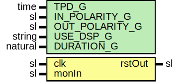

# Entity: WatchDogRst

- **File**: WatchDogRst.vhd
## Diagram

## Description

-----------------------------------------------------------------------------
 Company    : SLAC National Accelerator Laboratory
-----------------------------------------------------------------------------
 Description: Watch Dog Reset module
-----------------------------------------------------------------------------
 This file is part of 'SLAC Firmware Standard Library'.
 It is subject to the license terms in the LICENSE.txt file found in the
 top-level directory of this distribution and at:
    https://confluence.slac.stanford.edu/display/ppareg/LICENSE.html.
 No part of 'SLAC Firmware Standard Library', including this file,
 may be copied, modified, propagated, or distributed except according to
 the terms contained in the LICENSE.txt file.
-----------------------------------------------------------------------------
## Generics

| Generic name   | Type    | Value     | Description |
| -------------- | ------- | --------- | ----------- |
| TPD_G          | time    | 1 ns      |             |
| IN_POLARITY_G  | sl      | '1'       |             |
| OUT_POLARITY_G | sl      | '1'       |             |
| USE_DSP_G      | string  | "no"      |             |
| DURATION_G     | natural | 156250000 |             |
## Ports

| Port name | Direction | Type | Description |
| --------- | --------- | ---- | ----------- |
| clk       | in        | sl   |             |
| monIn     | in        | sl   |             |
| rstOut    | out       | sl   |             |
## Signals

| Name     | Type                          | Description |
| -------- | ----------------------------- | ----------- |
| rst      | sl                            |             |
| monInput | sl                            |             |
| cnt      | natural range 0 to DURATION_G |             |
## Processes
- unnamed: ( clk )
## Instantiations

- Synchronizer_Inst: surf.Synchronizer
