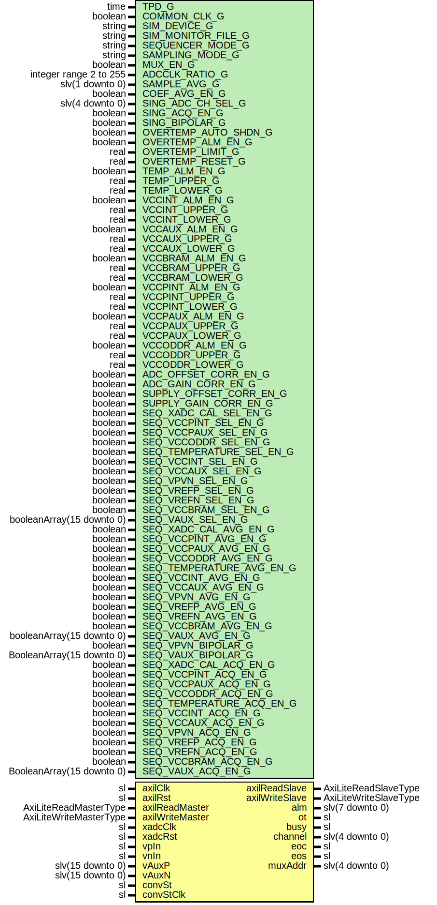

# Entity: XadcSimpleCore

- **File**: XadcSimpleCore.vhd
## Diagram

## Description

-----------------------------------------------------------------------------
 Company    : SLAC National Accelerator Laboratory
-----------------------------------------------------------------------------
 Description: This core only measures internal voltages and temperature
-----------------------------------------------------------------------------
 This file is part of 'SLAC Firmware Standard Library'.
 It is subject to the license terms in the LICENSE.txt file found in the
 top-level directory of this distribution and at:
    https://confluence.slac.stanford.edu/display/ppareg/LICENSE.html.
 No part of 'SLAC Firmware Standard Library', including this file,
 may be copied, modified, propagated, or distributed except according to
 the terms contained in the LICENSE.txt file.
-----------------------------------------------------------------------------
## Generics

| Generic name             | Type                      | Value             | Description                                    |
| ------------------------ | ------------------------- | ----------------- | ---------------------------------------------- |
| TPD_G                    | time                      | 1 ns              |                                                |
| COMMON_CLK_G             | boolean                   | true              |                                                |
| SIM_DEVICE_G             | string                    | "7SERIES"         |                                                |
| SIM_MONITOR_FILE_G       | string                    | "design.txt"      |                                                |
| SEQUENCER_MODE_G         | string                    | "DEFAULT"         |  SINGLE_PASS, CONTINUOUS, SINGLE_CHANNEL,      |
| SAMPLING_MODE_G          | string                    | "CONTINUOUS"      |  or "EVENT-DRIVEN"                             |
| MUX_EN_G                 | boolean                   | false             |  Enable external multiplexer                   |
| ADCCLK_RATIO_G           | integer range 2 to 255    | 7                 |                                                |
| SAMPLE_AVG_G             | slv(1 downto 0)           | "11"              |  No averaging, 16  64 or 256 samples           |
| COEF_AVG_EN_G            | boolean                   | true              |  Enable averaging for calibration coefficients |
| SING_ADC_CH_SEL_G        | slv(4 downto 0)           | "00000"           |  Only valid for single channel or ext          |
| SING_ACQ_EN_G            | boolean                   | false             |  Extra settling time in single channel mode    |
| SING_BIPOLAR_G           | boolean                   | false             |  false: unipolar, true: bipolar                |
| OVERTEMP_AUTO_SHDN_G     | boolean                   | true              | Alarm configuration                            |
| OVERTEMP_ALM_EN_G        | boolean                   | false             |                                                |
| OVERTEMP_LIMIT_G         | real                      | 125.0             |                                                |
| OVERTEMP_RESET_G         | real                      | 50.0              |                                                |
| TEMP_ALM_EN_G            | boolean                   | false             |                                                |
| TEMP_UPPER_G             | real                      | 80.0              |                                                |
| TEMP_LOWER_G             | real                      | 70.0              |                                                |
| VCCINT_ALM_EN_G          | boolean                   | false             |                                                |
| VCCINT_UPPER_G           | real                      | 1.1               |                                                |
| VCCINT_LOWER_G           | real                      | 0.9               |                                                |
| VCCAUX_ALM_EN_G          | boolean                   | false             |                                                |
| VCCAUX_UPPER_G           | real                      | 1.9               |                                                |
| VCCAUX_LOWER_G           | real                      | 1.7               |                                                |
| VCCBRAM_ALM_EN_G         | boolean                   | false             |                                                |
| VCCBRAM_UPPER_G          | real                      | 1.1               |                                                |
| VCCBRAM_LOWER_G          | real                      | 0.9               |                                                |
| VCCPINT_ALM_EN_G         | boolean                   | false             |                                                |
| VCCPINT_UPPER_G          | real                      | 1.1               |                                                |
| VCCPINT_LOWER_G          | real                      | 0.9               |                                                |
| VCCPAUX_ALM_EN_G         | boolean                   | false             |                                                |
| VCCPAUX_UPPER_G          | real                      | 1.9               |                                                |
| VCCPAUX_LOWER_G          | real                      | 1.7               |                                                |
| VCCODDR_ALM_EN_G         | boolean                   | false             |                                                |
| VCCODDR_UPPER_G          | real                      | 1.9               |                                                |
| VCCODDR_LOWER_G          | real                      | 1.7               |                                                |
| ADC_OFFSET_CORR_EN_G     | boolean                   | true              |  CAL0                                          |
| ADC_GAIN_CORR_EN_G       | boolean                   | true              |  CAL1                                          |
| SUPPLY_OFFSET_CORR_EN_G  | boolean                   | true              |  CAL2                                          |
| SUPPLY_GAIN_CORR_EN_G    | boolean                   | true              |  CAL3                                          |
| SEQ_XADC_CAL_SEL_EN_G    | boolean                   | true              | Sequencer configurations                       |
| SEQ_VCCPINT_SEL_EN_G     | boolean                   | false             |                                                |
| SEQ_VCCPAUX_SEL_EN_G     | boolean                   | false             |                                                |
| SEQ_VCCODDR_SEL_EN_G     | boolean                   | false             |                                                |
| SEQ_TEMPERATURE_SEL_EN_G | boolean                   | false             |                                                |
| SEQ_VCCINT_SEL_EN_G      | boolean                   | false             |                                                |
| SEQ_VCCAUX_SEL_EN_G      | boolean                   | false             |                                                |
| SEQ_VPVN_SEL_EN_G        | boolean                   | false             |                                                |
| SEQ_VREFP_SEL_EN_G       | boolean                   | false             |                                                |
| SEQ_VREFN_SEL_EN_G       | boolean                   | false             |                                                |
| SEQ_VCCBRAM_SEL_EN_G     | boolean                   | false             |                                                |
| SEQ_VAUX_SEL_EN_G        | booleanArray(15 downto 0) | (others => false) |                                                |
| SEQ_XADC_CAL_AVG_EN_G    | boolean                   | true              |                                                |
| SEQ_VCCPINT_AVG_EN_G     | boolean                   | true              |                                                |
| SEQ_VCCPAUX_AVG_EN_G     | boolean                   | true              |                                                |
| SEQ_VCCODDR_AVG_EN_G     | boolean                   | true              |                                                |
| SEQ_TEMPERATURE_AVG_EN_G | boolean                   | true              |                                                |
| SEQ_VCCINT_AVG_EN_G      | boolean                   | true              |                                                |
| SEQ_VCCAUX_AVG_EN_G      | boolean                   | true              |                                                |
| SEQ_VPVN_AVG_EN_G        | boolean                   | true              |                                                |
| SEQ_VREFP_AVG_EN_G       | boolean                   | true              |                                                |
| SEQ_VREFN_AVG_EN_G       | boolean                   | true              |                                                |
| SEQ_VCCBRAM_AVG_EN_G     | boolean                   | true              |                                                |
| SEQ_VAUX_AVG_EN_G        | booleanArray(15 downto 0) | (others => true)  |                                                |
| SEQ_VPVN_BIPOLAR_G       | boolean                   | false             |                                                |
| SEQ_VAUX_BIPOLAR_G       | BooleanArray(15 downto 0) | (others => false) |                                                |
| SEQ_XADC_CAL_ACQ_EN_G    | boolean                   | false             |                                                |
| SEQ_VCCPINT_ACQ_EN_G     | boolean                   | false             |                                                |
| SEQ_VCCPAUX_ACQ_EN_G     | boolean                   | false             |                                                |
| SEQ_VCCODDR_ACQ_EN_G     | boolean                   | false             |                                                |
| SEQ_TEMPERATURE_ACQ_EN_G | boolean                   | false             |                                                |
| SEQ_VCCINT_ACQ_EN_G      | boolean                   | false             |                                                |
| SEQ_VCCAUX_ACQ_EN_G      | boolean                   | false             |                                                |
| SEQ_VPVN_ACQ_EN_G        | boolean                   | false             |                                                |
| SEQ_VREFP_ACQ_EN_G       | boolean                   | false             |                                                |
| SEQ_VREFN_ACQ_EN_G       | boolean                   | false             |                                                |
| SEQ_VCCBRAM_ACQ_EN_G     | boolean                   | false             |                                                |
| SEQ_VAUX_ACQ_EN_G        | BooleanArray(15 downto 0) | (others => false) |                                                |
## Ports

| Port name       | Direction | Type                   | Description       |
| --------------- | --------- | ---------------------- | ----------------- |
| axilClk         | in        | sl                     | AxiLite Interface |
| axilRst         | in        | sl                     |                   |
| axilReadMaster  | in        | AxiLiteReadMasterType  |                   |
| axilReadSlave   | out       | AxiLiteReadSlaveType   |                   |
| axilWriteMaster | in        | AxiLiteWriteMasterType |                   |
| axilWriteSlave  | out       | AxiLiteWriteSlaveType  |                   |
| xadcClk         | in        | sl                     | ADC I/O ports     |
| xadcRst         | in        | sl                     |                   |
| vpIn            | in        | sl                     |                   |
| vnIn            | in        | sl                     |                   |
| vAuxP           | in        | slv(15 downto 0)       |                   |
| vAuxN           | in        | slv(15 downto 0)       |                   |
| convSt          | in        | sl                     |                   |
| convStClk       | in        | sl                     |                   |
| alm             | out       | slv(7 downto 0)        |                   |
| ot              | out       | sl                     |                   |
| busy            | out       | sl                     |                   |
| channel         | out       | slv(4 downto 0)        |                   |
| eoc             | out       | sl                     |                   |
| eos             | out       | sl                     |                   |
| muxAddr         | out       | slv(4 downto 0)        |                   |
## Signals

| Name      | Type             | Description                                                                                                                                                                                               |
| --------- | ---------------- | --------------------------------------------------------------------------------------------------------------------------------------------------------------------------------------------------------- |
| drpClk    | sl               | -----------------------------------------------------------------------------------------------  Signals -----------------------------------------------------------------------------------------------  |
| drpRst    | sl               |                                                                                                                                                                                                           |
| drpAddr   | slv(6 downto 0)  |                                                                                                                                                                                                           |
| drpEn     | sl               |                                                                                                                                                                                                           |
| drpDi     | slv(15 downto 0) |                                                                                                                                                                                                           |
| drpDo     | slv(15 downto 0) |                                                                                                                                                                                                           |
| drpWe     | sl               |                                                                                                                                                                                                           |
| drpRdy    | sl               |                                                                                                                                                                                                           |
| drpUsrRst | sl               |                                                                                                                                                                                                           |
## Constants

| Name      | Type                    | Value                                                                                                                                                                                                                         | Description                                                                                                                                                                                                       |
| --------- | ----------------------- | ----------------------------------------------------------------------------------------------------------------------------------------------------------------------------------------------------------------------------- | ----------------------------------------------------------------------------------------------------------------------------------------------------------------------------------------------------------------- |
| INIT_49_C | bit_vector(15 downto 0) |  to_bitvector(toSlv(SEQ_VAUX_SEL_EN_G))                                                                                                                                                                                       |                                                                                                                                                                                                                   |
| INIT_4B_C | bit_vector(15 downto 0) |  to_bitvector(toSlv(SEQ_VAUX_AVG_EN_G))                                                                                                                                                                                       |                                                                                                                                                                                                                   |
| INIT_4D_C | bit_vector(15 downto 0) |  to_bitvector(toSlv(SEQ_VAUX_BIPOLAR_G))                                                                                                                                                                                      |                                                                                                                                                                                                                   |
| INIT_4F_C | bit_vector(15 downto 0) |  to_bitvector(toSlv(SEQ_VAUX_ACQ_EN_G))                                                                                                                                                                                       |                                                                                                                                                                                                                   |
| INIT_50_C | bit_vector(15 downto 0) |  to_bitvector(convTemp(TEMP_UPPER_G) & "0000")                                                                                                                                                                                | -----------------------------------------------------------------------------------------------  ALARM registers -----------------------------------------------------------------------------------------------  |
| INIT_51_C | bit_vector(15 downto 0) |  to_bitvector(convPwr(VCCINT_UPPER_G) & "0000")                                                                                                                                                                               |                                                                                                                                                                                                                   |
| INIT_52_C | bit_vector(15 downto 0) |  to_bitvector(convPwr(VCCAUX_UPPER_G) & "0000")                                                                                                                                                                               |                                                                                                                                                                                                                   |
| INIT_53_C | bit_vector(15 downto 0) |  to_bitvector(convTemp(OVERTEMP_LIMIT_G) &                                                                 ite(OVERTEMP_AUTO_SHDN_G,  "0011",  "0000")) |                                                                                                                                                                                                                   |
| INIT_54_C | bit_vector(15 downto 0) |  to_bitvector(convTemp(TEMP_LOWER_G) & "0000")                                                                                                                                                                                |                                                                                                                                                                                                                   |
| INIT_55_C | bit_vector(15 downto 0) |  to_bitvector(convPwr(VCCINT_LOWER_G) & "0000")                                                                                                                                                                               |                                                                                                                                                                                                                   |
| INIT_56_C | bit_vector(15 downto 0) |  to_bitvector(convPwr(VCCAUX_LOWER_G) & "0000")                                                                                                                                                                               |                                                                                                                                                                                                                   |
| INIT_57_C | bit_vector(15 downto 0) |  to_bitvector(convTemp(OVERTEMP_RESET_G) & "0000")                                                                                                                                                                            |                                                                                                                                                                                                                   |
| INIT_58_C | bit_vector(15 downto 0) |  to_bitvector(convPwr(VCCBRAM_UPPER_G) & "0000")                                                                                                                                                                              |                                                                                                                                                                                                                   |
| INIT_59_C | bit_vector(15 downto 0) |  to_bitvector(convPwr(VCCPINT_UPPER_G) & "0000")                                                                                                                                                                              |                                                                                                                                                                                                                   |
| INIT_5A_C | bit_vector(15 downto 0) |  to_bitvector(convPwr(VCCPAUX_UPPER_G) & "0000")                                                                                                                                                                              |                                                                                                                                                                                                                   |
| INIT_5B_C | bit_vector(15 downto 0) |  to_bitvector(convPwr(VCCODDR_UPPER_G) & "0000")                                                                                                                                                                              |                                                                                                                                                                                                                   |
| INIT_5C_C | bit_vector(15 downto 0) |  to_bitvector(convPwr(VCCBRAM_LOWER_G) & "0000")                                                                                                                                                                              |                                                                                                                                                                                                                   |
| INIT_5D_C | bit_vector(15 downto 0) |  to_bitvector(convPwr(VCCPINT_LOWER_G) & "0000")                                                                                                                                                                              |                                                                                                                                                                                                                   |
| INIT_5E_C | bit_vector(15 downto 0) |  to_bitvector(convPwr(VCCPAUX_LOWER_G) & "0000")                                                                                                                                                                              |                                                                                                                                                                                                                   |
| INIT_5F_C | bit_vector(15 downto 0) |  to_bitvector(convPwr(VCCODDR_LOWER_G) & "0000")                                                                                                                                                                              |                                                                                                                                                                                                                   |
## Functions
- convTemp (temp : real)  return slv 
- convPwr (pwr : real)  return slv 
- INIT_40_C () return bit_vector 
**Description**
-----------------------------------------------------------------------------------------------
 Global config registers
-----------------------------------------------------------------------------------------------

- INIT_41_C () return bit_vector 
- INIT_42_C () return bit_vector 
- INIT_48_C () return bit_vector 
**Description**
-----------------------------------------------------------------------------------------------
 Sequencer registers
-----------------------------------------------------------------------------------------------

- INIT_4A_C () return bit_vector 
- INIT_4C_C () return bit_vector 
- INIT_4E_C () return bit_vector 
## Instantiations

- U_AxiLiteToDrp_1: surf.AxiLiteToDrp
- XADC_Inst: XADC
**Description**
 [in]

