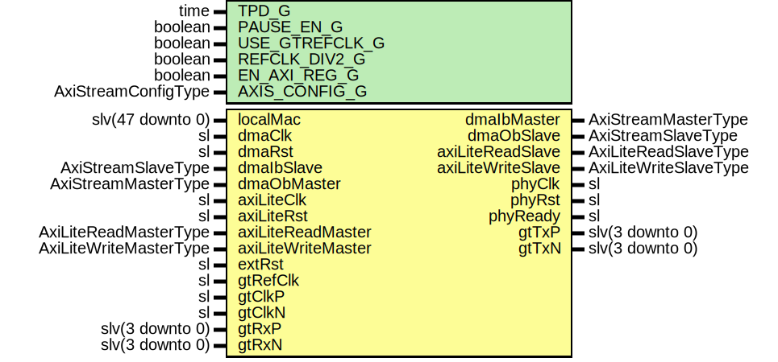

# Entity: XauiGth7Wrapper

- **File**: XauiGth7Wrapper.vhd
## Diagram

## Description

-----------------------------------------------------------------------------
 Company    : SLAC National Accelerator Laboratory
-----------------------------------------------------------------------------
 Description: Gth7 Wrapper for 10 GigE XAUI
-----------------------------------------------------------------------------
 This file is part of 'SLAC Firmware Standard Library'.
 It is subject to the license terms in the LICENSE.txt file found in the
 top-level directory of this distribution and at:
    https://confluence.slac.stanford.edu/display/ppareg/LICENSE.html.
 No part of 'SLAC Firmware Standard Library', including this file,
 may be copied, modified, propagated, or distributed except according to
 the terms contained in the LICENSE.txt file.
-----------------------------------------------------------------------------
## Generics

| Generic name   | Type                | Value              | Description                                                 |
| -------------- | ------------------- | ------------------ | ----------------------------------------------------------- |
| TPD_G          | time                | 1 ns               |                                                             |
| PAUSE_EN_G     | boolean             | true               |                                                             |
| USE_GTREFCLK_G | boolean             | false              |   FALSE: gtClkP/N,  TRUE: gtRefClk                          |
| REFCLK_DIV2_G  | boolean             | false              |   FALSE: gtClkP/N = 156.25 MHz,  TRUE: gtClkP/N = 312.5 MHz |
| EN_AXI_REG_G   | boolean             | false              | AXI-Lite Configurations                                     |
| AXIS_CONFIG_G  | AxiStreamConfigType | EMAC_AXIS_CONFIG_C | AXI Streaming Configurations                                |
## Ports

| Port name          | Direction | Type                   | Description              |
| ------------------ | --------- | ---------------------- | ------------------------ |
| localMac           | in        | slv(47 downto 0)       | Local Configurations     |
| dmaClk             | in        | sl                     | Streaming DMA Interface  |
| dmaRst             | in        | sl                     |                          |
| dmaIbMaster        | out       | AxiStreamMasterType    |                          |
| dmaIbSlave         | in        | AxiStreamSlaveType     |                          |
| dmaObMaster        | in        | AxiStreamMasterType    |                          |
| dmaObSlave         | out       | AxiStreamSlaveType     |                          |
| axiLiteClk         | in        | sl                     | Slave AXI-Lite Interface |
| axiLiteRst         | in        | sl                     |                          |
| axiLiteReadMaster  | in        | AxiLiteReadMasterType  |                          |
| axiLiteReadSlave   | out       | AxiLiteReadSlaveType   |                          |
| axiLiteWriteMaster | in        | AxiLiteWriteMasterType |                          |
| axiLiteWriteSlave  | out       | AxiLiteWriteSlaveType  |                          |
| extRst             | in        | sl                     | Misc. Signals            |
| phyClk             | out       | sl                     |                          |
| phyRst             | out       | sl                     |                          |
| phyReady           | out       | sl                     |                          |
| gtRefClk           | in        | sl                     |  156.25 MHz only         |
| gtClkP             | in        | sl                     |                          |
| gtClkN             | in        | sl                     |                          |
| gtTxP              | out       | slv(3 downto 0)        | MGT Ports                |
| gtTxN              | out       | slv(3 downto 0)        |                          |
| gtRxP              | in        | slv(3 downto 0)        |                          |
| gtRxN              | in        | slv(3 downto 0)        |                          |
## Signals

| Name         | Type | Description |
| ------------ | ---- | ----------- |
| phyClock     | sl   |             |
| refClockDiv2 | sl   |             |
| refClock     | sl   |             |
| refClk       | sl   |             |
## Instantiations

- IBUFDS_GTE2_Inst: IBUFDS_GTE2
- XauiGth7_Inst: surf.XauiGth7
 **Description**
--------------------
 10 GigE XAUI Module
--------------------

