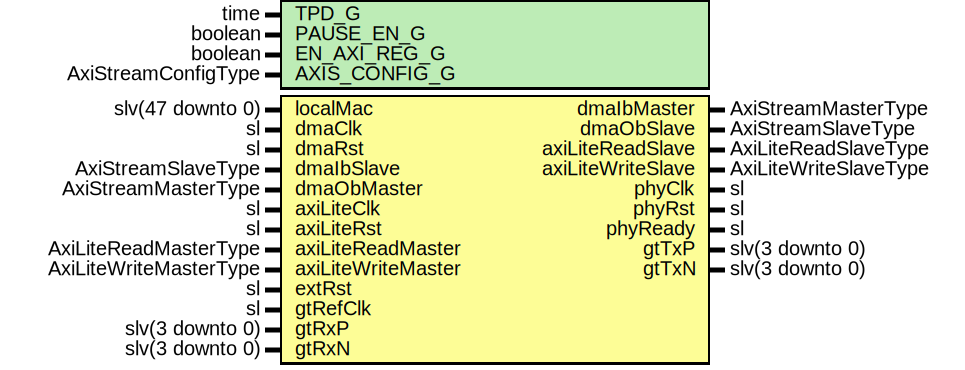

# Entity: XauiGtx7

## Diagram

## Description

Company    : SLAC National Accelerator Laboratory
Description: 10 GigE XAUI for Gtx7
This file is part of 'SLAC Firmware Standard Library'.
It is subject to the license terms in the LICENSE.txt file found in the
top-level directory of this distribution and at:
   https://confluence.slac.stanford.edu/display/ppareg/LICENSE.html.
No part of 'SLAC Firmware Standard Library', including this file,
may be copied, modified, propagated, or distributed except according to
the terms contained in the LICENSE.txt file.
## Generics

| Generic name  | Type                | Value              | Description                   |
| ------------- | ------------------- | ------------------ | ----------------------------- |
| TPD_G         | time                | 1 ns               |                               |
| PAUSE_EN_G    | boolean             | true               |                               |
| EN_AXI_REG_G  | boolean             | false              | AXI-Lite Configurations       |
| AXIS_CONFIG_G | AxiStreamConfigType | EMAC_AXIS_CONFIG_C | AXI Streaming Configurations  |
## Ports

| Port name          | Direction | Type                   | Description              |
| ------------------ | --------- | ---------------------- | ------------------------ |
| localMac           | in        | slv(47 downto 0)       | Local Configurations     |
| dmaClk             | in        | sl                     | Streaming DMA Interface  |
| dmaRst             | in        | sl                     |                          |
| dmaIbMaster        | out       | AxiStreamMasterType    |                          |
| dmaIbSlave         | in        | AxiStreamSlaveType     |                          |
| dmaObMaster        | in        | AxiStreamMasterType    |                          |
| dmaObSlave         | out       | AxiStreamSlaveType     |                          |
| axiLiteClk         | in        | sl                     | Slave AXI-Lite Interface |
| axiLiteRst         | in        | sl                     |                          |
| axiLiteReadMaster  | in        | AxiLiteReadMasterType  |                          |
| axiLiteReadSlave   | out       | AxiLiteReadSlaveType   |                          |
| axiLiteWriteMaster | in        | AxiLiteWriteMasterType |                          |
| axiLiteWriteSlave  | out       | AxiLiteWriteSlaveType  |                          |
| extRst             | in        | sl                     | Misc. Signals            |
| phyClk             | out       | sl                     |                          |
| phyRst             | out       | sl                     |                          |
| phyReady           | out       | sl                     |                          |
| gtRefClk           | in        | sl                     | MGT Ports                |
| gtTxP              | out       | slv(3 downto 0)        |                          |
| gtTxN              | out       | slv(3 downto 0)        |                          |
| gtRxP              | in        | slv(3 downto 0)        |                          |
| gtRxN              | in        | slv(3 downto 0)        |                          |
## Signals

| Name            | Type                | Description |
| --------------- | ------------------- | ----------- |
| phyRxd          | slv(63 downto 0)    |             |
| phyRxc          | slv(7 downto 0)     |             |
| phyTxd          | slv(63 downto 0)    |             |
| phyTxc          | slv(7 downto 0)     |             |
| areset          | sl                  |             |
| phyClock        | sl                  |             |
| phyReset        | sl                  |             |
| config          | XauiConfig          |             |
| status          | XauiStatus          |             |
| macRxAxisMaster | AxiStreamMasterType |             |
| macRxAxisCtrl   | AxiStreamCtrlType   |             |
| macTxAxisMaster | AxiStreamMasterType |             |
| macTxAxisSlave  | AxiStreamSlaveType  |             |
## Instantiations

- U_MAC: surf.EthMacTop
**Description**
Ethernet MAC core

- U_XauiGtx7Core: surf.XauiGtx7Core
**Description**
10 GigE XAUI Core

- RstSync_0: surf.RstSync
- RstSync_1: surf.RstSync
- U_XauiReg: surf.XauiReg
**Description**
Configuration/Status Register

