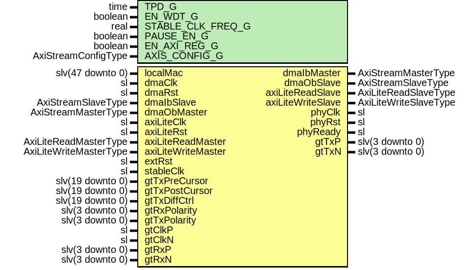

# Entity: XauiGtyUltraScaleWrapper

- **File**: XauiGtyUltraScaleWrapper.vhd
## Diagram

## Description

Company    : SLAC National Accelerator Laboratory
Description: GTH UltraScale+ Wrapper for 10 GigE XAUI
This file is part of 'SLAC Firmware Standard Library'.
It is subject to the license terms in the LICENSE.txt file found in the
top-level directory of this distribution and at:
   https://confluence.slac.stanford.edu/display/ppareg/LICENSE.html.
No part of 'SLAC Firmware Standard Library', including this file,
may be copied, modified, propagated, or distributed except according to
the terms contained in the LICENSE.txt file.
## Generics

| Generic name      | Type                | Value              | Description                   |
| ----------------- | ------------------- | ------------------ | ----------------------------- |
| TPD_G             | time                | 1 ns               |                               |
| EN_WDT_G          | boolean             | false              |                               |
| STABLE_CLK_FREQ_G | real                | 156.25E+6          | Support 156.25MHz or 312.5MHz |
| PAUSE_EN_G        | boolean             | true               |                               |
| EN_AXI_REG_G      | boolean             | false              | AXI-Lite Configurations       |
| AXIS_CONFIG_G     | AxiStreamConfigType | EMAC_AXIS_CONFIG_C | AXI Streaming Configurations  |
## Ports

| Port name          | Direction | Type                   | Description                            |
| ------------------ | --------- | ---------------------- | -------------------------------------- |
| localMac           | in        | slv(47 downto 0)       | Local Configurations                   |
| dmaClk             | in        | sl                     | Streaming DMA Interface                |
| dmaRst             | in        | sl                     |                                        |
| dmaIbMaster        | out       | AxiStreamMasterType    |                                        |
| dmaIbSlave         | in        | AxiStreamSlaveType     |                                        |
| dmaObMaster        | in        | AxiStreamMasterType    |                                        |
| dmaObSlave         | out       | AxiStreamSlaveType     |                                        |
| axiLiteClk         | in        | sl                     | Slave AXI-Lite Interface               |
| axiLiteRst         | in        | sl                     |                                        |
| axiLiteReadMaster  | in        | AxiLiteReadMasterType  |                                        |
| axiLiteReadSlave   | out       | AxiLiteReadSlaveType   |                                        |
| axiLiteWriteMaster | in        | AxiLiteWriteMasterType |                                        |
| axiLiteWriteSlave  | out       | AxiLiteWriteSlaveType  |                                        |
| extRst             | in        | sl                     | Misc. Signals                          |
| stableClk          | in        | sl                     |                                        |
| phyClk             | out       | sl                     |                                        |
| phyRst             | out       | sl                     |                                        |
| phyReady           | out       | sl                     |                                        |
| gtTxPreCursor      | in        | slv(19 downto 0)       | Transceiver Debug Interface            |
| gtTxPostCursor     | in        | slv(19 downto 0)       |                                        |
| gtTxDiffCtrl       | in        | slv(19 downto 0)       |                                        |
| gtRxPolarity       | in        | slv(3 downto 0)        |                                        |
| gtTxPolarity       | in        | slv(3 downto 0)        |                                        |
| gtClkP             | in        | sl                     | MGT Clock Port (156.25MHz or 312.5MHz) |
| gtClkN             | in        | sl                     |                                        |
| gtTxP              | out       | slv(3 downto 0)        | MGT Ports                              |
| gtTxN              | out       | slv(3 downto 0)        |                                        |
| gtRxP              | in        | slv(3 downto 0)        |                                        |
| gtRxN              | in        | slv(3 downto 0)        |                                        |
## Signals

| Name     | Type | Description |
| -------- | ---- | ----------- |
| refClk   | sl   |             |
| linkUp   | sl   |             |
| wdtRst   | sl   |             |
| wdtReset | sl   |             |
| extReset | sl   |             |
## Instantiations

- U_refClk: IBUFDS_GTE4
- XauiGtyUltraScale_Inst: surf.XauiGtyUltraScale
**Description**
10 GigE XAUI Module

