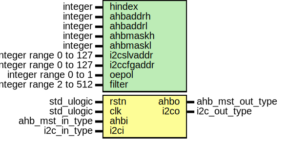

# Entity: i2c2ahb

- **File**: i2c2ahb.vhd
## Diagram

## Description

----------------------------------------------------------------------------
  This file is a part of the GRLIB VHDL IP LIBRARY
  Copyright (C) 2003 - 2008, Gaisler Research
  Copyright (C) 2008 - 2012, Aeroflex Gaisler

  This program is free software; you can redistribute it and/or modify
  it under the terms of the GNU General Public License as published by
  the Free Software Foundation; either version 2 of the License, or
  (at your option) any later version.

  This program is distributed in the hope that it will be useful,
  but WITHOUT ANY WARRANTY; without even the implied warranty of
  MERCHANTABILITY or FITNESS FOR A PARTICULAR PURPOSE.  See the
  GNU General Public License for more details.

  You should have received a copy of the GNU General Public License
  along with this program; if not, write to the Free Software
  Foundation, Inc., 59 Temple Place, Suite 330, Boston, MA  02111-1307  USA
-----------------------------------------------------------------------------
 Entity:      i2c2ahb
 File:        i2c2ahb.vhd
 Author:      Jan Andersson - Aeroflex Gaisler AB
 Contact:     support@gaisler.com
 Description: Simple I2C-slave providing a bridge to AMBA AHB
              See i2c2ahbx.vhd and GRIP for documentation
-----------------------------------------------------------------------------
## Generics

| Generic name | Type                   | Value | Description        |
| ------------ | ---------------------- | ----- | ------------------ |
| hindex       | integer                | 0     | AHB Configuration  |
| ahbaddrh     | integer                | 0     |                    |
| ahbaddrl     | integer                | 0     |                    |
| ahbmaskh     | integer                | 0     |                    |
| ahbmaskl     | integer                | 0     |                    |
| i2cslvaddr   | integer range 0 to 127 | 0     | I2C configuration  |
| i2ccfgaddr   | integer range 0 to 127 | 0     |                    |
| oepol        | integer range 0 to 1   | 0     |                    |
| filter       | integer range 2 to 512 | 2     |                    |
## Ports

| Port name | Direction | Type             | Description          |
| --------- | --------- | ---------------- | -------------------- |
| rstn      | in        | std_ulogic       |                      |
| clk       | in        | std_ulogic       |                      |
| ahbi      | in        | ahb_mst_in_type  | AHB master interface |
| ahbo      | out       | ahb_mst_out_type |                      |
| i2ci      | in        | i2c_in_type      | I2C signals          |
| i2co      | out       | i2c_out_type     |                      |
## Signals

| Name     | Type            | Description |
| -------- | --------------- | ----------- |
| i2c2ahbi | i2c2ahb_in_type |             |
## Instantiations

- bridge: i2c2ahbx
