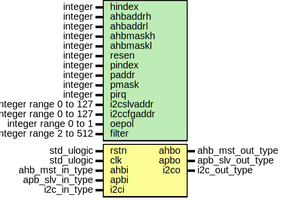

# Entity: i2c2ahb_apb

## Diagram

## Description

 This file is a part of the GRLIB VHDL IP LIBRARY
 Copyright (C) 2003 - 2008, Gaisler Research
 Copyright (C) 2008 - 2012, Aeroflex Gaisler
 This program is free software; you can redistribute it and/or modify
 it under the terms of the GNU General Public License as published by
 the Free Software Foundation; either version 2 of the License, or
 (at your option) any later version.
 This program is distributed in the hope that it will be useful,
 but WITHOUT ANY WARRANTY; without even the implied warranty of
 MERCHANTABILITY or FITNESS FOR A PARTICULAR PURPOSE.  See the
 GNU General Public License for more details.
 You should have received a copy of the GNU General Public License
 along with this program; if not, write to the Free Software
 Foundation, Inc., 59 Temple Place, Suite 330, Boston, MA  02111-1307  USA
Entity:      i2c2ahb_apb
File:        i2c2ahb_apb.vhd
Author:      Jan Andersson - Aeroflex Gaisler AB
Contact:     support@gaisler.com
Description: Simple I2C-slave providing a bridge to AMBA AHB
             This entity provides an APB interface for setting defining the
             AHB address window that can be accessed from I2C.
             See i2c2ahbx.vhd and GRIP for documentation
## Generics

| Generic name | Type                   | Value   | Description        |
| ------------ | ---------------------- | ------- | ------------------ |
| hindex       | integer                | 0       | AHB Configuration  |
| ahbaddrh     | integer                | 0       |                    |
| ahbaddrl     | integer                | 0       |                    |
| ahbmaskh     | integer                | 0       |                    |
| ahbmaskl     | integer                | 0       |                    |
| resen        | integer                | 0       |                    |
| pindex       | integer                | 0       | slave bus index    |
| paddr        | integer                | 0       |                    |
| pmask        | integer                | 16#fff# |                    |
| pirq         | integer                | 0       |                    |
| i2cslvaddr   | integer range 0 to 127 | 0       | I2C configuration  |
| i2ccfgaddr   | integer range 0 to 127 | 0       |                    |
| oepol        | integer range 0 to 1   | 0       |                    |
| filter       | integer range 2 to 512 | 2       |                    |
## Ports

| Port name | Direction | Type             | Description          |
| --------- | --------- | ---------------- | -------------------- |
| rstn      | in        | std_ulogic       |                      |
| clk       | in        | std_ulogic       |                      |
| ahbi      | in        | ahb_mst_in_type  | AHB master interface |
| ahbo      | out       | ahb_mst_out_type |                      |
| apbi      | in        | apb_slv_in_type  |                      |
| apbo      | out       | apb_slv_out_type |                      |
| i2ci      | in        | i2c_in_type      | I2C signals          |
| i2co      | out       | i2c_out_type     |                      |
## Signals

| Name     | Type             | Description |
| -------- | ---------------- | ----------- |
| r        | apb_reg_type     |             |
|  rin     | apb_reg_type     |             |
| i2c2ahbo | i2c2ahb_out_type |             |
## Constants

| Name     | Type                         | Value                                                                                                                                                                                                                                                                                                                           | Description |
| -------- | ---------------------------- | ------------------------------------------------------------------------------------------------------------------------------------------------------------------------------------------------------------------------------------------------------------------------------------------------------------------------------- | ----------- |
| CTRL_OFF | std_logic_vector(4 downto 2) |  "000"                                                                                                                                                                                                                                                                                                                          |             |
| STS_OFF  | std_logic_vector(4 downto 2) |  "001"                                                                                                                                                                                                                                                                                                                          |             |
| ADDR_OFF | std_logic_vector(4 downto 2) |  "010"                                                                                                                                                                                                                                                                                                                          |             |
| MASK_OFF | std_logic_vector(4 downto 2) |  "011"                                                                                                                                                                                                                                                                                                                          |             |
| SLVA_OFF | std_logic_vector(4 downto 2) |  "100"                                                                                                                                                                                                                                                                                                                          |             |
| SLVC_OFF | std_logic_vector(4 downto 2) |  "101"                                                                                                                                                                                                                                                                                                                          |             |
| PCONFIG  | apb_config_type              |  (     0 => ahb_device_reg(VENDOR_GAISLER,  GAISLER_I2C2AHB,  0,  0,  0),      1 => apb_iobar(paddr,  pmask)) | AMBA PnP    |
## Types

| Name         | Type | Description |
| ------------ | ---- | ----------- |
| apb_reg_type |      |             |
## Processes
- comb: ( r, rstn, apbi, i2c2ahbo )
- reg: ( clk )
## Instantiations

- bridge: i2c2ahbx
